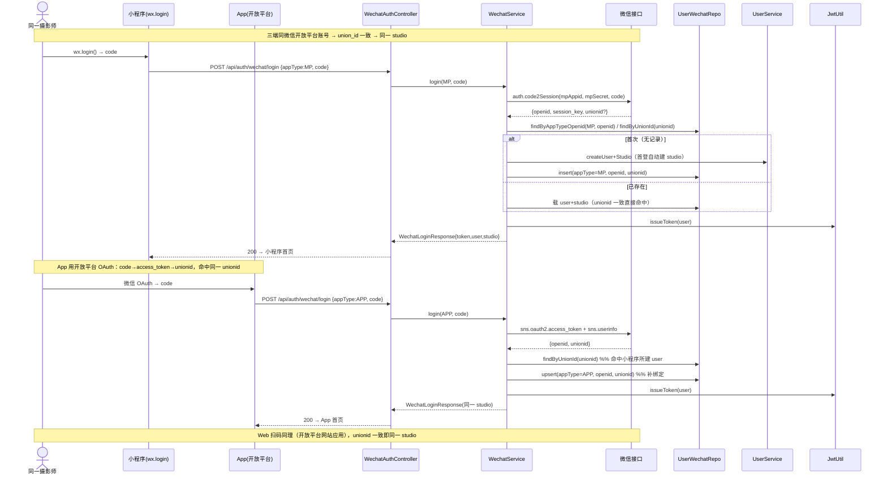
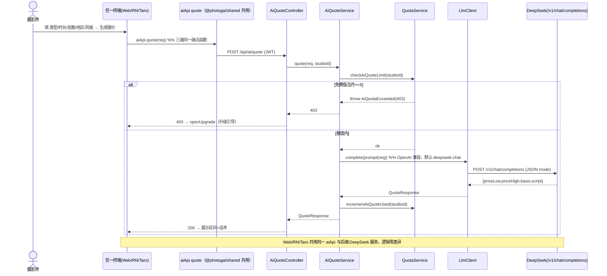
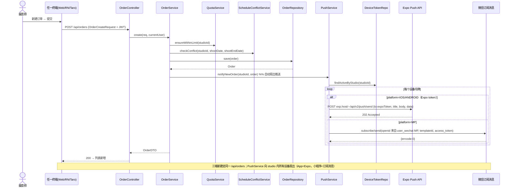
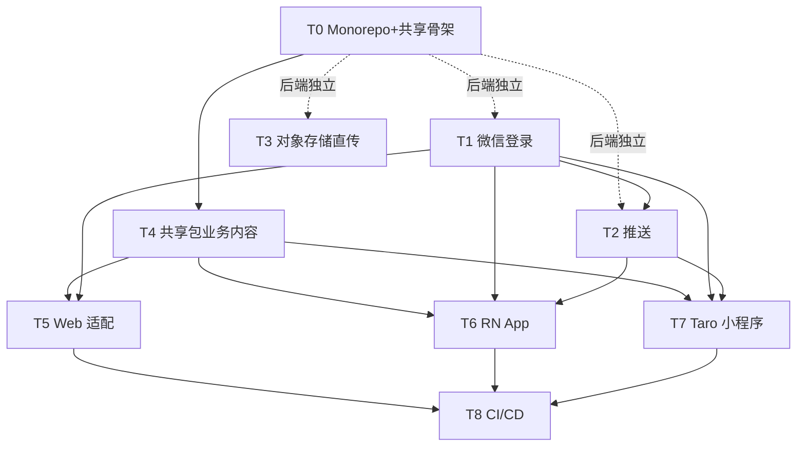

# 摄影师的 AI 接单跟单助手 — 三端扩张架构设计 + 任务分解（Web + React Native App + 微信小程序）

> 文档：架构设计 v4.0（多端扩张版）
> 作者：架构师 高见远（Gao）
> 日期：2026-07-24
> 范围：**三端统一（Web 已存在 / RN(Expo) App / Taro 微信小程序）+ 后端最小扩展（微信登录 / 推送 / 对象存储直传）**；**不重写**既有 Web 与后端。
> 基线：`architecture.md`（v1.0）、`architecture-phase2.md`（v2.0）、`architecture-phase3.md`（v3.0，小程序独立立项「阶段3-B」复用本设计落地的 REST API）。
> 配套文件：`docs/class-diagram-multiterminal.mermaid`、`docs/sequence-diagram-multiterminal.mermaid`

---

## 0. 设计总纲（最小变更 + 最大复用）

- **后端零重写**：复用现有 Spring Boot 3.2 / JPA / PostgreSQL / Flyway / `Result{code,data,message}` / `CurrentUser.getStudioId()` 多租户隔离。仅在 `auth` 扩微信登录、`push` / `storage` 两个新 module，AI 报价/脚本生成沿用既有 `LlmClient`（OpenAI 兼容，默认 DeepSeek `deepseek-chat`，`DEEPSEEK_API_KEY` 走环境变量，模型可配）。
- **前端最大复用**：三端**全 React 技术栈**。把 Web 现有 `types/models.ts`、`api/client.ts` 核心、`api/*.ts` 端点、`TanStack Query` hooks、`Zustand` store 抽到 **共享包 `@photogai/shared`**；Web / RN / Taro **共用同一份类型、API 客户端、领域逻辑、Query hooks、状态管理**，**仅 UI 组件层因平台差异各自实现**（MUI / RN 原生组件 / Taro 组件）。
- **仓库形态**：**pnpm workspace 单仓（monorepo）**。后端 Java/Maven 作为**同 git 仓的兄弟目录**（`photographer-ai-backend/`），不加入 pnpm workspace（避免 npm 工具链冲突），由 CI 单独一个 job 构建。
- **三端同一 studio 的纽带 = 微信开放平台 UnionID**：小程序 `wx.login`→code、App 走开放平台 OAuth、Web 走开放平台扫码，后端统一解析出 `union_id` 后关联到同一 `studio`。
- **推送**：App 用 **Expo Push（无需 FCM/APNs 证书，Expo 代发）**；小程序用 **微信订阅消息**；后端 `PushService` 按 `studio_id` 内成员的设备令牌扇出。
- **图片上传**：默认**对象存储预签名直传**（OSS/COS/S3），dev 用 `LOCAL` 后端接收兜底；后端仅暴露预签名与确认接口。

---

## 1. 实现方案 + 框架选型

### 1.1 仓库形态：pnpm workspace 单仓

**结论：采用 monorepo（pnpm workspace + 可选 Turborepo 缓存）**，理由：

1. 三端共用同一套 TS 类型与 API client，独立仓库会出现"类型漂移 + 重复维护"，monorepo 通过 workspace 依赖 `@photogai/shared` 一次定义、三端引用。
2. 既有 Web 项目可平滑迁入 `apps/web`，不破坏其 Vite/MUI/Tailwind 运行方式。
3. pnpm 的 `workspace:*` 协议让共享包变更即时被三端感知，配合 Turborepo 的任务缓存（`build`/`lint`/`test`）可并行加速。

> 若团队坚持多仓，则把 `@photogai/shared` 发成私有 npm 包（Verdaccio / npm 私有 scope），但会增加发版摩擦，**不推荐**。本设计按 monorepo 落地。

### 1.2 目标工程结构（迁移后的目标态）

```
software-photographer-ai/                   # git 根（pnpm workspace）
├── package.json                            # 私有根，scripts 委托 turbo
├── pnpm-workspace.yaml                     # packages/* + apps/*
├── turbo.json                             # pipeline: build / lint / test
├── tsconfig.base.json                     # 三端共享 ts 严格度
├── .npmrc
├── packages/
│   └── shared/                            # @photogai/shared（三端唯一真源）
│       ├── package.json                   # name:@photogai/shared, exports 映射
│       ├── tsconfig.json
│       └── src/
│           ├── index.ts                   # 统一出口
│           ├── types/models.ts            # 从 web 迁入：全部领域类型（含订阅/团队/校准）
│           ├── types/multiterminal.ts     # 新增：WechatLogin*/DeviceToken/Presign*/UploadFile
│           ├── http/
│           │   ├── HttpClient.ts         # 平台无关接口 + axios 默认实现 + ApiError + 解包
│           │   └── adapters.ts           # Taro.request 适配器（axios-taro-adapter 封装）
│           ├── api/                       # 端点函数（三端共用，不直接 import axios）
│           │   ├── auth.ts  order.ts  customer.ts  schedule.ts
│           │   ├── ai.ts   quota.ts  subscription.ts
│           │   ├── push.ts storage.ts    # 新增：推送/存储端点
│           ├── domain/                    # 纯逻辑：格式化/校验/常量
│           │   ├── order.ts  quote.ts
│           │   └── constants.ts          # STATUS_LABELS/NEXT_STATUSES/主题色 token/错误码映射
│           ├── store/                     # Zustand：authStore/uiStore（含 StorageAdapter 抽象）
│           │   ├── authStore.ts  uiStore.ts  storage.ts
│           ├── hooks/                     # TanStack Query hooks（三端共用）
│           │   ├── useAuth.ts useOrders.ts useQuote.ts
│           │   ├── useCustomers.ts useSubscription.ts usePush.ts
│           └── config.ts                  # API path 前缀、环境常量占位
├── apps/
│   ├── web/                              # 既有 photographer-ai-web 迁入（Vite+React+MUI+Tailwind）
│   │   ├── src/
│   │   │   ├── lib/http.ts              # 用 shared HttpClient 接 web 存储 + 401/402/403 UX
│   │   │   ├── lib/storage.ts           # localStorage 实现 StorageAdapter
│   │   │   ├── pages/LoginPage.tsx      # 增加微信扫码登录入口
│   │   │   └── ...（其余页面/组件基本不变，api/* 改为从 @photogai/shared 引入）
│   ├── mobile/                          # 新建：React Native + Expo
│   │   ├── app/ (expo-router 目录式路由)
│   │   ├── src/lib/http.ts              # 接 MMKV/AsyncStorage + 导航式 401/402/403 UX
│   │   ├── src/screens/                 # 登录/订单看板/日历/AI报价/客户/订阅
│   │   ├── src/lib/wechat.ts            # 微信开放平台登录 → /wechat/login
│   │   └── src/lib/push.ts              # expo-notifications 取 token → POST /push/device
│   └── miniprogram/                     # 新建：Taro（React 语法）微信小程序
│       ├── src/
│       │   ├── app.config.ts
│       │   ├── lib/http.ts              # 用 axios + axios-taro-adapter（shared HttpClient 不变）
│       │   ├── lib/storage.ts           # Taro.getStorageSync 实现 StorageAdapter
│       │   ├── pages/                   # 登录/订单/日历/AI报价/客户/订阅
│       │   └── lib/wechat.ts            # Taro.login → /wechat/login(MP)；订阅消息授权
└── photographer-ai-backend/             # 既有 Spring Boot（兄弟目录，非 pnpm workspace 成员）
    └── src/main/java/com/photogai/
        ├── config/WechatConfig.java     # mp appid/secret + 开放平台 appid/secret（application.yml）
        ├── modules/
        │   ├── auth/
        │   │   ├── entity/UserWechat.java
        │   │   ├── UserWechatRepository.java
        │   │   ├── WechatService.java        # code2Session / sns oauth2
        │   │   ├── AuthController.java       # + /wechat/login /wechat/bind
        │   │   └── dto/{WechatLoginRequest,WechatLoginResponse,WechatBindRequest}.java
        │   ├── push/
        │   │   ├── entity/DeviceToken.java
        │   │   ├── DeviceTokenRepository.java
        │   │   ├── PushService.java          # 扇出：Expo Push API + 微信订阅消息
        │   │   └── PushController.java       # /push/device 注册/注销 /push/test
        │   ├── storage/
        │   │   ├── entity/UploadFile.java
        │   │   ├── UploadFileRepository.java
        │   │   ├── StorageService.java        # presign(OSS/COS/S3/LOCAL) + confirm/receive
        │   │   └── StorageController.java     # /storage/presign /confirm /upload
        │   └── order/OrderService.java        # ~ 注入 PushService，建单/分配/改状态时扇出推送
        └── resources/db/migration/V4__multiterminal.sql
```

### 1.3 共享策略（关键设计）

| 层 | 是否共享 | 做法 |
|---|---|---|
| **TS 类型** | ✅ 完全共享 | `packages/shared/src/types/*` 一处定义，三端 import |
| **API 客户端** | ✅ 完全共享 | 端点函数调用 `HttpClient`（axios 实现）；Taro 经 `axios-taro-adapter` 复用**同一份 axios 代码**，端点零改动 |
| **领域逻辑** | ✅ 完全共享 | `domain/`（格式化、状态机 `NEXT_STATUSES`、金额/日期格式化）+ `constants`（主题色、`STATUS_LABELS`、错误码映射） |
| **TanStack Query hooks** | ✅ 完全共享 | `hooks/*`（React DOM / RN / Taro 均为 React，hooks 通用） |
| **Zustand store** | ✅ 共享逻辑 | `authStore/uiStore` 逻辑共享；通过 `StorageAdapter` 抽象适配各端存储（localStorage / MMKV / Taro storage） |
| **HTTP 传输差异** | ⚠️ 适配 | web/RN 用浏览器/RN 的 XMLHttpRequest；Taro 用 `axios-taro-adapter` 包一层 `Taro.request` |
| **鉴权/错误 UX** | ⚠️ 各端接 | shared 仅抛语义 `ApiError(code)`；web 用 `window.location` 跳登录、RN 用 `router.replace`、MP 用 `Taro.redirectTo` |
| **UI 组件** | ❌ 不共享 | MUI（web）/ RN 原生组件（mobile）/ Taro 组件（miniprogram）各自实现；**但页面结构、字段、交互一致** |

**共享包导出契约（给工程师）**：`@photogai/shared` 的 `package.json` 用 `exports` 字段按子路径导出（`@photogai/shared/types`、`/api`、`/hooks`、`/store`、`/domain`、`/http`），并声明 `peerDependencies: react, @tanstack/react-query, zustand, axios`，避免三端重复装包。

### 1.4 Web 迁入 monorepo 的具体步骤（不重写）

1. 根目录加 `package.json`(private) + `pnpm-workspace.yaml`(`packages/*`,`apps/*`) + `turbo.json` + `tsconfig.base.json`。
2. `photographer-ai-web/` → `apps/web/`，保留全部 `src/` 与配置。
3. 新建 `packages/shared/`，把 `apps/web/src/types/models.ts` 移入 `packages/shared/src/types/`，把 `apps/web/src/api/client.ts` 的**核心**（axios 实例 + `ApiError` + `request` 解包）抽成 `packages/shared/src/http/HttpClient.ts`；`apps/web/src/api/*.ts` 的全部端点函数移入 `packages/shared/src/api/*`。
4. `apps/web` 删除自有 `types/models.ts` 与 `api/*.ts`，改为 `import { authApi, orderApi, ... } from '@photogai/shared'`；仅保留 `src/lib/http.ts`（用 shared HttpClient 接 web 存储 + 401/402/403 UX 跳转）与 `src/lib/storage.ts`。
5. `apps/web/package.json` 加 `"@photogai/shared": "workspace:*"`；`tsconfig` 加 `paths` 指向共享包（或靠 workspace 软链）。

### 1.5 关键难点与对策

| 难点 | 对策 |
|---|---|
| Taro 无法用浏览器 XMLHttpRequest（axios 直用报错） | 用 `axios-taro-adapter` 让 `axios` 在 Taro 走 `Taro.request`；shared 的 `HttpClient`(axios) **无需改动**，端点函数 100% 复用 |
| 三端 token 存储差异 | shared `authStore` 通过 `StorageAdapter` 接口读写；web=localStorage、RN=MMKV/AsyncStorage、MP=Taro storage |
| 三端登录 UX 差异（401 跳登录） | shared 只抛 `ApiError(code)`；各端 `lib/http.ts` 接自己的路由跳转；逻辑一致、实现分离 |
| 微信三端打通同一 studio | 后端统一解析 `union_id`：`user_wechat` 表以 `(app_type, openid)` 唯一、`union_id` 建索引；任一端登录命中同一 `union_id` 即同一 `studio` |
| App 推送要 FCM/APNs 证书 | 用 **Expo Push**：App 取 Expo push token 存 `device_token`，后端调 Expo Push API 代发，**免证书** |
| 小程序推送触达 | 微信订阅消息：用户授权 `requestSubscribeMessage` 后，后端 `PushService` 用该用户 MP `openid` + 模板 ID 调微信订阅消息接口 |
| 图片存储合规/成本 | 预签名直传（OSS/COS/S3），后端不落盘大文件；dev 用 `LOCAL` 后端接收兜底 |

---

## 2. 文件列表及相对路径

见 §1.2 目标结构树（含共享包、三端应用、后端扩展 module 与迁移脚本）。

**后端新增/修改文件（相对 `photographer-ai-backend/`）**

| 文件 | 动作 | 说明 |
|---|---|---|
| `src/main/resources/db/migration/V4__multiterminal.sql` | **+** | 新建 `user_wechat` / `device_token` / `upload_file` 三表 + 索引 |
| `src/main/resources/application.yml` | ~ | 增 `app.wechat.*`（mp/op appid+secret）、`app.storage.*`（provider/local 路径/oss 配置）、`app.push.expo.*`（access token，可选） |
| `config/WechatConfig.java` | **+** | 读 `app.wechat.*`，装配 RestClient |
| `modules/auth/entity/UserWechat.java` | **+** | 微信绑定实体 |
| `modules/auth/UserWechatRepository.java` | **+** | `findByAppTypeOpenid` / `findByUnionId` / `upsert` |
| `modules/auth/WechatService.java` | **+** | `loginByCode(appType,code)`：MP `code2Session` / App·Web 开放平台 `sns.oauth2`；解析 openid+unionid；绑定或建用户+studio |
| `modules/auth/AuthController.java` | ~ | 增 `POST /api/auth/wechat/login`、`POST /api/auth/wechat/bind` |
| `modules/auth/dto/{WechatLoginRequest,WechatLoginResponse,WechatBindRequest}.java` | **+** | DTO |
| `common/ErrorCode.java` | ~ | 增 `WECHAT_LOGIN_FAILED(401)`、`INVALID_WX_CODE(400)`、`PUSH_FAILED(500)`、`STORAGE_FAILED(500)` |
| `modules/push/entity/DeviceToken.java` | **+** | 设备令牌实体 |
| `modules/push/DeviceTokenRepository.java` | **+** | `findActiveByStudio` / `upsert(user,platform,token)` |
| `modules/push/PushService.java` | **+** | `sendToStudio(studioId,title,body,payload)`：按 `device_token` 扇出 Expo/微信订阅；`notifyNewOrder`/`notifyStatusChange` 包装 |
| `modules/push/PushController.java` | **+** | `POST /api/push/device`（注册）、`DELETE /api/push/device/{id}`（注销）、`POST /api/push/test` |
| `modules/storage/entity/UploadFile.java` | **+** | 上传文件记录 |
| `modules/storage/UploadFileRepository.java` | **+** | `save` / `findByStudio` |
| `modules/storage/StorageService.java` | **+** | `presign(...)`（OSS/COS/S3 预签名或 LOCAL 占位）、`confirm(fileKey)`、`receive(multipart)`（LOCAL 兜底） |
| `modules/storage/StorageController.java` | **+** | `POST /api/storage/presign`、`POST /api/storage/confirm`、`POST /api/storage/upload` |
| `modules/order/OrderService.java` | ~ | 注入 `PushService`：建单后 `notifyNewOrder`、改状态/分配后 `notifyStatusChange`（按 studio 内设备扇出） |

**共享包新增/迁出文件（相对 `packages/shared/`）**

| 文件 | 动作 | 说明 |
|---|---|---|
| `src/types/models.ts` | 迁出（从 web） | 全部既有领域类型（含订阅/团队/校准） |
| `src/types/multiterminal.ts` | **+** | `WechatLoginRequest/Response`、`WechatBindRequest`、`DeviceTokenRegister`、`PresignRequest/Response`、`UploadFileDTO` |
| `src/http/HttpClient.ts` | 抽出（从 web `api/client.ts`） | axios 实例 + `ApiError` + `request` 解包 + 平台无关 |
| `src/api/{auth,order,customer,schedule,ai,quota,subscription,push,storage}.ts` | 迁出+新增 | 端点函数，全部走 `HttpClient` |
| `src/domain/*`、`src/constants.ts`、`src/hooks/*`、`src/store/*` | 迁出/新增 | 领域逻辑、Query hooks、Zustand store（含 StorageAdapter） |
| `src/config.ts` | **+** | API 前缀、环境占位 |

**三端应用改动（相对各 `apps/*`）**

- `apps/web/`：迁入；删自有 `api/*.ts`/`types/models.ts`；新增 `lib/http.ts`、`lib/storage.ts`、`pages/LoginPage.tsx` 微信扫码入口。
- `apps/mobile/`（新建）：`app/`(expo-router)、`src/screens/*`、`src/lib/{http,storage,wechat,push}.ts`、`package.json`（expo 依赖）。
- `apps/miniprogram/`（新建）：`src/pages/*`、`src/lib/{http,storage,wechat}.ts`、`app.config.ts`、`package.json`（taro 依赖）。

---

## 3. 数据结构与接口（类图 + 契约）

### 3.1 核心实体类图（后端）

> 完整 Mermaid 见 `docs/class-diagram-multiterminal.mermaid`。

要点：
- `Studio` 1——*`User`（团队，含 OWNER/ADMIN/MEMBER/READONLY）
- `User` 1——*`UserWechat`（绑定 WEB/APP/MP 多端，`union_id` 三端纽带）
- `User` 1——*`DeviceToken`（IOS/ANDROID/MP 多设备）
- `Studio` 1——*`Order`/`Customer`/`Subscription`/`UploadFile`/`DeviceToken`/`UserWechat`（均按 `studio_id` 隔离）
- `Order` 1——*`StatusHistory`/`Reminder`，`Order.assignedTo`→`User`（团队分配，可空）
- `Customer` 1——*`Order`

### 3.2 后端迁移 SQL（`V4__multiterminal.sql`）

```sql
-- 阶段3-B / 多端扩张：微信绑定 + 设备令牌 + 对象存储直传（2026-07-24）
-- 幂等：IF NOT EXISTS；不改动 V1/V2/V3 既有表。

-- 1) 微信绑定表（三端同一 studio 的纽带 = union_id）
CREATE TABLE IF NOT EXISTS user_wechat (
    id          BIGSERIAL PRIMARY KEY,
    user_id     BIGINT       NOT NULL REFERENCES users(id),
    studio_id   BIGINT       NOT NULL REFERENCES studio(id),
    app_type    VARCHAR(10)  NOT NULL,            -- WEB | APP | MP
    openid      VARCHAR(64)  NOT NULL,
    union_id    VARCHAR(64),                       -- 微信开放平台 UnionID（三端打通关键）
    session_key VARCHAR(64),                       -- 仅 MP：wx.login 换取的 session_key
    created_at  TIMESTAMPTZ  NOT NULL DEFAULT now(),
    updated_at  TIMESTAMPTZ  NOT NULL DEFAULT now(),
    UNIQUE (app_type, openid)
);
CREATE INDEX IF NOT EXISTS idx_user_wechat_union  ON user_wechat(union_id);
CREATE INDEX IF NOT EXISTS idx_user_wechat_studio ON user_wechat(studio_id);

-- 2) 设备令牌表（推送扇出）
CREATE TABLE IF NOT EXISTS device_token (
    id            BIGSERIAL PRIMARY KEY,
    user_id       BIGINT       NOT NULL REFERENCES users(id),
    studio_id     BIGINT       NOT NULL REFERENCES studio(id),
    platform      VARCHAR(10)  NOT NULL,           -- IOS | ANDROID | MP
    token         VARCHAR(512) NOT NULL,           -- Expo push token / FCM / APNs / MP openid(订阅消息)
    app_version   VARCHAR(20),
    last_active_at TIMESTAMPTZ,
    created_at    TIMESTAMPTZ  NOT NULL DEFAULT now(),
    updated_at    TIMESTAMPTZ  NOT NULL DEFAULT now(),
    UNIQUE (user_id, platform, token)
);
CREATE INDEX IF NOT EXISTS idx_device_token_studio ON device_token(studio_id, platform);

-- 3) 上传文件记录（对象存储直传后回写）
CREATE TABLE IF NOT EXISTS upload_file (
    id            BIGSERIAL PRIMARY KEY,
    studio_id     BIGINT       NOT NULL REFERENCES studio(id),
    owner_user_id BIGINT       REFERENCES users(id),
    biz_type      VARCHAR(20)  NOT NULL,           -- ORDER_SAMPLE | CUSTOMER_AVATAR | STUDIO_LOGO
    file_key      VARCHAR(255) NOT NULL,
    url           VARCHAR(1024) NOT NULL,
    original_name VARCHAR(255),
    size          BIGINT,
    content_type  VARCHAR(100),
    created_at    TIMESTAMPTZ  NOT NULL DEFAULT now()
);
CREATE INDEX IF NOT EXISTS idx_upload_file_studio ON upload_file(studio_id, biz_type);
```

### 3.3 后端新增接口契约

> 统一前缀 `/api`，除 `/api/auth/*` 白名单外均需 `Authorization: Bearer <jwt>`；响应统一 `{code,data,message}`；多租户按 `CurrentUser.getStudioId()` 隔离。错误码沿用阶段1 约定 + 新增 `WECHAT_LOGIN_FAILED(401)` / `INVALID_WX_CODE(400)` / `PUSH_FAILED(500)` / `STORAGE_FAILED(500)`。

| # | 方法 | 路径 | 入参 | 出参 | 说明 |
|---|---|---|---|---|---|
| W1 | POST | `/api/auth/wechat/login` | `WechatLoginRequest{appType:WEB\|APP\|MP, code, encryptedData?, iv?, bindToken?}` | `WechatLoginResponse{ token, user, studio, isNewUser, needBind }` | 小程序 `wx.login`→code；App/Web 开放平台 OAuth→code；后端解析 openid+unionid；命中同 unionid 即同 studio；`bindToken` 非空表示绑定到已登录密码账号 |
| W2 | POST | `/api/auth/wechat/bind` | `WechatBindRequest{appType, code}` | `AuthResponse` | 已登录用户绑定微信（需 JWT）；插入 `user_wechat` |
| W3 | POST | `/api/push/device` | `{platform:IOS\|ANDROID\|MP, token, appVersion?}` | `DeviceTokenDTO{id,platform,token,appVersion}` | 注册/更新设备令牌（JWT） |
| W4 | DELETE | `/api/push/device/{id}` | path | `void` | 注销设备（换机/登出） |
| W5 | POST | `/api/push/test` | 无 | `void` | 向当前用户设备发测试推送（QA/Dev） |
| W6 | POST | `/api/storage/presign` | `{fileName, contentType, bizType:ORDER_SAMPLE\|CUSTOMER_AVATAR\|STUDIO_LOGO}` | `PresignResponse{uploadUrl, fileKey, method:"PUT", headers, expiresAt}` | OSS 预签名直传（dev LOCAL 时返回占位 + 走 W8） |
| W7 | POST | `/api/storage/confirm` | `{fileKey}` | `UploadFileDTO{id, url, fileKey, bizType}` | 直传后回写记录并返回 CDN url |
| W8 | POST | `/api/storage/upload` | `multipart/form-data(file, bizType)` | `UploadFileDTO` | 后端接收兜底（LOCAL 存储） |

**关键 JSON 示例**

`WechatLoginRequest`（小程序）
```json
{ "appType": "MP", "code": "081abc..." }
```
`WechatLoginResponse`（命中同 unionid → 同 studio）
```json
{ "token": "eyJ...", "user": {"id":7,"studioId":3,"username":"wx_***","role":"OWNER"},
  "studio": {"id":3,"name":"许清楚的摄影工作室","planType":"PRO"},
  "isNewUser": false, "needBind": false }
```
`PresignResponse`（阿里云 OSS 示例）
```json
{ "uploadUrl": "https://bucket.oss-cn-shanghai.aliyuncs.com/order-sample/3/uuid.jpg?Expires=...&OSSAccessKeyId=...&Signature=...",
  "fileKey": "order-sample/3/uuid.jpg", "method": "PUT",
  "headers": {"Content-Type":"image/jpeg"}, "expiresAt": "2026-07-24T12:10:00Z" }
```
`UploadFileDTO`
```json
{ "id": 12, "url": "https://cdn.example.com/order-sample/3/uuid.jpg", "fileKey": "order-sample/3/uuid.jpg", "bizType": "ORDER_SAMPLE" }
```

### 3.4 前端（共享包）新增类型（`types/multiterminal.ts`）

```ts
export type WechatAppType = 'WEB' | 'APP' | 'MP';
export type PushPlatform = 'IOS' | 'ANDROID' | 'MP';

export interface WechatLoginRequest {
  appType: WechatAppType;
  code: string;
  encryptedData?: string;
  iv?: string;
  bindToken?: string;
}
export interface WechatLoginResponse {
  token: string;
  user: User;
  studio: Studio;
  isNewUser: boolean;
  needBind: boolean;
}
export interface WechatBindRequest {
  appType: WechatAppType;
  code: string;
}
export interface DeviceTokenRegister {
  platform: PushPlatform;
  token: string;
  appVersion?: string;
}
export interface DeviceTokenDTO {
  id: number;
  platform: PushPlatform;
  token: string;
  appVersion?: string;
}
export interface PresignRequest {
  fileName: string;
  contentType: string;
  bizType: 'ORDER_SAMPLE' | 'CUSTOMER_AVATAR' | 'STUDIO_LOGO';
}
export interface PresignResponse {
  uploadUrl: string;
  fileKey: string;
  method: 'PUT' | 'POST';
  headers?: Record<string, string>;
  expiresAt?: string;
}
export interface UploadFileDTO {
  id: number;
  url: string;
  fileKey: string;
  bizType: string;
}
```

---

## 4. 程序调用流程（时序图）

> 完整 Mermaid 见 `docs/sequence-diagram-multiterminal.mermaid`（3 张：①微信登录打通三端同一 studio ②AI 报价三端同调后端 DeepSeek ③订单在 App/MP/Web 新建并推送）。

### 4.1 ① 微信登录打通三端同一 studio（以小程序首次 → App 复登为例）



### 4.2 ② AI 报价三端同调后端 DeepSeek



### 4.3 ③ 订单在 App/MP/Web 新建并推送通知



---

## 5. 任务列表（按阶段/模块，含依赖、顺序、可并行）

> 约定：后端（Java）在兄弟目录独立构建，**不依赖** monorepo；共享包是三端的共同前置。后端微信绑定（T1）先于推送 MP 订阅消息（T2 的 MP 分支）与微信登录前端（T5/T6/T7）。

| ID | 阶段 | 模块 | 任务 | 关键文件 | 依赖 | 优先级 | 可并行 |
|---|---|---|---|---|---|---|---|
| **T0** | 0 基础 | 仓库 | **Monorepo 脚手架 + 共享包骨架** | 根 `package.json`/`pnpm-workspace.yaml`/`turbo.json`/`tsconfig.base.json`；`packages/shared`(`package.json`/`tsconfig`/`src/index.ts` 空模块)；`apps/web` 迁入 | 无 | P0 | — |
| **T1** | 1 后端 | 认证 | **后端微信登录（统一账号）** | `WechatConfig`+`WechatService`+`UserWechat`(实体/Repo)+`AuthController`(+`/wechat/login`/`/wechat/bind`)+3 DTO+`ErrorCode`(+2)+`V4__multiterminal.sql`(user_wechat) | 阶段3 基线 | P0 | ✅ 与 T2/T3 并行 |
| **T2** | 1 后端 | 推送 | **后端推送（设备令牌 + 扇出）** | `DeviceToken`(实体/Repo)+`PushService`(Expo+微信订阅)+`PushController`(+`/push/device`/`/test`)+`ErrorCode`(+1)+`V4`(device_token) | T1(user_wechat 供 MP openid) | P1 | ✅ 与 T3 并行（IOS/ANDROID 分支独立于 T1） |
| **T3** | 1 后端 | 存储 | **后端对象存储直传（预签名）** | `UploadFile`(实体/Repo)+`StorageService`(presign/confirm/receive)+`StorageController`(+`/presign`/`/confirm`/`/upload`)+`V4`(upload_file) | 无 | P1 | ✅ 与 T1/T2 并行 |
| **T4** | 2 共享 | 共享包 | **共享包业务内容** | 迁出 `types/models.ts`→shared；抽 `http/HttpClient.ts`；`api/*`(含 push/storage)；`domain/*`+`constants.ts`；`hooks/*`；`store/*`(StorageAdapter)；新增 `types/multiterminal.ts` | T0；接口契约按本文档先写，后端落地后对齐 | P0 | ✅ 与 T5 部分并行 |
| **T5** | 3 Web | 适配 | **Web 适配（迁入 + 消费共享 + 微信扫码登录）** | `apps/web` 删自有 `api/*.ts`/`types/models.ts`，改引 `@photogai/shared`；`lib/http.ts`(web 存储+401/402/403 UX)；`lib/storage.ts`；`LoginPage` 加微信扫码 | T4；T1(微信扫码后端) | P1 | ✅ 与 T6/T7 并行 |
| **T6** | 4 App | RN | **React Native + Expo App** | `apps/mobile` 脚手架(expo-router/nativewind)；接 `@photogai/shared`；`screens/*`(登录/订单/日历/AI报价/客户/订阅)；`lib/{http,storage,wechat,push}.ts`；expo-notifications + 微信开放平台登录 | T4；T1(微信登录)；T2(推送) | P1 | ✅ 与 T7 强并行 |
| **T7** | 5 小程序 | Taro | **Taro 微信小程序** | `apps/miniprogram` 脚手架(taro weapp/taro-ui)；接 `@photogai/shared`(axios+axios-taro-adapter)；`pages/*`；`lib/{http,storage,wechat}.ts`(Taro.login + 订阅消息授权) | T4；T1(微信登录)；T2(订阅消息) | P1 | ✅ 与 T6 强并行 |
| **T8** | 6 CI | 交付 | **CI/CD 三端 + 后端** | GitHub Actions：backend(Maven test/build)、web/mobile/miniprogram(pnpm+ turbo；EAS Build / Taro build weapp) | T5/T6/T7 完成 | P2 | 各端流水线独立 |

### 任务依赖图（Mermaid）



### 实现提示（给工程师）

- **T0 最关键**：`pnpm-workspace.yaml` 只列 `packages/*` + `apps/*`，**不要**把 `photographer-ai-backend` 列进去；后端在 CI 单独 job 用 Maven 构建。`@photogai/shared` 用 `exports` 子路径 + `peerDependencies` 声明 react/@tanstack/react-query/zustand/axios。
- **T1 三端打通核心**：`WechatService.loginByCode` 先按 `union_id`（优先）再按 `(app_type, openid)` 查 `user_wechat`；首登自动建 `Studio`+`User`（沿用 `AuthService.register` 的建 studio 逻辑）；`bindToken` 非空时不建号、只绑。MP 走 `code2Session`，App/Web 走开放平台 `sns.oauth2.access_token`+`sns.userinfo`。
- **T2 扇出**：`PushService.sendToStudio` 查 `device_token` 按 `platform` 分流——`IOS`/`ANDROID` 调 Expo Push API（`RestClient` POST `exp.host/--/api/v2/push/send`，免证书）；`MP` 从 `user_wechat(app_type=MP)` 取该用户 `openid` + 模板 ID 调微信订阅消息（`RestClient` 调 `cgi-bin/message/subscribe/send`，access_token 缓存）。**零新增 Maven 依赖**（同 LlmClient/PaymentGateway 用 RestClient）。
- **T3 存储**：`storage.provider=OSS|COS|S3|LOCAL`；OSS/COS/S3 用对应 SDK 生成预签名 URL（**唯一可选新增后端依赖**：`com.aliyun.oss:aliyun-sdk-oss` 等，按所选云定）；`LOCAL` 走 `/storage/upload` 后端接收（dev 兜底）。前端拿到 `uploadUrl` 用 `PUT` 直传，再 `POST /storage/confirm` 回写 `upload_file` 拿 CDN url。
- **T4/T5/T6/T7 复用纪律**：UI 组件不跨端共享，但**页面字段、交互、Query hooks、store 逻辑必须一致**；任何领域规则变更只改 `packages/shared`，三端同步生效。

---

## 6. 依赖包列表

### 6.1 共享包 `@photogai/shared`（`packages/shared/package.json`）

```json
{
  "name": "@photogai/shared",
  "version": "1.0.0",
  "type": "module",
  "exports": {
    ".": "./src/index.ts",
    "./types": "./src/types/index.ts",
    "./api": "./src/api/index.ts",
    "./hooks": "./src/hooks/index.ts",
    "./store": "./src/store/index.ts",
    "./http": "./src/http/index.ts",
    "./domain": "./src/domain/index.ts"
  },
  "peerDependencies": {
    "react": "^18.3.0",
    "@tanstack/react-query": "^5.51.0",
    "zustand": "^4.5.0",
    "axios": "^1.7.0"
  },
  "devDependencies": {
    "typescript": "^5.5.0",
    "axios": "^1.7.0"
  }
}
```
> 注：共享包本体**不引入 UI 库**；`zod`（可选，运行时校验 DTO）可按需加。

### 6.2 Web（`apps/web`，既有 + 微调）

```
dependencies 新增: "@photogai/shared": "workspace:*"
（axios / @tanstack/react-query / zustand / MUI / Tailwind 等既有依赖全部保留，无新增 UI 依赖）
```

### 6.3 移动端 App（`apps/mobile`，React Native + Expo）

```json
{
  "dependencies": {
    "@photogai/shared": "workspace:*",
    "react": "18.3.1", "react-native": "0.74.x",
    "expo": "~51.0.0", "expo-router": "~3.5.0",
    "expo-notifications": "~0.28.0", "expo-device": "~5.9.0", "expo-constants": "~16.0.0",
    "react-native-screens": "~3.31.0", "react-native-safe-area-context": "4.10.0",
    "@react-navigation/native": "^6.1.0", "@react-navigation/stack": "^6.3.0",
    "zustand": "^4.5.0", "@tanstack/react-query": "^5.51.0", "axios": "^1.7.0",
    "react-native-mmkv": "^2.12.0",
    "nativewind": "^4.0.0", "tailwindcss": "^3.4.0", "react-native-reanimated": "~3.10.0",
    "react-native-css-interop": "^0.0.10",
    "react-native-wechat-lib": "^1.5.0",
    "dayjs": "^1.11.13"
  }
}
```
> 说明：UI 用 **nativewind**（Tailwind 语法映射到 RN 样式，与 Web 的 Tailwind 习惯一致）；日期选择用 `@react-native-community/datetimepicker`（替代 MUI x-date-pickers）；微信登录用 `react-native-wechat-lib` + Expo config plugin（`expo.plugins` 配微信 appid）；token 存 MMKV。@mui/x-date-pickers **不用于 RN**。

### 6.4 微信小程序（`apps/miniprogram`，Taro）

```json
{
  "dependencies": {
    "@photogai/shared": "workspace:*",
    "@tarojs/components": "3.6.x", "@tarojs/react": "3.6.x", "@tarojs/runtime": "3.6.x",
    "@tarojs/mini-runner": "3.6.x", "@tarojs/plugin-react": "3.6.x",
    "taro-ui": "^3.3.0", "axios": "^1.7.0", "axios-taro-adapter": "^1.0.0",
    "zustand": "^4.5.0", "@tanstack/react-query": "^5.51.0", "dayjs": "^1.11.13"
  },
  "devDependencies": {
    "@tarojs/cli": "3.6.x", "typescript": "^5.5.0"
  }
}
```
> 说明：Taro 用 React 语法 + `taro-ui` 组件（替代 MUI）；**关键**：`axios` + `axios-taro-adapter`，使 shared 的 `HttpClient`(axios) 在 Taro 走 `Taro.request`，端点函数零改动。状态/Query 与 Web/RN 完全一致。

### 6.5 后端（Maven `pom.xml`）

```
新增依赖（可选，仅当 storage.provider != LOCAL）：
  - 阿里云 OSS：com.aliyun.oss:aliyun-sdk-oss:3.17.x   （若选 OSS）
  - 或 腾讯云 COS：com.qcloud:cos_api:5.6.x            （若选 COS）
  - 或 AWS S3：software.amazon.awssdk:s3:2.x            （若选 S3/MinIO）
推送 / 微信订阅消息：零新增（复用 Spring 内置 RestClient，同 LlmClient/PaymentGateway）
```

---

## 7. 共享知识（跨文件约定）

| 约定项 | 内容 |
|---|---|
| **统一响应格式** | `{ "code": 0, "data": <T>, "message": "ok" }`；沿用阶段1。`code=0` 成功；分页 `data` 为 `{content,totalElements,totalPages,number,size}`。 |
| **API Base URL** | Web：`VITE_API_BASE`（默认 `http://localhost:8083/api`）；RN：`EXPO_PUBLIC_API_BASE`；小程序：`defineConstants.API_BASE`（dev/prod 分离）。路径前缀统一 `/api`。 |
| **鉴权 Header** | `Authorization: Bearer <jwt>`。shared `HttpClient` 请求拦截注入；收到 `401` 清 token + 跳登录（各端路由不同）。 |
| **错误码** | 沿用阶段1（`0/400/401/403/404/409/500`）+ 阶段3（`402` 等）+ **本版新增**：`WECHAT_LOGIN_FAILED(401)`、`INVALID_WX_CODE(400)`、`PUSH_FAILED(500)`、`STORAGE_FAILED(500)`。前端 `client.ts` 拦截：`401`→清 token 跳登录；`402`→跳订阅续费；`403`→`openUpgrade`（message 含"团队"注入团队版引导）。 |
| **Token 存储** | shared `authStore` 经 `StorageAdapter`：Web=`localStorage`、RN=`MMKV/AsyncStorage`、MP=`Taro.getStorageSync/setStorageSync`。键名统一 `photogai_token`。 |
| **环境/密钥变量** | `DEEPSEEK_API_KEY`（已有）、`DEEPSEEK_MODEL`（默认 `deepseek-chat`，可配）、`WECHAT_MP_APPID`/`WECHAT_MP_SECRET`、`WECHAT_OP_APPID`/`WECHAT_OP_SECRET`（开放平台，App/Web 扫码）、`STORAGE_PROVIDER`(OSS/COS/S3/LOCAL)、`OSS_*`/`COS_*`/`S3_*`、`EXPO_PUSH_*`(可选)。**密钥仅环境变量/配置中心，不入库。** |
| **多租户隔离** | 所有查询按 `CurrentUser.getStudioId()` 隔离；`user_wechat`/`device_token`/`upload_file` 均带 `studio_id`。 |
| **主题/视觉一致性** | 两主色：`#2D6CDF`（主操作/激活）、`#1A1A1A`（文字/重要）；背景白 `#FFFFFF`、浅灰分隔 `#F2F4F7`；圆角 10–12。三端复用 shared `constants` 中的色 token；RN 用 nativewind 映射，小程序用 taro-ui 主题变量。 |
| **状态机** | `OrderStatus` 流转顺序与 `NEXT_STATUSES` 沿用阶段1，shared `constants` 唯一真源；三端展示标签 `STATUS_LABELS` 一致。 |
| **日期/时区** | DB `TIMESTAMPTZ`(UTC)；展示 `Asia/Shanghai`；`shoot_date` 为 `DATE`；接口时间戳 ISO 8601。 |
| **软删除/金额** | 沿用阶段1：`deleted_at IS NULL` 有效；金额 `NUMERIC(12,2)` 元/CNY。 |
| **免费额度** | 沿用阶段1/3：`order_count ≤ 10`（FREE）、AI 报价 FREE 限 5 次/月；`requirePro` 委托 `SubscriptionService.isPro`。 |
| **命名** | 后端驼峰 DTO；前端 `types/models.ts` + `types/multiterminal.ts` 镜像枚举/字段；REST 全小写中划线；新 module 包名 `push` / `storage`。 |

---

## 8. 待明确事项（需用户/PM 拍板）

| # | 拍板点 | 默认方案（先这么做，不阻塞） |
|---|---|---|
| 1 | **微信三端打通时机** | 需客户在**微信开放平台**把小程序、App、网站应用绑定到同一开放平台账号，否则仅能按各端 `openid` 登录、无法靠 `union_id` 打通同一 studio。默认先支持"各端独立 openid 登录 + 同开放平台 unionid 打通"；若暂未绑定开放平台，先上小程序/App 各自独立账号，绑定后自动合并。需客户提供 **小程序 AppID/Secret** 与 **开放平台 AppID/Secret**。 |
| 2 | **推送证书策略** | 默认 **Expo Push**（App 免 FCM/APNs 证书，Expo 代发）；若后续自管推送则需客户提供 FCM 服务账号 JSON 与 APNs 证书（p8）。不阻塞。 |
| 3 | **图片存储提供商** | 默认 **阿里云 OSS**（国内合规、预签名成熟）；可选腾讯云 COS / AWS S3(MinIO)。dev 用 `LOCAL` 后端接收兜底。需客户提供对应 Bucket/密钥。不阻塞（dev 可先 LOCAL）。 |
| 4 | **发布节奏** | 默认：后端先行 → Web 适配与 RN/Taro **并行开发** → 各端**独立发布**（小程序需微信审核、App 需商店审核、Web 直接部署）。是否三端同日上线由 PM 定。 |
| 5 | **小程序订阅消息模板** | 需客户在微信后台申请订阅消息模板 ID 并配置（如"新订单通知""催款提醒"），`PushService` 用该模板 ID 发送。默认先实现"新订单/状态变更"两类。 |
| 6 | **Web 端是否需要设备推送** | Web 暂不做浏览器推送（无 `device_token`），仅站内提醒；如需 Web 推送后续补 `platform=WEB` 走 Web Push API。默认不阻塞。 |
| 7 | **微信扫码登录（Web）** | 需开放平台**网站应用** AppID（与 App 同一开放平台）。默认 Web 同时保留"账号密码 + 微信扫码"两种登录。 |

---

*三端扩张架构结束 — 回传主理人齐活林评审，并交工程师按 T0 → T1/T2/T3（后端并行）→ T4 → T5/T6/T7（三端并行）→ T8 实现。小程序独立立项复用本设计落地的 REST API（与阶段3-B 一致）。*
