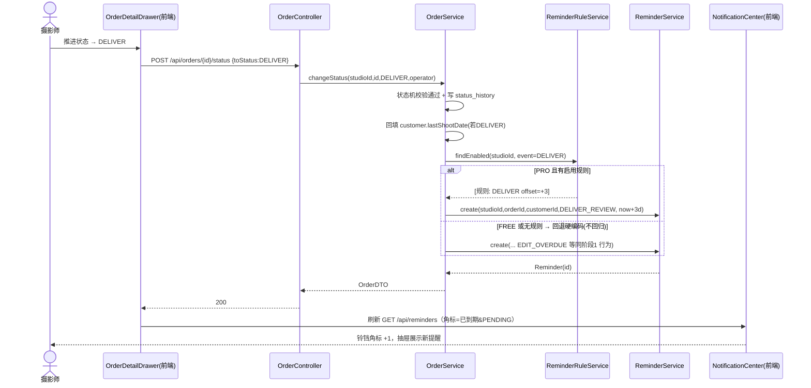
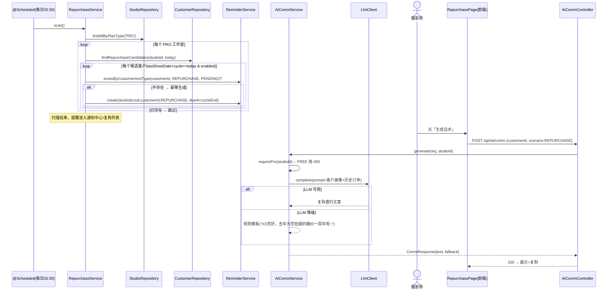
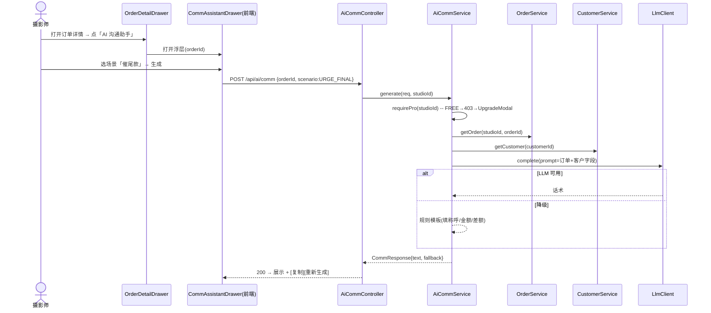
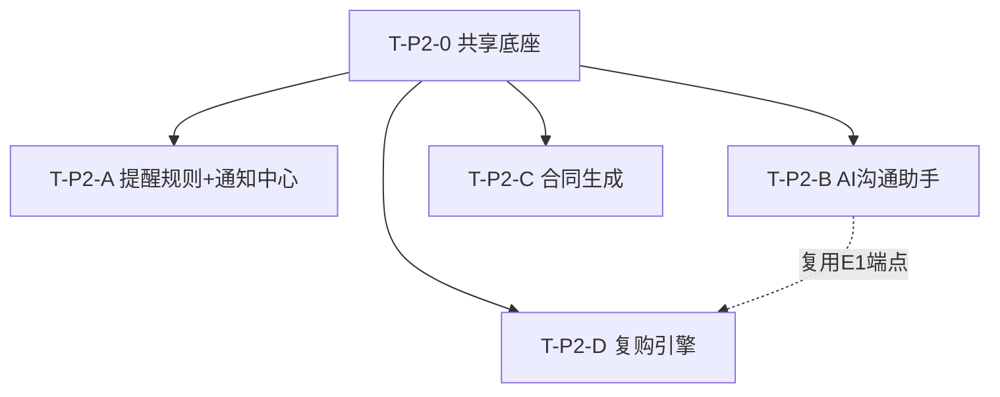

# 摄影师的 AI 接单跟单助手 — 阶段2 增量架构设计 + 任务分解（P1 五项）

> 文档：架构设计 v2.0（增量版）
> 作者：架构师 高见远（Gao）
> 日期：2026-07-23
> 范围：**仅阶段2 增量（P1 五项）**，复用阶段1 MVP（v1.0）能力，最小变更原则
> 配套文件：`class-diagram-phase2.mermaid`、`sequence-diagram-phase2.mermaid`
> 基线：`architecture.md`（v1.0）、`prd-phase2.md`（v2.0）

---

## 1. 增量实现方案 + 框架选型

### 1.1 是否沿用阶段1 技术栈 → **完全沿用，零框架新增**

| 层 | 阶段1 选型 | 阶段2 处理 | 说明 |
|---|---|---|---|
| 前端 | Vite + React + MUI + Tailwind + TanStack Query + Zustand + Axios | **沿用** | 仅新增页面/组件/API 模块，不引入新 UI 框架 |
| 后端 | Spring Boot 3.2 / Java 17 / JPA / Security / Validation | **沿用** | 新增 4 个 module 包 + 重构 2 个既有 Service |
| 存储 | PostgreSQL 16 + Flyway | **沿用** | 新增迁移 `V2__phase2.sql`（建表/改表/种子） |
| AI | `LlmClient`（Spring `RestClient` 调 OpenAI 兼容）+ 降级 | **复用** | 沟通助手/复购话术复用同一 `LlmClient` 与降级模式，不新增 SDK |
| 定时 | — | **新增 `@Scheduled`** | Spring 自带，仅需 `@EnableScheduling`，无第三方依赖 |
| 模板 | — | **无引擎依赖** | 合同采用纯字符串占位符替换（自建轻量引擎），不引入 FreeMarker/Thymeleaf |
| 导出 | — | **前端 Blob 下载** | 合同下载 `.md/.txt` 由前端 `Blob` 实现，后端仅返回文本 |

**结论**：阶段2 **不新增任何第三方依赖**（Maven `pom.xml` 与 `package.json` 均无需改动）。唯一新增的是 Spring 原生 `@EnableScheduling` 注解与 Flyway 迁移文件。

### 1.2 架构模式（沿用 + 增量）

- **后端分层**：沿用 Controller → Service → Repository。新增 `reminder` / `contract` / `repurchase` 三个 module 包，遵循既有 `ai`、`order` 包的同一种分层与 `CurrentUser.getStudioId()` 多租户隔离。
- **PRO 门禁统一入口**：新增 `QuotaService.requirePro(studioId)`，所有 P1-1/2/4/5 写/生成入口统一调用，FREE 抛 `PRO_REQUIRED(403)`。后端 403 是**最终防线**（即使前端灰显被绕过也拦截）。
- **LLM 降级统一入口**：复用 `LlmClient.complete(prompt)`，密钥缺失/调用失败/解析失败抛 `IllegalStateException`，上层 `try-catch` 降级为规则模板话术（不报错、不空）。沟通助手与复购话术共用同一降级逻辑。
- **提醒机制统一**：扩展既有 `reminder` 表 + `ReminderService`，新增 `reminder_rule` 表驱动"可配置触发"。阶段1 硬编码 3 类提醒对 FREE 继续生效（不回归），PRO 走规则表，关闭规则即不生成。
- **复购引擎**：`customer` 扩画像字段；`@Scheduled` 每日扫描 PRO 工作室，按 `last_shoot_date + repurchase_cycle_days` 幂等生成 `REPURCHASE` 提醒；话术复用沟通助手（`POST /api/ai/comm` + `scenario=REPURCHASE`）。

### 1.3 关键难点与对策

| 难点 | 对策 |
|---|---|
| 提醒规则 vs 阶段1 硬编码不回归 | `OrderService.triggerReminders` 重构：PRO 且有启用规则→读规则；FREE 或无规则→回退硬编码 3/1/3/7（与阶段1 完全一致） |
| 复购幂等（不重复生成） | `reminder` 扩 `customer_id`；扫描前 `existsByStudioIdAndCustomerIdAndTypeAndStatus(...PENDING)` 去重；按客户+周期窗口唯一 |
| `last_shoot_date` 来源 | 订单到达 `DELIVER` 时 `OrderService` 回填客户 `last_shoot_date = max(原值, shoot_date)`，并按 `shoot_type` 默认周期（无则 365） |
| LLM 抖动不影响业务 | 沟通助手/复购话术全部 `try-catch` → 规则模板兜底；PRO 不计免费额度（不调 `checkAiQuoteLimit`） |
| 合同模板替换残留 | 自建替换引擎遍历 `{{key}}`，未匹配 key 保留原文并打日志（不抛错）；下载前前端可二次校验 |
| 定时任务多租户 | `@Scheduled` 先查 `studio.plan_type='PRO'` 工作室列表，逐 studio 扫描其客户，避免误触 FREE |

---

## 2. 文件变更清单

> 约定：`+` 新增文件，`~` 修改文件。路径相对 `photographer-ai-backend/` 与 `photographer-ai-web/`。

### 2.1 数据库 / 迁移

| 文件 | 动作 | 改动 |
|---|---|---|
| `src/main/resources/db/migration/V2__phase2.sql` | **+** | 新建 `reminder_rule`、`contract_template` 表；`customer` 扩画像字段；`reminder` 扩 `customer_id`；内置合同模板种子数据 |
| `src/main/resources/application.yml` | ~ | （可选）`@Scheduled` 无需配置；如需可调扫描时间窗加 `app.repurchase.cron` 配置项 |

### 2.2 后端新增文件

| 文件 | 说明 |
|---|---|
| `modules/reminder/ReminderRule.java` | 提醒规则实体（`event/offsetDays/enabled/channel`） |
| `modules/reminder/ReminderRuleRepository.java` | 规则仓储（按 studio + event 查启用规则） |
| `modules/reminder/ReminderRuleService.java` | 规则 CRUD + **懒种子默认规则**（PRO 首读无规则时种入 3 条） |
| `modules/reminder/ReminderRuleController.java` | `GET/POST/PUT/DELETE /api/reminder-rules` |
| `modules/reminder/enums/ReminderTriggerEvent.java` | `DEPOSIT/SHOOT/DELIVER/REPURCHASE` |
| `modules/reminder/dto/ReminderRuleDTO.java` | 规则视图 |
| `modules/reminder/dto/ReminderRuleRequest.java` | 规则增改请求（event/offsetDays/enabled/channel） |
| `modules/ai/dto/CommRequest.java` | `{orderId?, customerId?, scenario}` |
| `modules/ai/dto/CommResponse.java` | `{text, scenario, fallback}` |
| `modules/ai/AiCommService.java` | 沟通助手：拼装 Prompt + 调 `LlmClient` + 规则降级 |
| `modules/ai/AiCommController.java` | `POST /api/ai/comm` |
| `modules/contract/ContractTemplate.java` | 合同模板实体 |
| `modules/contract/ContractTemplateRepository.java` | 模板仓储（内置 + 自定义） |
| `modules/contract/ContractService.java` | 模板列表 + 字段替换引擎 + 生成 |
| `modules/contract/ContractController.java` | `GET /api/contract-templates`、`POST /api/contracts/generate` |
| `modules/contract/dto/ContractTemplateDTO.java` | 模板视图 |
| `modules/contract/dto/ContractGenerateRequest.java` | `{orderId, templateId}` |
| `modules/contract/dto/ContractGenerateResponse.java` | `{title, content}` |
| `modules/repurchase/RepurchaseService.java` | `@Scheduled` 每日扫描 + `listTasks(studioId)` |
| `modules/repurchase/RepurchaseController.java` | `GET /api/repurchases` |
| `modules/repurchase/dto/RepurchaseTaskDTO.java` | 复购任务视图（客户/周期/触发日/状态） |

### 2.3 后端修改文件（精确到类与方法）

| 文件 | 类 / 方法 | 改动 |
|---|---|---|
| `PhotogAiApplication.java` | 类 | 加 `@EnableScheduling` |
| `common/ErrorCode.java` | 枚举 | 新增 `PRO_REQUIRED(403, "该功能为专业版专属，请升级专业版")` |
| `modules/order/enums/ReminderType.java` | 枚举 | 新增 `DELIVER_REVIEW`、`REPURCHASE`（原 3 类保留） |
| `modules/order/entity/Reminder.java` | 实体 | 新增 `customerId`（nullable）字段 + getter/setter |
| `modules/order/ReminderRepository.java` | 接口 | 新增 `findByStudioIdAndTypeAndStatus`、`existsByStudioIdAndCustomerIdAndTypeAndStatus`、`findByStudioIdAndCustomerIdAndType` |
| `modules/order/ReminderService.java` | `create` | 重载 `create(studioId, orderId, customerId, type, dueAt)`；`listByStudioAndStatus` 兼容 `customerId` |
| `modules/order/OrderService.java` | `triggerReminders` | **重构**：读 `reminder_rule`（PRO）/ 回退硬编码（FREE）；`changeStatus` 在 `to==DELIVER` 时回填 `customer.lastShootDate` + 默认 `repurchaseCycleDays` |
| `modules/order/ReminderController.java` | `list` | 新增可选 `dueOnly` 参数（通知中心角标精准化） |
| `modules/customer/entity/Customer.java` | 实体 | 扩 `lastShootDate/repurchaseCycleDays/birthday/anniversary/repurchaseEnabled/sourceChannel` |
| `modules/customer/dto/CustomerDTO.java` | DTO | 映射上述画像字段 |
| `modules/customer/dto/CustomerCreateRequest.java` | DTO | 新增可选画像字段 |
| `modules/customer/dto/CustomerUpdateRequest.java` | DTO | 新增可选画像字段 |
| `modules/customer/CustomerService.java` | `create/update/detail(from)` | 映射画像字段 |
| `modules/quota/QuotaService.java` | 类 | 注入 `StudioRepository`；新增 `requirePro(studioId)`（FREE→抛 `PRO_REQUIRED`） |
| `modules/ai/AiQuoteService.java` | （可选复用） | 不改动；`AiCommService` 独立实现 Prompt 拼装（避免耦合） |

### 2.4 前端新增文件

| 文件 | 说明 |
|---|---|
| `src/api/comm.ts` | `commApi.generate(req)` → `/ai/comm` |
| `src/api/reminderRule.ts` | `reminderRuleApi.list/create/update/remove` |
| `src/api/contract.ts` | `contractApi.templates()/generate(req)` |
| `src/api/repurchase.ts` | `repurchaseApi.list()` |
| `src/pages/ContractPage.tsx` | 合同生成页（选模板+选订单+预览+复制/下载） |
| `src/pages/ReminderRulePage.tsx` | 提醒规则设置页（PRO） |
| `src/pages/RepurchasePage.tsx` | 复购列表页（PRO） |
| `src/components/CommAssistantDrawer.tsx` | 订单详情内沟通助手浮层 |
| `src/components/NotificationCenter.tsx` | 通知中心（取代/扩展 `ReminderList`，TopBar 角标+抽屉） |

### 2.5 前端修改文件

| 文件 | 改动 |
|---|---|
| `src/types/models.ts` | `ReminderType` 增 `DELIVER_REVIEW/REPURCHASE`；`REMINDER_LABELS` 增对应文案；新增 `CommScenario/CommRequest/CommResponse/ReminderRule/ContractTemplate/ContractGenerateRequest/ContractGenerateResponse/RepurchaseTask`；`Customer` 增画像字段；`CustomerUpdateRequest/CustomerCreateRequest` 镜像 |
| `src/api/client.ts` | 响应拦截：当 `code===403` 自动打开 `UpgradeModal`（经 `uiStore.openUpgrade`），统一 PRO 拦截 |
| `src/store/uiStore.ts` | 增 `upgradeOpen` 状态 + `openUpgrade()/closeUpgrade()` |
| `src/layout/TopBar.tsx` | 用 `NotificationCenter` 替换 `ReminderList` |
| `src/layout/SideBar.tsx` | 导航新增「合同生成 / 提醒规则 / 复购引擎」（PRO 角标，FREE 灰显） |
| `src/router.tsx` | 路由新增 `/contract`、`/reminder-rules`、`/repurchases` |
| `src/pages/OrderDetailDrawer.tsx` | 增加「AI 沟通助手」按钮，打开 `CommAssistantDrawer` |
| `src/pages/CustomerDrawer.tsx` | 增加画像字段编辑（最近拍摄日/复购周期/生日/纪念日/来源渠道/复购开关） |

---

## 3. 数据模型增量

### 3.1 类图（Mermaid）

```mermaid
classDiagram
    %% 既有（仅展示与阶段2 相关的关系）
    class Studio {
        +Long id
        +String name
        +String planType  %% FREE|PRO
    }
    class Customer {
        +Long id
        +String name
        +String wechatId
        +String phone
        +String tags
        +String note
        %% 阶段2 新增画像字段
        +LocalDate lastShootDate
        +Integer repurchaseCycleDays
        +LocalDate birthday
        +LocalDate anniversary
        +Boolean repurchaseEnabled
        +String sourceChannel
    }
    class Order {
        +Long id
        +Long customerId
        +String shootType
        +BigDecimal amount
        +BigDecimal depositAmount
        +LocalDate shootDate
    }
    class Reminder {
        +Long id
        +Long orderId
        +Long customerId   %% 阶段2 新增
        +ReminderType type %% 扩 DELIVER_REVIEW/REPURCHASE
        +LocalDateTime dueAt
        +ReminderStatus status
    }

    %% 阶段2 新增
    class ReminderRule {
        +Long id
        +Long studioId
        +ReminderTriggerEvent event
        +int offsetDays   %% 负=提前
        +boolean enabled
        +String channel   %% INAPP
    }
    class ContractTemplate {
        +Long id
        +Long studioId   %% NULL=系统内置
        +String name
        +String category
        +String content  %% {{占位符}}
        +boolean builtin
        +Long createdBy
    }
    class ReminderTriggerEvent {
        <<enum>>
        DEPOSIT
        SHOOT
        DELIVER
        REPURCHASE
    }
    class ReminderType {
        <<enum>>
        DEPOSIT_DUE
        SHOOT_TOMORROW
        EDIT_OVERDUE
        DELIVER_REVIEW
        REPURCHASE
    }

    Studio "1" --> "*" Customer : 隔离
    Studio "1" --> "*" Order : 隔离
    Studio "1" --> "*" ReminderRule : 隔离
    Studio "1" --> "*" Reminder : 隔离
    Studio "1" --> "*" ContractTemplate : 内置studioId=NULL
    Customer "1" --> "*" Order
    Order "1" --> "*" Reminder : orderId
    Customer "1" --> "*" Reminder : customerId(复购)
    ReminderRule "1" ..> "触发" Reminder : event→type
    ContractTemplate "1" ..> "套用" Order : 字段替换
```

### 3.2 阶段2 迁移 SQL（`V2__phase2.sql`）

```sql
-- ============================================================
-- 阶段2 增量迁移（P1 五项）：2026-07-23
-- 幂等：所有 ALTER 用 IF NOT EXISTS / IF EXISTS
-- ============================================================

-- 1) 客户画像扩展（供复购引擎 + 沟通助手）
ALTER TABLE customer ADD COLUMN IF NOT EXISTS last_shoot_date DATE;
ALTER TABLE customer ADD COLUMN IF NOT EXISTS repurchase_cycle_days INT;
ALTER TABLE customer ADD COLUMN IF NOT EXISTS birthday DATE;
ALTER TABLE customer ADD COLUMN IF NOT EXISTS anniversary DATE;
ALTER TABLE customer ADD COLUMN IF NOT EXISTS repurchase_enabled BOOLEAN NOT NULL DEFAULT TRUE;
ALTER TABLE customer ADD COLUMN IF NOT EXISTS source_channel VARCHAR(30);  -- 微信/小红书/转介绍

-- 2) 提醒规则表（可配置触发）
CREATE TABLE IF NOT EXISTS reminder_rule (
    id          BIGSERIAL PRIMARY KEY,
    studio_id   BIGINT       NOT NULL REFERENCES studio(id),
    event       VARCHAR(20)  NOT NULL,   -- DEPOSIT | SHOOT | DELIVER | REPURCHASE
    offset_days INT          NOT NULL DEFAULT 0,   -- 负=提前(如拍摄前1天=-1)
    enabled     BOOLEAN      NOT NULL DEFAULT TRUE,
    channel     VARCHAR(20)  NOT NULL DEFAULT 'INAPP',
    created_at  TIMESTAMPTZ  NOT NULL DEFAULT now(),
    updated_at  TIMESTAMPTZ  NOT NULL DEFAULT now()
);
CREATE INDEX IF NOT EXISTS idx_reminder_rule_studio ON reminder_rule(studio_id);

-- 3) reminder 扩 customer_id（复购提醒无关联订单）
ALTER TABLE reminder ADD COLUMN IF NOT EXISTS customer_id BIGINT;
CREATE INDEX IF NOT EXISTS idx_reminder_customer ON reminder(customer_id) WHERE customer_id IS NOT NULL;

-- 4) 合同模板表（内置 studio_id=NULL）
CREATE TABLE IF NOT EXISTS contract_template (
    id          BIGSERIAL PRIMARY KEY,
    studio_id   BIGINT       REFERENCES studio(id),  -- NULL = 系统内置
    name        VARCHAR(100) NOT NULL,
    category    VARCHAR(50),
    content     TEXT         NOT NULL,                -- 含 {{占位符}}
    builtin     BOOLEAN      NOT NULL DEFAULT FALSE,
    created_by  BIGINT,
    created_at  TIMESTAMPTZ  NOT NULL DEFAULT now(),
    updated_at  TIMESTAMPTZ  NOT NULL DEFAULT now()
);
CREATE INDEX IF NOT EXISTS idx_contract_template_studio ON contract_template(studio_id);

-- 5) 内置合同模板种子（studio_id=NULL，纯字段替换，不依赖 LLM）
INSERT INTO contract_template (studio_id, name, category, content, builtin, created_by)
VALUES
(NULL, '摄影服务合同',
 'service',
 '摄影服务合同

甲方（摄影方）：{{studioName}}
乙方（客户）：{{customerName}}
联系微信：{{wechatId}}　电话：{{phone}}

一、服务项目
拍摄类型：{{shootType}}
拍摄日期：{{shootDate}}
拍摄时长：{{durationHours}} 小时　拍摄张数：约 {{photoCount}} 张
拍摄地区：{{region}}　风格：{{style}}

二、费用与支付
套餐总金额：{{amount}} 元　已付定金：{{depositAmount}} 元　尾款：{{balance}} 元。

三、交付物
精修 {{retouchCount}} 张 + 全部底片（云盘交付）。

四、其他约定
{{note}}
-------------------------
本合同由「摄影师 AI 助手」自动生成，仅供双方协商参考，正式签署前请核对信息。',
 TRUE, NULL),

(NULL, '肖像权授权书',
 'portrait',
 '肖像权授权书

授权人（乙方）：{{customerName}}
被授权人（甲方）：{{studioName}}

本人同意甲方在{{shootType}}拍摄中所摄本人肖像，用于甲方作品展示、宣传及案例分享（不含第三方商业转授权）。授权期限自{{shootDate}}起两年。

授权人签名：__________　日期：__________',
 TRUE, NULL),

(NULL, '定金协议',
 'deposit',
 '定金协议

甲方（摄影方）：{{studioName}}
乙方（客户）：{{customerName}}

乙方向甲方预约{{shootType}}拍摄，支付定金 {{depositAmount}} 元（占总金额 {{amount}} 元的 {{depositRatio}}%）。
定金支付后保留档期{{shootDate}}；乙方取消拍摄，定金按约定不予退还，可协商改期一次。

甲方：__________　乙方：__________　日期：{{shootDate}}',
 TRUE, NULL);
```

> 说明：`reminder.type` 在阶段1 为 `VARCHAR(30)` + `@Enumerated(STRING)`，新增 `DELIVER_REVIEW`/`REPURCHASE` **无需改表**，仅扩展 Java 枚举；两值长度均 < 30，安全。

---

## 4. 接口增量（7 个新增 REST 端点）

> 统一前缀 `/api`，均需 `Authorization: Bearer <jwt>`；响应统一 `{code,data,message}`；PRO 门禁 = `QuotaService.requirePro` → `PRO_REQUIRED(403)`；错误码复用阶段1 约定（`400/401/403/404/409/500`）。

| # | 方法 | 路径 | 入参 DTO | 出参 DTO | 错误码 | PRO 门禁 |
|---|---|---|---|---|---|---|
| E1 | POST | `/api/ai/comm` | `CommRequest{orderId?, customerId?, scenario}` | `CommResponse{text, scenario, fallback}` | 400 校验 / 403 / 404 订单或客户不存在 | ✅ requirePro |
| E2 | GET | `/api/reminder-rules` | query: 无 | `List<ReminderRuleDTO>` | 403 | ✅ requirePro |
| E3 | POST | `/api/reminder-rules` | `ReminderRuleRequest{event, offsetDays, enabled, channel}` | `ReminderRuleDTO` | 400 / 403 | ✅ requirePro |
| E4 | PUT | `/api/reminder-rules/{id}` | `ReminderRuleRequest`（同 E3） | `ReminderRuleDTO` | 400 / 403 / 404 | ✅ requirePro |
| E5 | DELETE | `/api/reminder-rules/{id}` | path | `void` | 403 / 404 | ✅ requirePro |
| E6 | GET | `/api/contract-templates` | query: 无（内置+本工作室自定义） | `List<ContractTemplateDTO>` | —（列表全员可见） | ❌ 仅生成 PRO |
| E7 | POST | `/api/contracts/generate` | `ContractGenerateRequest{orderId, templateId}` | `ContractGenerateResponse{title, content}` | 400 / 403 / 404 | ✅ requirePro |
| E8 | GET | `/api/repurchases` | query: 无 | `List<RepurchaseTaskDTO>` | 403 | ✅ requirePro |
| — | （内部） | `@Scheduled` 每日扫描 | — | — | — | 仅 PRO 工作室 |

> E1 复用为复购话术入口：传 `customerId` + `scenario=REPURCHASE` 即生成复购邀约（满足 US-P2-10，不另开端点）。

### 关键 DTO 示例

**CommRequest（E1）**
```json
{ "orderId": 12, "customerId": null, "scenario": "URGE_FINAL" }
// 复购话术：{ "orderId": null, "customerId": 7, "scenario": "REPURCHASE" }
```
**CommResponse（E1）**
```json
{ "text": "王小姐您好，您婚纱写真尾款 ¥1999 还差最后一步，方便时微信转我就行~",
  "scenario": "URGE_FINAL", "fallback": false }
```
**ContractGenerateResponse（E7）**
```json
{ "title": "摄影服务合同 - 王小姐-婚纱写真",
  "content": "摄影服务合同\n甲方（摄影方）：光影工作室\n乙方（客户）：王小姐\n..." }
```
**RepurchaseTaskDTO（E8）**
```json
{ "reminderId": 88, "customerId": 7, "customerName": "王小姐",
  "shootType": "婚纱写真", "lastShootDate": "2025-06-20",
  "repurchaseCycleDays": 365, "dueAt": "2026-06-20", "status": "PENDING" }
```

---

## 5. 调用流程（Mermaid 时序图）

### 5.1 ① 提醒规则触发 → 生成 reminder → 通知中心



### 5.2 ② 复购引擎 `@Scheduled` 扫描 → 生成 REPURCHASE 提醒 + LLM 话术



### 5.3 ③（补充）AI 沟通助手生成话术（批次 B）



---

## 6. 增量任务列表（按批次 A→D，含依赖）

> 原则：先做 **T-P2-0 共享底座**（所有批次依赖），之后 A/B/C/D 可并行开发；B 与 D 通过 E1 端点契约对齐（D 复购话术复用 B 的 `/api/ai/comm`）。每个任务标注：新增/修改文件、是否依赖 LLM、可并行性。

| ID | 批次 | 任务名 | 关键文件（一批写） | 依赖 | 优先级 | LLM | 可并行 |
|---|---|---|---|---|---|---|---|
| **T-P2-0** | 底座 | 共享增量底座 | `V2__phase2.sql`、`PhotogAiApplication`@EnableScheduling、`ErrorCode.PRO_REQUIRED`、`ReminderType`(+2)、`Reminder`(+customerId)、`ReminderRepository`(+3 方法)、`QuotaService.requirePro`(+StudioRepository)、`ReminderController`(+dueOnly)、`Customer` 实体/DTO/Request 画像字段、`CustomerService` 映射、`client.ts`(403→UpgradeModal)、`uiStore`(+upgradeOpen)、`models.ts`(类型/标签/画像) | 阶段1 | P0 | 否 | — |
| **T-P2-A** | A | 提醒规则 + 通知中心 | **后端+**：`reminder/ReminderRule*`(实体/Repo/Service/Controller/enums/DTO)、重构 `OrderService.triggerReminders`（读规则/回退）<br>**前端+**：`api/reminderRule.ts`、`ReminderRulePage.tsx`、`NotificationCenter.tsx`、`TopBar`(替换)、`SideBar`(导航)、`router`(路由)、`models.ts`(ReminderRule) | T-P2-0 | P0 | 否 | ✅ 与 B/C/D 并行 |
| **T-P2-B** | B | AI 沟通助手 | **后端+**：`ai/AiCommService`+`AiCommController`+`dto/CommRequest`+`dto/CommResponse`（复用 `LlmClient`+降级）<br>**前端+**：`api/comm.ts`、`CommAssistantDrawer.tsx`、`OrderDetailDrawer`(挂按钮)、`models.ts`(Comm*) | T-P2-0 | P1 | ✅ | ✅ 与 A/C 并行；D 复用其端点 |
| **T-P2-C** | C | 合同生成 | **后端+**：`contract/ContractTemplate`+`Repo`+`Service`(替换引擎)+`Controller`+`dto/*`<br>**前端+**：`api/contract.ts`、`ContractPage.tsx`、`SideBar`+`router`、`models.ts`(Contract*) | T-P2-0 | P1 | 否 | ✅ 与 A/B/D 并行 |
| **T-P2-D** | D | 复购引擎 | **后端+**：`repurchase/RepurchaseService`(@Scheduled+list)+`Controller`+`dto/RepurchaseTaskDTO`；`OrderService.changeStatus` 在 DELIVER 回填 `lastShootDate`/`repurchaseCycleDays`<br>**前端+**：`api/repurchase.ts`、`RepurchasePage.tsx`、`CustomerDrawer`(画像编辑)、`SideBar`+`router`、`models.ts`(RepurchaseTask)；复购话术调用 T-P2-B 的 `commApi.generate({customerId, scenario:REPURCHASE})` | T-P2-0,（话术依赖 T-P2-B 端点契约） | P1 | ✅ 话术 | ✅ 与 A/C 并行；话术 UI 依赖 B |

### 任务依赖图（Mermaid）



### 实现提示（给工程师）

- **T-P2-0 最关键**：`requirePro` 以 `Studio.planType` 为唯一真源（注入 `StudioRepository`）；`reminder_rule` 默认规则采用**懒种子**——`ReminderRuleService.listByStudio` 在 PRO 且无规则时种入 `DEPOSIT+3 / SHOOT-1 / DELIVER+3`，避免迁移耦合。
- **T-P2-A**：`triggerReminders` 重构后，FREE 路径必须与阶段1 硬编码 `3/1/7` 完全一致（不回归验收点）。
- **T-P2-B/D 共用降级**：`AiCommService` 内置 `buildFallback(scenario, order/customer)`，LLM 异常即返回 `fallback=true`。
- **T-P2-C 替换引擎**：遍历 `{{key}}` 正则，key 集合 = `{studioName,customerName,wechatId,phone,shootType,shootDate,durationHours,photoCount,region,style,amount,depositAmount,balance,retouchCount,depositRatio,note}`；未匹配保留原占位符并 warn。
- **T-P2-D 扫描时间窗**：默认 `cron = "0 30 2 * * ?"`（每日 02:30），可由 `application.yml` 的 `app.repurchase.cron` 覆盖（默认方案，见 §8）。

---

## 7. 共享约定增量（阶段2 新增/确认）

| 约定项 | 内容 |
|---|---|
| **PRO 门禁统一入口** | `QuotaService.requirePro(studioId)`：读 `Studio.planType`，非 `PRO` 抛 `BizException(ErrorCode.PRO_REQUIRED)`。被 E1/E2-E5/E7/E8 的 Service 入口调用；控制器不重复判断。 |
| **新增错误码** | `PRO_REQUIRED(403, "该功能为专业版专属，请升级专业版")`。HTTP 状态仍为 **403**，与阶段1 `FORBIDDEN` 共用状态码，仅语义文案更精准。 |
| **reminder.type 枚举扩展** | 新增 `DELIVER_REVIEW`（交付后求好评）、`REPURCHASE`（复购）；原 `DEPOSIT_DUE/SHOOT_TOMORROW/EDIT_OVERDUE` 保留。**仅 Java 枚举扩展，不改库**（VARCHAR 列）。 |
| **LLM 降级统一入口** | 复用 `LlmClient.complete(prompt)`；`AiCommService` 与复购话术均 `try-catch(IllegalStateException)` → 规则模板兜底，返回 `fallback=true`。密钥/模型走 `application.yml` 环境变量，不入库。 |
| **403 → UpgradeModal 复用确认** | 前端 `api/client.ts` 响应拦截：当 `body.code === 403` 时调用 `useUiStore.getState().openUpgrade()` 打开既有 `UpgradeModal`（按当前路由/功能注入差异文案），并 reject。阶段1 仅处理 401；阶段2 补 403 统一拦截，**后端 403 为最终防线**。 |
| **多租户隔离** | 所有新增查询（规则/模板/复购/合同）均按 `CurrentUser.getStudioId()` 过滤；`contract_template` 内置行 `studio_id IS NULL` 对所有 studio 可见，自定义行仅本 studio。 |
| **reminder 复用** | 复购提醒复用 `reminder` 表（`type=REPURCHASE`、`customer_id` 非空、`order_id` 可空）；通知中心/复购列表共用同一数据源，避免双写。 |
| **免费版不回归** | 阶段1 硬编码 3 类站内提醒、AI 报价 5 次/月、≤10 单，阶段2 一律不变；PRO 才走 `reminder_rule` 与复购。 |
| **命名** | 后端驼峰 DTO；前端 `types/models.ts` 镜像枚举/字段；REST 路径全小写中划线；新增 module 包名 `reminder/contract/repurchase`。 |

---

## 8. 待明确事项（架构层拍板点，均已给默认方案，不阻塞）

| # | 拍板点 | 默认方案（先这么做） |
|---|---|---|
| 1 | **合同生成格式：PDF vs 文本/Markdown** | 阶段2 仅生成 **Markdown/纯文本**（前端 Blob 下载 `.md/.txt` + 复制）。不引入 PDF 库；如需 PDF 留 P3（可用 `pdfkit`/后端渲染）。不阻塞。 |
| 2 | **复购扫描时间窗** | 默认每日 **02:30**（`cron="0 30 2 * * ?"`），可由 `application.yml` 的 `app.repurchase.cron` 覆盖。无实时推送 SLA，通知中心按 `due_at≤now` 亮起。不阻塞。 |
| 3 | **复购周期默认值** | 按 `shoot_type` 默认：婚纱写真/亲子/宝宝照/毕业 → **365 天**；用户可在客户档案覆盖 `repurchase_cycle_days`、填生日/纪念日。`repurchase_enabled` 默认 `true`。不阻塞。 |
| 4 | **生日/纪念日关怀任务** | 默认**不做**独立关怀提醒类型（仅收集字段，供画像/未来用）。若需，作为 P3 新增 `ReminderType` + 规则。不阻塞。 |
| 5 | **提醒规则 `REPURCHASE` 项** | `reminder_rule` 含 `REPURCHASE` 事件行（仅启停 + 额外偏移 `offset_days`，默认 0），供统一配置；实际周期取自 `customer.repurchase_cycle_days`。不阻塞。 |
| 6 | **合同模板自定义上传** | 阶段2 仅内置 2–3 套（摄影服务合同/肖像权授权书/定金协议），纯字段替换、不依赖 LLM。用户自定义上传留 P3。不阻塞。 |
| 7 | **沟通助手是否直发** | 阶段2 **仅生成+复制**（无微信/短信通道），直发留 P3。不阻塞（与 PRD Q1 一致）。 |
| 8 | **PRO 切换/支付** | 阶段2 不接支付；演示/测试时手动 `UPDATE studio SET plan_type='PRO'`，或预留 `QuotaService` 同写 `studio.plan_type`。支付留 P3。不阻塞。 |

---

*阶段2 增量架构结束 — 回传主理人齐活林评审，并交工程师按 T-P2-0 → A/B/C/D 实现。*
