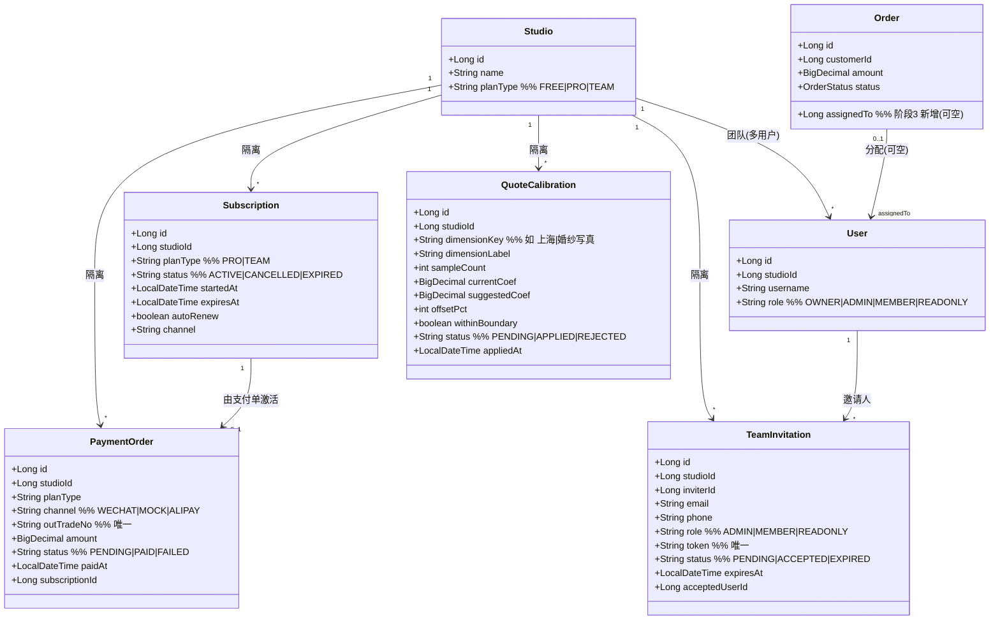
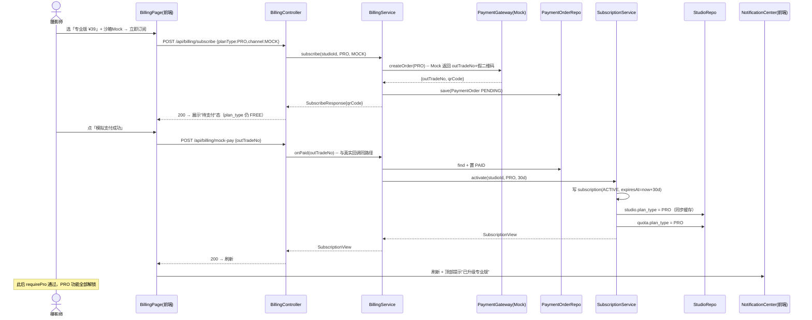
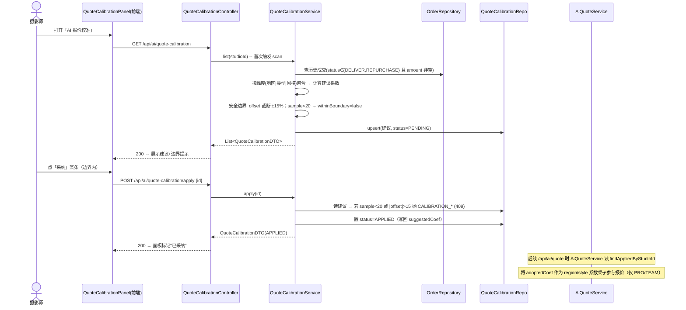
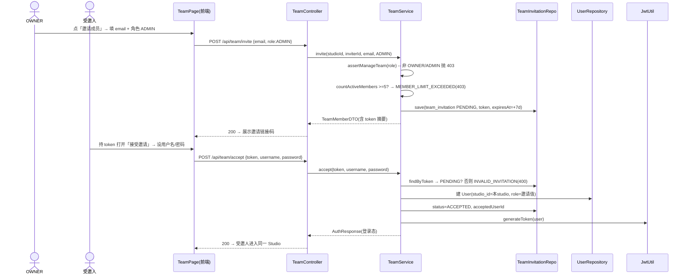
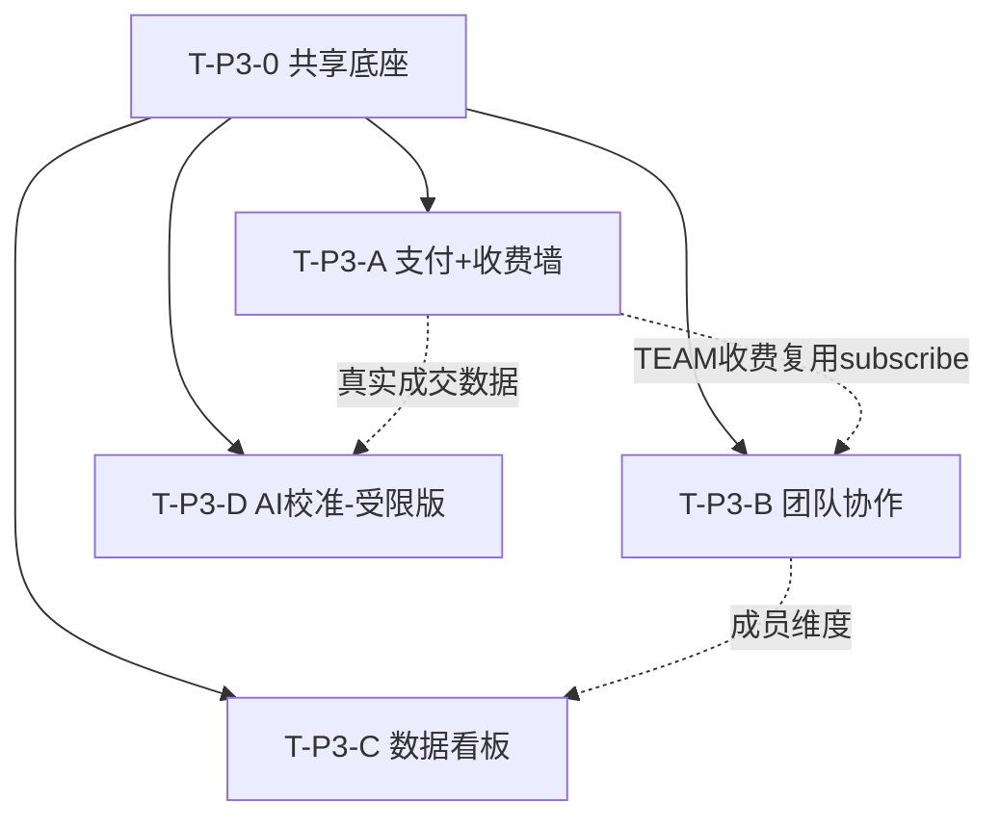

# 摄影师的 AI 接单跟单助手 — 阶段3 增量架构设计 + 任务分解（P2 五项）

> 文档：架构设计 v3.0（增量版）
> 作者：架构师 高见远（Gao）— 因专用架构师 agent 临时不可用，由我以高见远视角独立产出，标准与高见远一致（结构化、含 Mermaid 图、最小变更、精确到文件路径）
> 日期：2026-07-24
> 范围：**仅阶段3 增量（批次 A 支付接入 / B 团队协作 / C 数据看板 / D AI 自学习报价-受限版）**；小程序独立立项「阶段3-B」，不在本增量
> 基线：`architecture.md`（v1.0）、`architecture-phase2.md`（v2.0）、`prd-phase3.md`（v3.0）
> 配套文件：`class-diagram-phase3.mermaid`、`sequence-diagram-phase3.mermaid`

---

## 0. 设计总纲（最小变更原则）

- **复用优先**：阶段1/2 技术栈（Spring Boot 3.2 / JPA / PostgreSQL / Flyway / React / MUI / Tailwind / TanStack Query / Zustand / Axios）**零框架新增**；AI 复用既有 `LlmClient`（RestClient 调 OpenAI 兼容）降级模式；定时复用既有 `@EnableScheduling`。
- **统一真源**：阶段1/2 的 PRO 真源是 `studio.plan_type` 手动置位；阶段3 起 **PRO 真源改为"有效订阅（`subscription` 表有效期）"**，`QuotaService.requirePro` 改为委托 `SubscriptionService.isPro`，不破坏既有 phase2 五项的门禁调用点。
- **不回归**：阶段1 免费额度（≤10 单 / AI 5 次/月 / 基础提醒）、阶段2 五项 PRO 门禁**全部保持**，仅新增"支付真实生效"与"TEAM 档位 + 团队功能"。
- **新依赖收敛**：
  - 后端 **不引新 Maven 依赖**（支付与 LLM 同理用 Spring 内置 `RestClient`）。
  - 前端 **仅新增 `recharts`**（图表库，理由见 §1.1）。
  - 迁移新增 `V3__phase3.sql`，**不动 V1/V2**。

---

## 1. 增量实现方案 + 框架选型

### 1.1 是否沿用 + 新增依赖

| 层 | 阶段1/2 选型 | 阶段3 处理 | 说明 |
|---|---|---|---|
| 前端 | Vite + React + MUI + Tailwind + TanStack Query + Zustand + Axios | **沿用** | 仅新增页面/组件/API 模块，新增 1 个图表库 `recharts` |
| 后端 | Spring Boot 3.2 / Java 17 / JPA / Security / Validation | **沿用** | 新增 `billing` / `team` / `dashboard` 三个 module 包；`ai` 包扩校准子模块；重构 `QuotaService` 与 `Studio.planType` |
| 存储 | PostgreSQL 16 + Flyway | **沿用** | 新增迁移 `V3__phase3.sql`（建 4 张表 + `orders` 扩列 + 种子常量） |
| 支付 | — | **新增 `RestClient` 调微信支付** | 同 `LlmClient` 模式：定义 `PaymentGateway` 接口，`WechatPaymentGateway`（RestClient 调 `/v3/pay/transactions` 等）+ `MockPaymentGateway`（沙箱全闭环，零外部依赖）；`app.payment.mock=true` 切换。**不引微信官方 SDK**。 |
| AI | `LlmClient`（RestClient + 降级） | **复用** | 批次 D 校准"建议文案"可选复用 `LlmClient.chat`，主逻辑为规则计算，LLM 缺失即降级（不阻塞） |
| 定时 | 阶段2 已 `@EnableScheduling` | **复用** | 新增 `SubscriptionService.expireOverdue()` 每日扫描降 FREE；批次 D 校准扫描可 `@Scheduled` 或按需触发 |
| 图表 | — | **新增 Recharts** | 选 **Recharts**（React 组件式、体积小、与 MUI/Tailwind 风格融合好）做收入趋势折线 / 漏斗柱状。不引 ECharts（体积大、命令式 API 与 React 心智不符，除非后续需复杂下钻/3D 再评估）。 |

**结论**：阶段3 **后端 Maven `pom.xml` 零改动**；前端 `package.json` 仅加 `recharts` 一项依赖。

### 1.2 架构模式（沿用 + 增量）

- **分层**：沿用 Controller → Service → Repository。新增 `billing` / `team` / `dashboard` 三个 module 包，遵循 `ai` / `order` 包的同一种分层与 `CurrentUser.getStudioId()` 多租户隔离。
- **订阅有效期判定统一入口（核心）**：新增 `billing/SubscriptionService`，提供 `isPro(studioId)` / `isTeam(studioId)` / `getPlanType(studioId)` / `requirePro` / `requireTeam`。**`QuotaService.requirePro` 改为委托 `SubscriptionService.isPro`**（PRO 或 TEAM 均视为"已解锁专业能力"）。后端 403 仍是最终防线。
- **支付网关统一入口**：`PaymentGateway` 接口 + `MockPaymentGateway`（默认开发/沙箱可用）+ `WechatPaymentGateway`（RestClient 实现，缺商户号时优雅降级为"待配置"）。`BillingService` 编排"下单→支付单→回调/ mock→置订阅→置 plan_type"。
- **角色矩阵统一入口**：`team/RoleGuard` 静态方法（`assertManageTeam` / `assertManageBilling` / `assertWriteOrder` …）在 Service 入口校验；越权抛 `TEAM_REQUIRED(403)` / `FORBIDDEN(403)`。
- **校准安全边界统一入口**：`ai/QuoteCalibrationService` 常量 `MAX_OFFSET_PCT=15`、`MIN_SAMPLE=20`；超边界/样本不足仅产出"仅供参考"建议，不写回。
- **复用约定**：通知中心继续读 `reminder` 表；升级/到期通知沿用"扩展 `ReminderType` 枚举（Java 枚举扩展，不改库）+ 前端 Toast"双通道（见 §7）。

### 1.3 关键难点与对策

| 难点 | 对策 |
|---|---|
| PRO 真源从 plan_type 切到订阅，怕双写不一致 | `SubscriptionService` 为唯一真源，`QuotaService.requirePro` 与 `getPlanType` 全部委托它；`studio.plan_type`、`quota.plan_type` 仅作为"展示缓存"，在订阅生效/到期时同步更新，且 `isPro` 以 `subscription.expires_at > now` 为准（懒校验 + 定时任务双保险） |
| 微信支付商户号未到位阻塞开发 | 默认 `app.payment.mock=true`：`MockPaymentGateway` 走与真实回调**完全相同**的状态机（生成订阅/置 PRO），全程不连外部；`/api/billing/mock-pay` 仅在 mock=true 或非 prod 暴露，生产禁用 |
| TEAM 与 PRO 关系 | 互斥：一个 studio 同时仅一个有效订阅；TEAM = PRO 全部能力 + 协作权限，¥99/月；PRO = ¥39/月 单人；二者均使 `isPro=true` |
| 团队角色矩阵复杂 | `RoleGuard` 集中在 Service 入口校验，不散落 Controller；READONLY 仅读、MEMBER 可 CRUD 订单客户不可改团队/计费、ADMIN≈OWNER 不可退订/转让、OWNER 全权 |
| 删除成员丢订单 | `orders.assigned_to` 可空；删除成员时其名下订单 `assigned_to` 置 NULL（回退未分配），不级联删 |
| 校准自动覆盖风险 | 受限版：仅产出"建议 + 安全边界"，**采纳需人工确认**才写回；超 ±15% 截断并标注"已达边界"，样本 <20 仅"仅供参考" |
| 看板要不要埋点 | 不埋点：核心指标全由 `orders` / `status_history` / `customer` 聚合得出（PRD Q4 默认方案） |
| 前端图表库选型 | 选 Recharts（轻量、React 友好、与现有栈融合好），不引 ECharts |

---

## 2. 文件变更清单

> 约定：`+` 新增文件，`~` 修改文件。路径相对 `photographer-ai-backend/` 与 `photographer-ai-web/`。精确到阶段1/2 具体类。

### 2.1 数据库 / 迁移 / 配置

| 文件 | 动作 | 改动 |
|---|---|---|
| `src/main/resources/db/migration/V3__phase3.sql` | **+** | 新建 `subscription` / `payment_order` / `team_invitation` / `quote_calibration` 4 表；`orders` 扩 `assigned_to`；索引；可选内置校准安全边界常量不入库（走代码常量） |
| `src/main/resources/application.yml` | ~ | 增 `app.payment.mock`（默认 true）、`app.payment.channel`（WECHAT/ALIPAY）、`app.payment.wechat.*`（mchid/appid/key 占位，缺省时网关降级）、`app.subscription.expire-cron`（默认 `0 0 4 * * ?`） |

### 2.2 后端新增文件（批次 A 支付 / 收费墙）

| 文件 | 说明 |
|---|---|
| `modules/billing/entity/Subscription.java` | 订阅实体（studioId/planType[PRO/TEAM]/status[ACTIVE/CANCELLED/EXPIRED]/startedAt/expiresAt/autoRenew/channel） |
| `modules/billing/entity/PaymentOrder.java` | 支付单实体（studioId/planType/channel[WECHAT/MOCK/ALIPAY]/outTradeNo 唯一/amount/status[PENDING/PAID/FAILED]/paidAt/subscriptionId） |
| `modules/billing/SubscriptionRepository.java` | `findActiveByStudioId`（status=ACTIVE and expiresAt>now）、`findDue(expiresAt<now and status=ACTIVE)` |
| `modules/billing/PaymentOrderRepository.java` | `findByOutTradeNo`、`findByStudioIdAndStatus` |
| `modules/billing/SubscriptionService.java` | **统一入口**：`isPro` / `isTeam` / `getPlanType` / `requirePro` / `requireTeam`；`activate(studioId,planType,months)`（写订阅+同步 `studio.plan_type`/`quota.plan_type`）；`cancelAutoRenew`；`@Scheduled expireOverdue()`（到期降 FREE，`ReminderType.SUBSCRIPTION_EXPIRED` 通知） |
| `modules/billing/PaymentGateway.java` | 接口：`createOrder(planType)→{outTradeNo,payUrl/qrCode}`、`verifyAndParse(rawBody)→outTradeNo` |
| `modules/billing/MockPaymentGateway.java` | 沙箱实现：直接回 `outTradeNo` + 假二维码；`verifyAndParse` 直接返回传入 `outTradeNo` |
| `modules/billing/WechatPaymentGateway.java` | `RestClient` 调微信支付 `/v3/pay/transactions/native`；商户号缺省时构造抛 `PAYMENT_FAILED` 并提示"待配置"；签名/回调验签留标准实现位（真实商户到位后填） |
| `modules/billing/PaymentConfig.java` | 装配 `RestClient` + 读 `app.payment.*`；按 `mock` 决定注入 Mock 还是 Wechat 网关 |
| `modules/billing/BillingService.java` | 编排：subscribe→建 PaymentOrder(PENDING)+网关下单；onPaid(outTradeNo)→activate 订阅+置 PRO/TEAM+通知；getSubscription(studioId)；cancel |
| `modules/billing/BillingController.java` | `POST /api/billing/subscribe`、`POST /api/billing/notify/{channel}`、`POST /api/billing/mock-pay`、`GET /api/billing/subscription`、`POST /api/billing/cancel` |
| `modules/billing/dto/{SubscribeRequest,SubscribeResponse,PaymentNotifyRequest,SubscriptionView,SubscriptionCancelRequest}.java` | DTO |

### 2.3 后端新增文件（批次 B 团队）

| 文件 | 说明 |
|---|---|
| `modules/team/entity/TeamInvitation.java` | 邀请实体（studioId/inviterId/email/phone/role/token 唯一/status[PENDING/ACCEPTED/EXPIRED]/expiresAt/acceptedUserId） |
| `modules/team/TeamInvitationRepository.java` | `findByToken`、`findPendingByStudioId`、`countActiveMembers(studioId)` |
| `modules/team/RoleGuard.java` | 角色矩阵静态校验：`assertManageTeam(role)`、`assertManageBilling(role)`（OWNER/ADMIN）、`assertWriteOrder(role)`（非 READONLY）、`assertOwnerOrAdmin(role)` |
| `modules/team/TeamService.java` | 邀请/接受/改角色/移除/列表；成员上限校验（TEAM ≤5）；`accept` 按 token 建 `User`（studio_id 绑定、角色取邀请值） |
| `modules/team/TeamController.java` | `POST /api/team/invite`、`GET /api/team/members`、`PUT /api/team/members/{id}`、`DELETE /api/team/members/{id}`、`POST /api/team/accept` |
| `modules/team/dto/{TeamInviteRequest,TeamMemberDTO,AcceptInvitationRequest}.java` | DTO |
| `modules/order/entity/Order.java` | ~ 实体新增 `assignedTo`（可空 Long）字段 + getter/setter |
| `modules/order/OrderRepository.java` | ~ 新增 `findByStudioIdAndAssignedTo` |
| `modules/order/OrderService.java` | ~ 新增 `assign(studioId,orderId,memberId,operator)`（OWNER/ADMIN 可分配；删除成员时回退 NULL） |
| `modules/order/OrderController.java` | ~ 新增 `POST /api/orders/{id}/assign` |

### 2.4 后端新增文件（批次 C 看板）

| 文件 | 说明 |
|---|---|
| `modules/dashboard/DashboardService.java` | 只读聚合：收入（Σ amount，按 status/时间窗）、订单数、客单价 AOV、转化率（status_history 漏斗）、复购率（重复 customer / 总客户）、收入趋势（按月/日分组）、按成员业绩（`assigned_to`） |
| `modules/dashboard/DashboardController.java` | `GET /api/dashboard/overview`(range)、`GET /api/dashboard/funnel`(range)、`GET /api/dashboard/members`(requireTeam) |
| `modules/dashboard/dto/{OverviewDTO,FunnelDTO,MemberPerfDTO,RevenuePointDTO}.java` | DTO |

### 2.5 后端新增文件（批次 D 校准）

| 文件 | 说明 |
|---|---|
| `modules/ai/entity/QuoteCalibration.java` | 校准建议实体（studioId/dimensionKey[如 `上海|婚纱写真`]/dimensionLabel/sampleCount/currentCoef/suggestedCoef/offsetPct/withinBoundary/status[PENDING/APPLIED/REJECTED]/appliedAt） |
| `modules/ai/QuoteCalibrationRepository.java` | `findByStudioIdAndStatus`、`findAppliedByStudioId`（status=APPLIED，供报价读取） |
| `modules/ai/QuoteCalibrationService.java` | 扫描历史成交单（status∈{DELIVER,REPURCHASE} 且 amount 非空）按维度聚合并计算建议系数；`MAX_OFFSET_PCT=15`、`MIN_SAMPLE=20` 安全边界；`scan(studioId)`、`list(studioId)`、`apply(id)`（写回+置 APPLIED）、`reject(id)` |
| `modules/ai/QuoteCalibrationController.java` | `GET /api/ai/quote-calibration`、`POST /api/ai/quote-calibration/apply` |
| `modules/ai/dto/{QuoteCalibrationDTO,QuoteCalibrationApplyRequest}.java` | DTO |

### 2.6 后端修改文件（精确到类/方法）

| 文件 | 类 / 方法 | 改动 |
|---|---|---|
| `common/ErrorCode.java` | 枚举 | 新增 `PAYMENT_REQUIRED(402,"需订阅后支付")`、`PAYMENT_FAILED(400,"支付失败")`、`SUBSCRIPTION_EXPIRED(403,"订阅已到期，请续费")`、`SUBSCRIPTION_NOT_FOUND(404,"无有效订阅")`、`TEAM_REQUIRED(403,"该功能需团队版")`、`INVALID_INVITATION(400,"邀请无效或已过期")`、`MEMBER_LIMIT_EXCEEDED(403,"团队人数已达上限")`、`CALIBRATION_SAMPLE_INSUFFICIENT(409,"样本不足，建议仅供参考")`、`CALIBRATION_OUT_OF_BOUND(409,"超出安全边界")` |
| `modules/studio/entity/Studio.java` | 实体 | `planType` 注释扩 `FREE\|PRO\|TEAM`（列本身 VARCHAR，无需改 DDL；仅接受新值） |
| `modules/quota/QuotaService.java` | `requirePro` | **重构**：改调 `subscriptionService.isPro(studioId)`（PRO 或 TEAM 均通过）；`getQuota`/`checkAiQuoteLimit`/`ensureWithinLimit` 中 `"FREE".equals(planType)` 判断改为 `!subscriptionService.isPro(studioId)`。注入 `SubscriptionService` |
| `modules/quota/entity/Quota.java` | 实体 | `planType` 仅作展示缓存，订阅生效/到期时同步（不改类型） |
| `modules/auth/entity/User.java` | 实体 | `role` 注释扩 `OWNER\|ADMIN\|MEMBER\|READONLY`（VARCHAR 无需改 DDL） |
| `modules/auth/AuthService.java` | `register` | `planType` 仍默认 FREE；JWT 中 `role` 仍写 `user.getRole()`（不变） |
| `modules/ai/AiQuoteService.java` | 类 | 注入 `QuoteCalibrationService`；`computeRule` 读取已采纳校准（`findAppliedByStudioId`）作为 region/style 系数乘子（仅 PRO/TEAM 生效；FREE 不走校准）。缺校准表数据时降级为原规则（不报错） |
| `modules/order/enums/ReminderType.java` | 枚举 | 新增 `SUBSCRIPTION_UPGRADED`、`SUBSCRIPTION_EXPIRED`（仅 Java 枚举，不改库） |
| `modules/ai/LlmClient.java` | （可选复用） | 不改动；批次 D 文案可选复用 `chat()`，缺失即降级 |

### 2.7 前端新增文件

| 文件 | 说明 |
|---|---|
| `src/api/billing.ts` | `billingApi.subscribe/notify/mockPay/getSubscription/cancel` |
| `src/api/team.ts` | `teamApi.invite/members/updateRole/remove/accept` |
| `src/api/dashboard.ts` | `dashboardApi.overview/funnel/members` |
| `src/api/quoteCalibration.ts` | `calibrationApi.list/apply` |
| `src/pages/BillingPage.tsx` | 订阅/支付页（套餐选择、支付二维码/跳转、当前订阅状态、过期黄条入口） |
| `src/pages/TeamPage.tsx` | 团队成员管理（邀请/角色/移除/分配） |
| `src/pages/DashboardPage.tsx` | 经营看板（指标卡 + 收入趋势折线 + 漏斗 + 复购；按成员拆分） |
| `src/pages/QuoteCalibrationPanel.tsx` | AI 自学习校准面板（建议值 + 采纳/驳回 + 安全边界提示） |
| `src/components/UpgradeModal.tsx` | ~ 增强：区分"新购 / 续费 / 团队版"文案（读 `upgradeMessage`） |

### 2.8 前端修改文件

| 文件 | 改动 |
|---|---|
| `src/types/models.ts` | `PlanType` 扩 `'TEAM'`；新增 `SubscriptionView` / `SubscriptionStatus` / `PaymentChannel` / `SubscribeRequest` / `SubscribeResponse` / `TeamInvitation` / `TeamMember` / `AcceptInvitationRequest` / `TeamRole` / `OverviewDTO` / `FunnelDTO` / `MemberPerfDTO` / `RevenuePointDTO` / `QuoteCalibration` / `QuoteCalibrationApplyRequest`；`User.role` 注释扩四态；`Order` 增 `assignedTo?`；`REMINDER_LABELS` 增 `SUBSCRIPTION_UPGRADED/SUBSCRIPTION_EXPIRED` |
| `src/api/client.ts` | 响应拦截：当 `code===403 && message` 含"团队"时打开团队版引导；其余 403 仍 `openUpgrade`（沿用）。新增 402 `PAYMENT_REQUIRED` → 跳 BillingPage |
| `src/store/uiStore.ts` | `upgradeOpen` 已具备；可选增 `expiredBanner` 状态（顶部黄条"已到期，续费继续"） |
| `src/store/authStore.ts` | `Studio.planType` 类型随 `PlanType` 扩 TEAM（由 models.ts 传导，无需大改） |
| `src/layout/TopBar.tsx` | 用户菜单展示 `FREE/专业版/团队版`；`SUBSCRIPTION_EXPIRED` 时顶部黄条 |
| `src/layout/SideBar.tsx` | 导航新增「数据看板」(PRO/TEAM 角标)、「团队」(TEAM 角标)、「订阅/升级」入口；`isFree` 逻辑兼容 TEAM（TEAM 视为已解锁专业能力） |
| `src/router.tsx` | 路由新增 `/billing`、`/team`、`/dashboard`、`/quote-calibration` |
| `src/pages/OrderDetailDrawer.tsx` | 订单详情增加「分配给」下拉（团队版可用） |
| `package.json` | `dependencies` 增 `recharts`（唯一新增前端依赖） |

---

## 3. 数据模型增量

### 3.1 类图（Mermaid）



### 3.2 阶段3 迁移 SQL（`V3__phase3.sql`）

```sql
-- ============================================================
-- 阶段3 增量迁移（P2 四项，不含小程序独立工程）：2026-07-24
-- 幂等：CREATE 用 IF NOT EXISTS；ALTER 用 IF NOT EXISTS。
-- 不改动 V1/V2 既有表与列定义。
-- ============================================================

-- 1) 订阅表（PRO/TEAM 有效期的唯一真源）
CREATE TABLE IF NOT EXISTS subscription (
    id          BIGSERIAL PRIMARY KEY,
    studio_id   BIGINT       NOT NULL REFERENCES studio(id),
    plan_type   VARCHAR(20)  NOT NULL,            -- PRO | TEAM
    status      VARCHAR(20)  NOT NULL DEFAULT 'ACTIVE', -- ACTIVE | CANCELLED | EXPIRED
    started_at  TIMESTAMPTZ  NOT NULL DEFAULT now(),
    expires_at  TIMESTAMPTZ  NOT NULL,            -- 到期时间（激活时 = started_at + 30d）
    auto_renew  BOOLEAN      NOT NULL DEFAULT TRUE,
    channel     VARCHAR(20),                      -- WECHAT | ALIPAY | MOCK
    created_at  TIMESTAMPTZ  NOT NULL DEFAULT now(),
    updated_at  TIMESTAMPTZ  NOT NULL DEFAULT now()
);
CREATE INDEX IF NOT EXISTS idx_subscription_studio ON subscription(studio_id);
CREATE INDEX IF NOT EXISTS idx_subscription_active ON subscription(studio_id, status, expires_at);

-- 2) 支付单表（下单→支付→激活订阅）
CREATE TABLE IF NOT EXISTS payment_order (
    id             BIGSERIAL PRIMARY KEY,
    studio_id      BIGINT       NOT NULL REFERENCES studio(id),
    plan_type      VARCHAR(20)  NOT NULL,         -- PRO | TEAM
    channel        VARCHAR(20)  NOT NULL,         -- WECHAT | ALIPAY | MOCK
    out_trade_no   VARCHAR(64)  NOT NULL UNIQUE,  -- 支付通道商户订单号
    amount         NUMERIC(12,2) NOT NULL,
    status         VARCHAR(20)  NOT NULL DEFAULT 'PENDING', -- PENDING | PAID | FAILED
    paid_at        TIMESTAMPTZ,
    subscription_id BIGINT      REFERENCES subscription(id),
    created_at     TIMESTAMPTZ  NOT NULL DEFAULT now(),
    updated_at     TIMESTAMPTZ  NOT NULL DEFAULT now()
);
CREATE INDEX IF NOT EXISTS idx_payment_order_studio ON payment_order(studio_id);
CREATE INDEX IF NOT EXISTS idx_payment_order_out ON payment_order(out_trade_no);

-- 3) 团队邀请表
CREATE TABLE IF NOT EXISTS team_invitation (
    id             BIGSERIAL PRIMARY KEY,
    studio_id      BIGINT       NOT NULL REFERENCES studio(id),
    inviter_id     BIGINT       NOT NULL REFERENCES users(id),
    email          VARCHAR(120),
    phone          VARCHAR(30),
    role           VARCHAR(20)  NOT NULL,         -- ADMIN | MEMBER | READONLY
    token          VARCHAR(64)  NOT NULL UNIQUE,  -- 接受邀请凭证
    status         VARCHAR(20)  NOT NULL DEFAULT 'PENDING', -- PENDING | ACCEPTED | EXPIRED
    expires_at     TIMESTAMPTZ  NOT NULL,          -- 默认邀请后 7d
    accepted_user_id BIGINT     REFERENCES users(id),
    created_at     TIMESTAMPTZ  NOT NULL DEFAULT now(),
    updated_at     TIMESTAMPTZ  NOT NULL DEFAULT now()
);
CREATE INDEX IF NOT EXISTS idx_team_invitation_studio ON team_invitation(studio_id);
CREATE INDEX IF NOT EXISTS idx_team_invitation_token ON team_invitation(token);

-- 4) 报价校准建议表（受限版：建议+采纳留痕，不自动覆盖）
CREATE TABLE IF NOT EXISTS quote_calibration (
    id              BIGSERIAL PRIMARY KEY,
    studio_id       BIGINT       NOT NULL REFERENCES studio(id),
    dimension_key   VARCHAR(80)  NOT NULL,        -- 如 上海|婚纱写真 或 上海|婚纱写真|轻奢
    dimension_label VARCHAR(120) NOT NULL,        -- 展示名
    sample_count    INT          NOT NULL DEFAULT 0,
    current_coef    NUMERIC(8,4) NOT NULL DEFAULT 1.0,
    suggested_coef  NUMERIC(8,4) NOT NULL DEFAULT 1.0,
    offset_pct      INT          NOT NULL DEFAULT 0,  -- 建议在 -15..+15 截断
    within_boundary BOOLEAN      NOT NULL DEFAULT TRUE,
    status          VARCHAR(20)  NOT NULL DEFAULT 'PENDING', -- PENDING | APPLIED | REJECTED
    applied_at      TIMESTAMPTZ,
    created_at      TIMESTAMPTZ  NOT NULL DEFAULT now(),
    updated_at      TIMESTAMPTZ  NOT NULL DEFAULT now()
);
CREATE INDEX IF NOT EXISTS idx_quote_calibration_studio ON quote_calibration(studio_id);

-- 5) orders 扩 assigned_to（订单分配成员，可空）
ALTER TABLE orders ADD COLUMN IF NOT EXISTS assigned_to BIGINT REFERENCES users(id);
CREATE INDEX IF NOT EXISTS idx_orders_assigned ON orders(studio_id, assigned_to) WHERE assigned_to IS NOT NULL;

-- 说明：studio.plan_type 列本身为 VARCHAR(20)，直接接受 'TEAM' 新值，无需 ALTER；
--       users.role 列同理接受 'ADMIN'/'READONLY'，无需 ALTER。
--       安全边界常量（MAX_OFFSET_PCT=15 / MIN_SAMPLE=20）写在 QuoteCalibrationService，不入库。
```

---

## 4. 接口增量

> 统一前缀 `/api`，均需 `Authorization: Bearer <jwt>`；响应统一 `{code,data,message}`；门禁：`requirePro`（PRO/TEAM 通过）/ `requireTeam`（仅 TEAM）；错误码复用阶段1 约定（400/401/403/404/409/500）+ 阶段3 新增（402 `PAYMENT_REQUIRED` 等，见 §2.6）。

### 4.1 批次 A 支付 / 收费墙

| # | 方法 | 路径 | 入参 DTO | 出参 DTO | 错误码 | 门禁 |
|---|---|---|---|---|---|---|
| A1 | POST | `/api/billing/subscribe` | `SubscribeRequest{planType:PRO\|TEAM, channel:WECHAT\|MOCK\|ALIPAY}` | `SubscribeResponse{outTradeNo, payUrl, qrCode, amount}` | 400 校验 / 402 未配置支付 / 403 TEAM 需 PRO 先购?（互斥，直接购 TEAM 即可） | ❌（本就是升级入口） |
| A2 | POST | `/api/billing/notify/{channel}` | `PaymentNotifyRequest{rawBody, signature}` | `void`（回 `success` 给通道） | 400 验签失败 | ❌（通道回调，按 outTradeNo 定位） |
| A3 | POST | `/api/billing/mock-pay` | `{outTradeNo}` | `SubscriptionView` | 400 / 403（非 mock 环境禁用） | ❌（沙箱） |
| A4 | GET | `/api/billing/subscription` | query: 无 | `SubscriptionView{planType,status,expiresAt,autoRenew}` | — | ❌ |
| A5 | POST | `/api/billing/cancel` | `SubscriptionCancelRequest{reason?}` | `void` | 403 / 404 | ❌（OWNER/ADMIN） |

### 4.2 批次 B 团队

| # | 方法 | 路径 | 入参 DTO | 出参 DTO | 错误码 | 门禁 |
|---|---|---|---|---|---|---|
| B1 | POST | `/api/team/invite` | `TeamInviteRequest{email?,phone?,role:ADMIN\|MEMBER\|READONLY}` | `TeamMemberDTO`（含 token 摘要） | 400 / 403（非 OWNER/ADMIN）/ 403 MEMBER_LIMIT_EXCEEDED | ✅ requireTeam |
| B2 | GET | `/api/team/members` | query: 无 | `List<TeamMemberDTO>` | 403 | ✅ requireTeam |
| B3 | PUT | `/api/team/members/{id}` | `{role}` | `TeamMemberDTO` | 400 / 403 / 404 | ✅ requireTeam（OWNER/ADMIN） |
| B4 | DELETE | `/api/team/members/{id}` | path | `void`（其订单 assigned_to 回退 NULL） | 403 / 404 | ✅ requireTeam（OWNER/ADMIN） |
| B5 | POST | `/api/team/accept` | `AcceptInvitationRequest{token, username?, password}` | `AuthResponse`（登录态） | 400 INVALID_INVITATION / 409 已接受 | ❌（匿名可访问） |
| B6 | POST | `/api/orders/{id}/assign` | `{memberId}` | `OrderDTO` | 400 / 403（READONLY 不可分配）/ 404 | ✅ 订单写权限（非 READONLY） |

### 4.3 批次 C 看板

| # | 方法 | 路径 | 入参 | 出参 DTO | 错误码 | 门禁 |
|---|---|---|---|---|---|---|
| C1 | GET | `/api/dashboard/overview` | `?from=&to=`（默认近 30 天） | `OverviewDTO{revenue,orderCount,aov,repurchaseRate,conversion}` | 403 | ✅ requirePro |
| C2 | GET | `/api/dashboard/funnel` | `?from=&to=` | `FunnelDTO{CONSULT,DEPOSIT,SHOOT,EDIT,DELIVER 各层 count/rate}` | 403 | ✅ requirePro |
| C3 | GET | `/api/dashboard/members` | `?from=&to=` | `List<MemberPerfDTO>{memberId,name,orderCount,revenue,aov}` | 403 TEAM_REQUIRED | ✅ requireTeam |

### 4.4 批次 D 校准

| # | 方法 | 路径 | 入参 | 出参 DTO | 错误码 | 门禁 |
|---|---|---|---|---|---|---|
| D1 | GET | `/api/ai/quote-calibration` | query: 无 | `List<QuoteCalibrationDTO>{sampleCount,currentCoef,suggestedCoef,offsetPct,withinBoundary,status}` | 403 | ✅ requirePro |
| D2 | POST | `/api/ai/quote-calibration/apply` | `QuoteCalibrationApplyRequest{id}` | `QuoteCalibrationDTO`（status=APPLIED） | 400 / 403 / 409（样本不足或越界不可采纳）/ 404 | ✅ requirePro |

> 注：批次 D 的"扫描历史成交生成建议"由 `QuoteCalibrationService.scan(studioId)` 提供，可在 `GET /api/ai/quote-calibration` 时懒触发（样本不足返回空/仅供参考），无需独立端点。

### 4.5 关键 DTO 示例

**SubscribeResponse（A1）**
```json
{ "outTradeNo": "P20260724-8841", "payUrl": "weixin://wxpay/bizpayurl?pr=xxx",
  "qrCode": "data:image/png;base64,...", "amount": 39.00 }
```
**SubscriptionView（A4）**
```json
{ "planType": "PRO", "status": "ACTIVE", "expiresAt": "2026-08-23T12:00:00Z", "autoRenew": true }
```
**TeamMemberDTO（B2）**
```json
{ "id": 7, "username": "小李", "email": "li@wx", "role": "MEMBER", "orderCount": 12 }
```
**OverviewDTO（C1）**
```json
{ "revenue": 42800.00, "orderCount": 32, "aov": 1337.50,
  "repurchaseRate": 0.18, "conversion": { "consult":50, "deposit":32, "shoot":28, "deliver":26 } }
```
**QuoteCalibrationDTO（D1）**
```json
{ "dimensionLabel": "上海·婚纱写真", "sampleCount": 24, "currentCoef": 1.00,
  "suggestedCoef": 1.08, "offsetPct": 8, "withinBoundary": true, "status": "PENDING" }
```

---

## 5. 调用流程（Mermaid 时序图）

### 5.1 ① 支付下单 → mock 支付 → 回调 → 置 PRO（批次 A）



### 5.2 ② AI 校准扫描历史成交 → 生成建议 → 人工确认 → 写回系数（批次 D）



### 5.3 ③（补充）团队邀请 → 接受 → 加入 Studio（批次 B）



---

## 6. 增量任务列表（按批次 A→D 顺序，含依赖）

> 原则：先 **T-P3-0 共享底座**（所有批次依赖），之后 A/B/C/D 可并行开发；B 的"TEAM 收费"复用 A 的 subscribe，权限模型本身可与 A 并行；C 成员维度依赖 B；D 功能独立、建议后置。每个任务标注：新增/修改文件、是否依赖支付/微信/LLM、可并行性。

| ID | 批次 | 任务名 | 关键文件（一批写） | 依赖 | 优先级 | 依赖支付/微信/LLM | 可并行 |
|---|---|---|---|---|---|---|---|
| **T-P3-0** | 底座 | 共享增量底座 | `V3__phase3.sql`、`Studio.planType`(TEAM 注释)、`ErrorCode`(+8)、`User.role`(四态注释)、`QuotaService.requirePro`(委托 SubscriptionService.isPro) + 注入 `SubscriptionService`、`ReminderType`(+2)、`models.ts`(PlanType 扩 TEAM + 全部 DTO 类型)、`client.ts`(403/402 分流)、`uiStore`(expiredBanner)、`SideBar`/`TopBar`(TEAM 兼容)`application.yml`(payment.*) | 阶段2 | P0 | 否 | — |
| **T-P3-A** | A | 支付接入 + 收费墙 | **后端+**：`billing/`(Subscription/PaymentOrder 实体+Repo+`SubscriptionService`+`PaymentGateway`+`MockPaymentGateway`+`WechatPaymentGateway`+`PaymentConfig`+`BillingService`+`BillingController`+dto)、`PhotogAiApplication`(无需改，已有 @EnableScheduling)、`QuotaService`(getQuota/checkAiQuoteLimit 改读 isPro)<br>**前端+**：`api/billing.ts`、`BillingPage.tsx`、`UpgradeModal`(文案增强)、`SideBar`+`router`(订阅入口)、`models.ts`(Subscription*) | T-P3-0 | P0 | ✅ 支付/微信(mock 默认) | ✅ 与 B/C/D 并行 |
| **T-P3-B** | B | 团队协作 | **后端+**：`team/`(TeamInvitation 实体/Repo/`RoleGuard`/`TeamService`/`TeamController`/dto)、`Order`(+assignedTo)+`OrderRepository`(+findByAssignedTo)+`OrderService.assign`+`OrderController`(+assign)<br>**前端+**：`api/team.ts`、`TeamPage.tsx`、`OrderDetailDrawer`(分配下拉)、`SideBar`+`router`、`models.ts`(Team*) | T-P3-0（收费复用 T-P3-A 的 subscribe，可并行开发） | P1 | 否 | ✅ 与 A/C/D 并行；收费依赖 A |
| **T-P3-C** | C | 数据看板 | **后端+**：`dashboard/`(`DashboardService`+`DashboardController`+dto)，复用 `OrderRepository`/`StatusHistoryRepository`/`CustomerRepository`<br>**前端+**：`api/dashboard.ts`、`DashboardPage.tsx`(Recharts 折线/漏斗)、`SideBar`+`router`、`models.ts`(Overview/Funnel/MemberPerf/RevenuePoint) | T-P3-0；成员维度依赖 T-P3-B | P1 | 否 | ✅ 与 A/B/D 并行；成员拆分依赖 B |
| **T-P3-D** | D | AI 自学习报价-受限版 | **后端+**：`ai/`(QuoteCalibration 实体/Repo/`QuoteCalibrationService`(scan+apply+安全边界)/`QuoteCalibrationController`/dto)；`AiQuoteService` 注入 `QuoteCalibrationService` 读取已采纳系数<br>**前端+**：`api/quoteCalibration.ts`、`QuoteCalibrationPanel.tsx`、`SideBar`+`router`、`models.ts`(QuoteCalibration*) | T-P3-0（真实成交数据随 A 更可信，但功能独立） | P1 | ⚠️ LLM 可选 | ✅ 与 A/B/C 并行 |

### 任务依赖图（Mermaid）



### 实现提示（给工程师）

- **T-P3-0 最关键**：`SubscriptionService.isPro(studioId)` = `subscriptionRepository.findActiveByStudioId(studioId)` 非空（status=ACTIVE 且 `expiresAt > now`）。`QuotaService.requirePro` 改为 `if (!subscriptionService.isPro(studioId)) throw PRO_REQUIRED`；TEAM 也通过（因 `isPro` 不区分 PRO/TEAM）。`requireTeam` 额外要求 `planType == TEAM`。
- **T-P3-A**：mock 是默认闭环，`WechatPaymentGateway` 仅留 RestClient 骨架 + 缺商户号优雅降级；生产环境 `app.payment.mock=false` 时 `/api/billing/mock-pay` 直接 403 禁用。`expireOverdue()` 每日 04:00 跑，将到期订阅置 EXPIRED 并 `studio.plan_type`/`quota.plan_type` 回 FREE + `ReminderType.SUBSCRIPTION_EXPIRED` 通知。
- **T-P3-B**：`RoleGuard` 集中校验，避免散落 Controller；邀请 token 用 `UUID` + 过期 7d；`accept` 建用户时 `role` 取邀请值，密码由受邀人设。删除成员前将其 `assigned_to` 订单置 NULL。
- **T-P3-C**：聚合全部走 JPQL/原生 SQL，不新增表；`repurchaseRate` 用"有 ≥2 笔订单的 customer 数 / 总 customer 数"或 `customer.repurchase_enabled` 标记近似；漏斗用 `status_history` 统计到达各状态的不同订单数。
- **T-P3-D**：扫描只在 `GET /api/ai/quote-calibration` 懒触发；`offsetPct` 截断到 `[-15, +15]`，`withinBoundary = |offset|<=15 && sample>=20`；未达标仅展示"仅供参考"，`apply` 时对不达标项抛 409 拒绝写回。校准系数作为 region/style 乘子叠加到 `AiQuoteService.computeRule`（不替代原规则，仅微调）。

---

## 7. 共享约定增量（阶段3 新增/确认）

| 约定项 | 内容 |
|---|---|
| **plan_type 枚举** | `FREE`（默认）/ `PRO`（¥39/月 单人）/ `TEAM`（¥99/月 2–5 人）。列本身 VARCHAR，直接接受新值，无需 DDL。`Studio.planType` 与 `Quota.planType` 为"展示缓存"，由订阅生命周期同步。 |
| **订阅有效期判定统一入口** | `SubscriptionService.isPro(studioId)`（PRO 或 TEAM 有效订阅即通过）、`isTeam(studioId)`（仅 TEAM）、`getPlanType(studioId)`。`QuotaService.requirePro` 委托 `isPro`；新增 `requireTeam`。后端 403 为最终防线。 |
| **支付 mock 开关** | `application.yml` 的 `app.payment.mock`（默认 `true` 开发/沙箱）、`app.payment.channel=WECHAT`、`app.payment.wechat.*` 占位。Mock 网关全闭环可跑通；`/api/billing/mock-pay` 仅在 `mock=true` 或非 prod 暴露，生产禁用。 |
| **校准安全边界常量** | `QuoteCalibrationService.MAX_OFFSET_PCT = 15`、`MIN_SAMPLE = 20`。单次偏移超 ±15% 截断并标"已达边界"；样本 <20 仅"仅供参考"；采纳需人工确认；不自动覆盖线上系数。 |
| **角色矩阵** | `OWNER`（全权）/ `ADMIN`（≈OWNER，不可退订/转让/改所有权）/ `MEMBER`（CRUD 订单客户，不可改团队与计费）/ `READONLY`（仅读订单/客户/日历）。`RoleGuard` 集中校验，越权抛 `TEAM_REQUIRED(403)` / `FORBIDDEN(403)`。所有数据仍按 `studio_id` 隔离。 |
| **新增错误码** | `PAYMENT_REQUIRED(402)`、`PAYMENT_FAILED(400)`、`SUBSCRIPTION_EXPIRED(403)`、`SUBSCRIPTION_NOT_FOUND(404)`、`TEAM_REQUIRED(403)`、`INVALID_INVITATION(400)`、`MEMBER_LIMIT_EXCEEDED(403)`、`CALIBRATION_SAMPLE_INSUFFICIENT(409)`、`CALIBRATION_OUT_OF_BOUND(409)`。HTTP 状态沿用既定约定（`403` 与 `PRO_REQUIRED`/`FORBIDDEN` 共用）。 |
| **403 → UpgradeModal 复用确认** | 前端 `client.ts` 响应拦截：`code===403` 仍 `openUpgrade`；若 `message` 含"团队"则注入团队版引导文案；新增 `code===402 PAYMENT_REQUIRED` → 跳 `/billing`。后端 403 为最终防线。顶部"已到期"黄条由 `uiStore.expiredBanner` + `TopBar` 渲染。 |
| **通知中心复用** | `ReminderType` 扩 `SUBSCRIPTION_UPGRADED` / `SUBSCRIPTION_EXPIRED`（仅 Java 枚举，不改库）；升级/到期时写 reminder 行，通知中心铃铛角标复用阶段2 机制；同时前端 `showToast` 即时反馈。 |
| **免费版不回归** | 阶段1 ≤10 单 / AI 5 次/月 / 基础提醒、阶段2 五项 PRO 门禁**全部不变**；新增"看板/团队"入口 FREE 可见但 PRO/TEAM 拦截。 |
| **多租户隔离** | 所有新增表（`subscription/payment_order/team_invitation/quote_calibration`）均带 `studio_id` 并按 `CurrentUser.getStudioId()` 过滤；`payment_order.out_trade_no`、`team_invitation.token` 唯一。 |
| **前端图表库** | 选 **Recharts**（唯一新增前端依赖）；与 MUI/Tailwind 风格一致，组件式、体积小。 |
| **命名** | 后端驼峰 DTO；前端 `types/models.ts` 镜像枚举/字段；REST 路径全小写中划线；新增 module 包名 `billing` / `team` / `dashboard`。 |

---

## 8. 待明确事项（架构层拍板点，均已给默认方案，不阻塞）

| # | 拍板点 | 默认方案（先这么做） |
|---|---|---|
| 1 | **支付真实通道时机** | 先微信支付打通（与微信/小程序生态一致），支付宝后置；沙箱 `mock-pay` 先跑通全状态机，商户资质到位后切真实通道。不阻塞。 |
| 2 | **TEAM 与 PRO 关系** | 互斥：一个 studio 同时仅一个有效订阅；TEAM = PRO 全部能力 + 协作，¥99/月；PRO = ¥39/月 单人。二者均使 `isPro=true`。不阻塞。 |
| 3 | **团队版成员上限** | 默认 2–5 人（硬上限 5，超员需升档或后续按人加价，本阶段先硬限 5）。`MEMBER_LIMIT_EXCEEDED(403)` 拦截。不阻塞。 |
| 4 | **看板时间范围** | 默认支持「近 30 天 / 本季度 / 自定义」；指标由现有表聚合，不埋点。如需导出 CSV/对接财务后置。不阻塞。 |
| 5 | **校准样本阈值/边界** | 默认 `MIN_SAMPLE=20`、`MAX_OFFSET_PCT=15`、三维（地区\|类型\|风格）分别校准、采纳需人工确认、不自动覆盖。阈值可配置在 `QuoteCalibrationService` 常量。不阻塞。 |
| 6 | **退款/续费/发票** | 阶段3 先做"新购 + 自动续费开关 + 到期降级"；退款与发票（涉及商户平台与合规）作为后续增强，不阻塞首版闭环。不阻塞。 |
| 7 | **邀请接受方式** | 默认 `accept` 端点凭 token 建用户（受邀人自设用户名/密码），绑定同一 studio；不做邮件/短信发送（仅返回邀请链接/码由 OWNER 自传）。不阻塞。 |
| 8 | **校准是否可选 LLM 生成建议文案** | 默认主逻辑规则计算（历史成交均值比），`LlmClient.chat` 仅可选生成"建议说明文案"，缺失即降级为规则文本。不阻塞。 |

---

*阶段3 增量架构结束 — 回传主理人齐活林评审，并交工程师按 T-P3-0 → A/B/C/D 实现。小程序独立立项「阶段3-B」另开 `architecture-miniprogram.md`，复用本阶段落地后的 REST API。*
