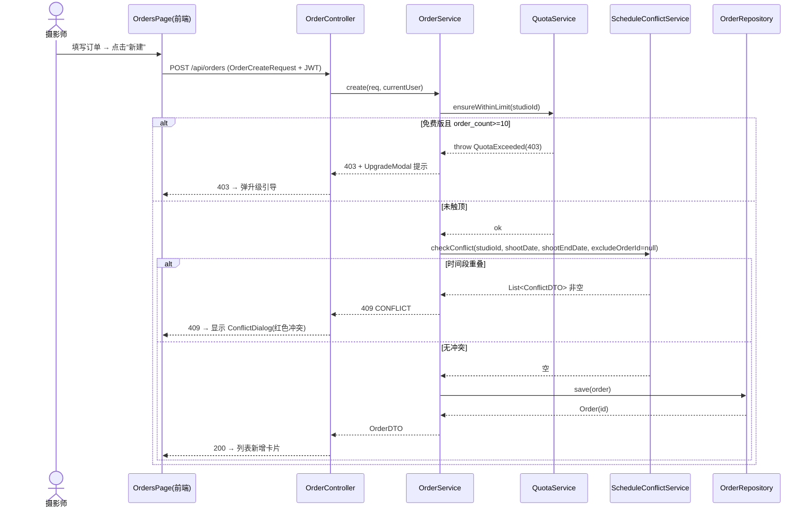
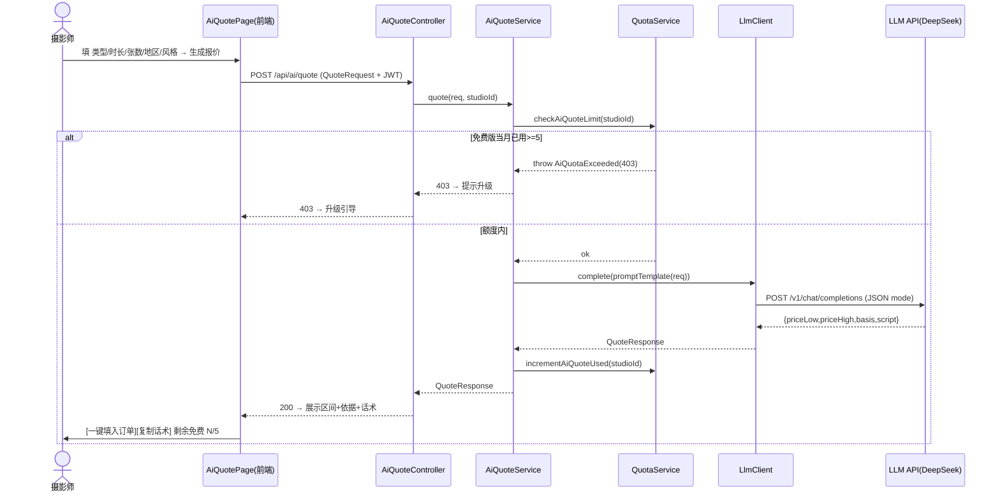
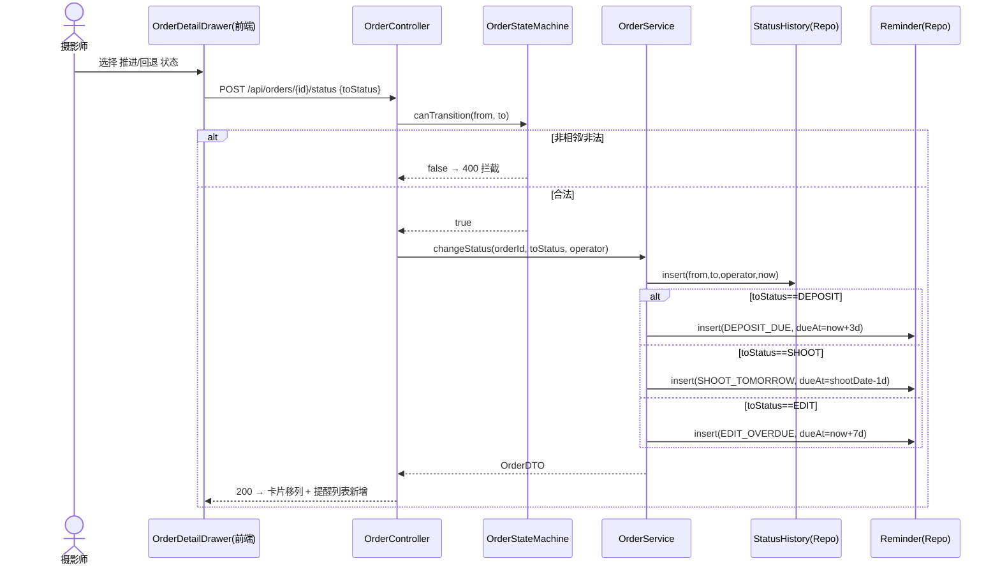
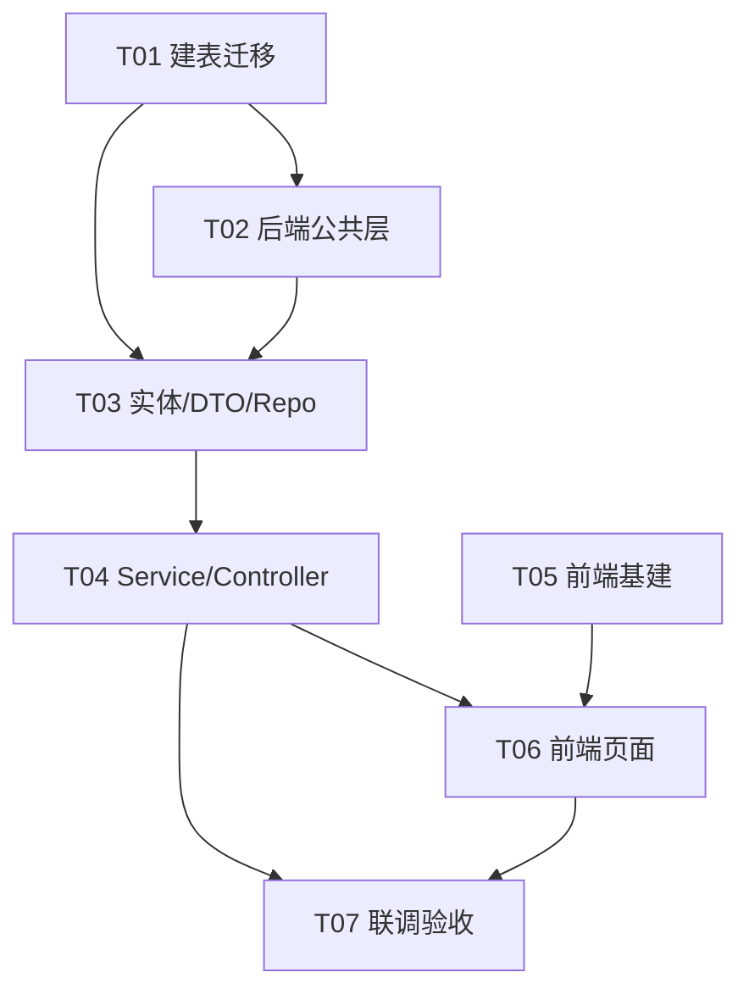

# 摄影师的 AI 接单跟单助手 — 架构设计 + 任务分解（阶段1 MVP）

> 文档：架构设计 v1.0
> 作者：架构师 高见远（Gao）
> 日期：2026-07-23
> 范围：**仅阶段1 MVP（P0 需求）**，不展开 P1/P2
> 配套文件：`class-diagram.mermaid`、`sequence-diagram.mermaid`

---

## 1. 实现方案与框架选型

### 1.1 技术栈（结合客户 Java 强项）

| 层 | 选型 | 版本 | 选型理由 |
|---|---|---|---|
| 前端构建 | Vite | ^5 | 极速冷启动/HMR，契合 React + TS |
| 前端框架 | React | ^18.3 | 客户指定；生态成熟 |
| UI 组件 | MUI (Material UI) | ^5 | 客户指定；组件全、可深度定制主题到 `#2D6CDF`/`#1A1A1A` |
| 样式 | Tailwind CSS | ^3 | 客户指定；与 MUI 互补做布局/间距原子类 |
| 路由 | react-router-dom | ^6 | SPA 路由 |
| 服务端状态 | TanStack Query | ^5 | 订单/客户列表缓存、失效刷新，省手写 fetching |
| 客户端状态 | Zustand | ^4 | 轻量存 token/UI 态，无样板 |
| HTTP | Axios | ^1 | 统一拦截注入 JWT、401 跳登录 |
| 日期 | dayjs + @mui/x-date-pickers | latest | 日期选择/展示，时区 Asia/Shanghai |
| **后端** | **Java Spring Boot** | **3.2+ (Java 17)** | **客户强项**；约定优于配置；生态完整 |
| Web | spring-boot-starter-web | — | REST 控制器 |
| 持久化 | spring-boot-starter-data-jpa + Hibernate | — | 实体映射、Repository 省 CRUD |
| 安全 | spring-boot-starter-security + JJWT | 0.12.x | JWT 鉴权（MVP 简单账号体系） |
| 校验 | spring-boot-starter-validation | — | 入参 @Valid |
| **存储** | **PostgreSQL** | **16** | 客户指定；JSONB/日期/索引成熟 |
| 迁移 | Flyway | — | 版本化建表（`V1__init.sql`） |
| **AI 接入** | **OpenAI 兼容 HTTP（Spring RestClient）** | — | **Prompt 工程为主、不训模型**；后端用 RestClient 调 LLM `/chat/completions` |
| 工具 | Lombok | — | 省 getter/setter |

### 1.2 架构模式

- **后端**：经典分层 + 轻 DDD。Controller → Service → Repository；实体带领域行为（如 `Order` 状态流转由 `OrderStateMachine` 校验）。
- **AI 报价**：Provider 无关设计。`LlmClient` 仅对接 OpenAI 兼容协议，模型/密钥/BaseURL 全部走配置，**默认 DeepSeek（国内合规、成本低）**，可切通义/智谱不改代码。
- **多租户预留**：所有业务表带 `studio_id`，查询强制按当前用户所属 studio 隔离。MVP 仅单 studio 单人，但 `studio`/`user` 表已建模，P2 团队协作零改造接入。
- **前端**：Feature-based（按页面/模块组织），API 层集中、组件复用、MUI 主题统一两主色。

### 1.3 关键难点与对策

| 难点 | 对策 |
|---|---|
| 状态流非法跳变 | `OrderStateMachine` 白名单相邻流转；每次变更写 `status_history` 留痕 |
| 档期冲突 | 保存前按 `studio_id + shoot_date/shoot_end_date` 时间段重叠查询；**硬阻断**（409）+ 前端冲突弹窗 |
| 免费额度 | `quota` 表按月计数；建单前校验 `order_count ≤ 10`，AI 报价前校验 `ai_quote_used_month < 5`（FREE） |
| AI 限次/成本 | 限额在 Service 层拦截；LLM 输出要求 JSON，后端强解析 + 兜底默认区间 |
| 不抽成/数据归属 | 订单/客户均为用户自有数据，导出 API 预留（P1） |

---

## 2. 文件列表及相对路径

### 2.1 仓库结构（前后端分离两仓，或 mono-repo 子目录）

```
software-photographer-ai/
├── architecture.md
├── class-diagram.mermaid
├── sequence-diagram.mermaid
├── photographer-ai-backend/              # Spring Boot (Maven)
│   ├── pom.xml
│   └── src/main/
│       ├── java/com/photogai/
│       │   ├── PhotogAiApplication.java
│       │   ├── config/
│       │   │   ├── SecurityConfig.java
│       │   │   ├── JwtFilter.java
│       │   │   ├── LlmConfig.java
│       │   │   └── OpenApiConfig.java
│       │   ├── common/
│       │   │   ├── Result.java              # {code,data,message}
│       │   │   ├── ErrorCode.java           # 错误码枚举
│       │   │   ├── BaseEntity.java          # id/createdAt/updatedAt/deletedAt
│       │   │   └── CurrentUser.java         # 当前用户上下文解析
│       │   ├── exception/
│       │   │   ├── BizException.java
│       │   │   └── GlobalExceptionHandler.java
│       │   └── modules/
│       │       ├── auth/
│       │       │   ├── AuthController.java
│       │       │   ├── AuthService.java
│       │       │   ├── UserService.java
│       │       │   ├── UserRepository.java
│       │       │   ├── JwtUtil.java
│       │       │   └── dto/{LoginRequest,RegisterRequest,AuthResponse}.java
│       │       ├── studio/
│       │       │   ├── StudioRepository.java
│       │       │   └── entity/Studio.java
│       │       ├── customer/
│       │       │   ├── CustomerController.java
│       │       │   ├── CustomerService.java
│       │       │   ├── CustomerRepository.java
│       │       │   ├── entity/Customer.java
│       │       │   └── dto/{CustomerDTO,CustomerCreateRequest,CustomerUpdateRequest}.java
│       │       ├── order/
│       │       │   ├── OrderController.java
│       │       │   ├── OrderService.java
│       │       │   ├── OrderRepository.java
│       │       │   ├── ScheduleConflictService.java
│       │       │   ├── entity/{Order,StatusHistory,Reminder}.java
│       │       │   ├── enums/{OrderStatus,ReminderType,ReminderStatus}.java
│       │       │   ├── statemachine/OrderStateMachine.java
│       │       │   └── dto/{OrderDTO,OrderCreateRequest,OrderUpdateRequest,
│       │       │           StatusChangeRequest,ConflictDTO}.java
│       │       ├── schedule/
│       │       │   ├── ScheduleController.java
│       │       │   ├── ScheduleService.java
│       │       │   └── dto/ScheduleDTO.java
│       │       ├── ai/
│       │       │   ├── AiQuoteController.java
│       │       │   ├── AiQuoteService.java
│       │       │   ├── LlmClient.java
│       │       │   └── dto/{QuoteRequest,QuoteResponse}.java
│       │       └── quota/
│       │           ├── QuotaService.java
│       │           ├── QuotaRepository.java
│       │           └── entity/Quota.java
│       └── resources/
│           ├── application.yml
│           └── db/migration/V1__init.sql
└── photographer-ai-web/                  # Vite + React + MUI + Tailwind
    ├── package.json
    ├── vite.config.ts
    ├── tailwind.config.js
    ├── postcss.config.js
    ├── tsconfig.json
    ├── tsconfig.node.json
    ├── index.html
    ├── .env
    └── src/
        ├── main.tsx
        ├── App.tsx
        ├── router.tsx
        ├── theme.ts                       # MUI 主题：#2D6CDF / #1A1A1A
        ├── api/
        │   ├── client.ts                 # Axios 实例 + JWT 拦截
        │   ├── auth.ts
        │   ├── order.ts
        │   ├── customer.ts
        │   ├── schedule.ts
        │   ├── ai.ts
        │   └── quota.ts
        ├── store/{authStore.ts,uiStore.ts}
        ├── hooks/useAuth.ts
        ├── types/models.ts                # TS 类型 + 枚举镜像
        ├── layout/{AppShell.tsx,TopBar.tsx,SideBar.tsx}
        ├── pages/
        │   ├── LoginPage.tsx
        │   ├── OrdersPage.tsx
        │   ├── OrderDetailDrawer.tsx
        │   ├── CustomersPage.tsx
        │   ├── CustomerDrawer.tsx
        │   ├── CalendarPage.tsx
        │   └── AiQuotePage.tsx
        ├── components/
        │   ├── OrderCard.tsx
        │   ├── StatusColumn.tsx
        │   ├── StatusBadge.tsx
        │   ├── UpgradeModal.tsx           # 免费转付费引导
        │   ├── ConflictDialog.tsx         # 档期冲突弹窗
        │   ├── AiQuoteForm.tsx
        │   └── ReminderList.tsx
        └── styles/index.css               # Tailwind 指令
```

### 2.2 建表 SQL（`photographer-ai-backend/src/main/resources/db/migration/V1__init.sql`）

```sql
-- 工作室（多租户根，MVP 单 studio；P2 团队复用）
CREATE TABLE studio (
    id            BIGSERIAL PRIMARY KEY,
    name          VARCHAR(100) NOT NULL,
    plan_type     VARCHAR(20)  NOT NULL DEFAULT 'FREE',  -- FREE | PRO
    owner_user_id BIGINT,
    created_at    TIMESTAMPTZ  NOT NULL DEFAULT now(),
    updated_at    TIMESTAMPTZ  NOT NULL DEFAULT now()
);

-- 用户（MVP 单人；P2 成员/权限）
CREATE TABLE users (
    id         BIGSERIAL PRIMARY KEY,
    studio_id  BIGINT       NOT NULL REFERENCES studio(id),
    username   VARCHAR(50)  NOT NULL UNIQUE,
    password_hash VARCHAR(100) NOT NULL,
    email      VARCHAR(120),
    role       VARCHAR(20)  NOT NULL DEFAULT 'OWNER',   -- OWNER | MEMBER
    created_at TIMESTAMPTZ  NOT NULL DEFAULT now(),
    updated_at TIMESTAMPTZ  NOT NULL DEFAULT now()
);

-- 客户库
CREATE TABLE customer (
    id         BIGSERIAL PRIMARY KEY,
    studio_id  BIGINT       NOT NULL REFERENCES studio(id),
    name       VARCHAR(100) NOT NULL,
    wechat_id  VARCHAR(100),
    phone      VARCHAR(30),
    tags       TEXT,                     -- MVP 逗号分隔；P1 可转标签表
    note       TEXT,
    created_at TIMESTAMPTZ  NOT NULL DEFAULT now(),
    updated_at TIMESTAMPTZ  NOT NULL DEFAULT now(),
    deleted_at TIMESTAMPTZ
);

-- 订单（核心）
CREATE TABLE orders (
    id               BIGSERIAL PRIMARY KEY,
    studio_id        BIGINT       NOT NULL REFERENCES studio(id),
    customer_id      BIGINT       NOT NULL REFERENCES customer(id),
    title            VARCHAR(200) NOT NULL,
    shoot_type       VARCHAR(50),       -- 婚纱写真/亲子/毕业/商务...
    status           VARCHAR(20)  NOT NULL DEFAULT 'CONSULT',
    amount           NUMERIC(12,2),
    deposit_amount   NUMERIC(12,2),
    currency         VARCHAR(10)  DEFAULT 'CNY',
    shoot_date       DATE,              -- 拍摄日（用于档期）
    shoot_end_date   DATE,              -- 拍摄结束日（跨天/多场重叠判定）
    duration_hours   INT,
    photo_count      INT,
    region           VARCHAR(50),
    style            VARCHAR(50),
    quote_suggestion TEXT,              -- AI 报价回填
    created_at       TIMESTAMPTZ  NOT NULL DEFAULT now(),
    updated_at       TIMESTAMPTZ  NOT NULL DEFAULT now(),
    deleted_at       TIMESTAMPTZ,
    created_by       BIGINT       REFERENCES users(id)
);

-- 状态流转留痕
CREATE TABLE status_history (
    id         BIGSERIAL PRIMARY KEY,
    order_id   BIGINT       NOT NULL REFERENCES orders(id),
    from_status VARCHAR(20),
    to_status  VARCHAR(20)  NOT NULL,
    operator_id BIGINT      REFERENCES users(id),
    created_at TIMESTAMPTZ  NOT NULL DEFAULT now()
);

-- 到期自动提醒（P0 仅站内；P1 扩微信/短信）
CREATE TABLE reminder (
    id         BIGSERIAL PRIMARY KEY,
    order_id   BIGINT       NOT NULL REFERENCES orders(id),
    studio_id  BIGINT       NOT NULL REFERENCES studio(id),
    type       VARCHAR(30)  NOT NULL,   -- DEPOSIT_DUE | SHOOT_TOMORROW | EDIT_OVERDUE
    due_at     TIMESTAMPTZ,
    status     VARCHAR(20)  NOT NULL DEFAULT 'PENDING', -- PENDING | DONE | DISMISSED
    created_at TIMESTAMPTZ  NOT NULL DEFAULT now()
);

-- 额度（免费版控制）
CREATE TABLE quota (
    id                 BIGSERIAL PRIMARY KEY,
    studio_id          BIGINT       NOT NULL REFERENCES studio(id) UNIQUE,
    plan_type          VARCHAR(20)  NOT NULL DEFAULT 'FREE',
    order_count        INT          NOT NULL DEFAULT 0,  -- 在管订单数（非软删）
    ai_quote_used_month INT         NOT NULL DEFAULT 0,  -- 当月 AI 报价已用
    quota_month        VARCHAR(7)   NOT NULL,            -- 'YYYY-MM'
    created_at         TIMESTAMPTZ  NOT NULL DEFAULT now(),
    updated_at         TIMESTAMPTZ  NOT NULL DEFAULT now()
);

CREATE INDEX idx_orders_studio_status ON orders(studio_id, status) WHERE deleted_at IS NULL;
CREATE INDEX idx_orders_shoot        ON orders(studio_id, shoot_date) WHERE deleted_at IS NULL;
CREATE INDEX idx_customer_studio     ON customer(studio_id) WHERE deleted_at IS NULL;
CREATE INDEX idx_reminder_studio     ON reminder(studio_id, status);
```

---

## 3. 数据结构与接口（类图）

> 完整 Mermaid 见 `class-diagram.mermaid`。

### 3.1 核心实体与关系（classDiagram 要点）

- `Studio` 1 —— * `User`（一个工作室多用户，MVP 仅 1）
- `Studio` 1 —— * `Customer` / `Order` / `Quota` / `Reminder`（均按 `studio_id` 隔离）
- `Customer` 1 —— * `Order`
- `Order` 1 —— * `StatusHistory`、`Reminder`
- `OrderStatus` 枚举：CONSULT → DEPOSIT → SHOOT → EDIT → DELIVER → REPURCHASE（仅相邻流转）
- `Quota`：orderCount / aiQuoteUsedMonth，按月重置

### 3.2 关键 REST API 一览

> 统一前缀 `/api`；除 `/api/auth/*` 外均须 `Authorization: Bearer <jwt>`。

| 方法 | 路径 | 入参 | 出参 |
|---|---|---|---|
| POST | `/api/auth/register` | `{username,password,email?,studioName}` | `{token, user, studio}` |
| POST | `/api/auth/login` | `{username,password}` | `{token, user}` |
| GET | `/api/orders?status=&page=&size=` | query | `Page<OrderDTO>` |
| POST | `/api/orders` | `OrderCreateRequest` | `OrderDTO` |
| GET | `/api/orders/{id}` | path | `OrderDTO`(含 history/customer) |
| PUT | `/api/orders/{id}` | `OrderUpdateRequest` | `OrderDTO` |
| DELETE | `/api/orders/{id}` | path | `void`（软删） |
| POST | `/api/orders/{id}/status` | `{toStatus, operatorId}` | `OrderDTO` + 触发 reminder |
| GET | `/api/orders/conflict?shootDate=&shootEndDate=&excludeOrderId=` | query | `List<ConflictDTO>` |
| GET | `/api/customers?keyword=` | query | `Page<CustomerDTO>` |
| POST | `/api/customers` | `CustomerCreateRequest` | `CustomerDTO` |
| GET | `/api/customers/{id}` | path | `CustomerDTO`(含 orders) |
| PUT | `/api/customers/{id}` | `CustomerUpdateRequest` | `CustomerDTO` |
| DELETE | `/api/customers/{id}` | path | `void`（校验无进行中订单） |
| GET | `/api/schedule/month?year=&month=` | query | `List<ScheduleDTO>`（含 conflict 标记） |
| POST | `/api/ai/quote` | `QuoteRequest` | `QuoteResponse` |
| GET | `/api/quota` | — | `QuotaDTO` |
| GET | `/api/reminders?status=PENDING` | query | `List<ReminderDTO>` |
| PUT | `/api/reminders/{id}` | `{status}` | `ReminderDTO` |

### 3.3 关键 DTO / JSON 示例

**OrderCreateRequest**
```json
{
  "customerId": 12,
  "title": "王小姐-婚纱写真",
  "shootType": "婚纱写真",
  "status": "CONSULT",
  "amount": 2999.00,
  "depositAmount": 1000.00,
  "shootDate": "2026-06-28",
  "shootEndDate": "2026-06-28",
  "durationHours": 4,
  "photoCount": 80,
  "region": "上海",
  "style": "轻奢"
}
```

**QuoteResponse（AI 报价）**
```json
{
  "priceLow": 2600.00,
  "priceHigh": 3400.00,
  "basis": "同城均价×风格系数(轻奢1.15)×张数档(80张1.0)",
  "script": "王小姐您好，您的婚纱写真套餐（4小时/80张/轻奢风）建议报价 ¥2600–¥3400，包含...",
  "remainingQuota": 3
}
```

**ConflictDTO（档期冲突）**
```json
{ "orderId": 7, "title": "张同学-毕业", "shootDate": "2026-06-28", "shootEndDate": "2026-06-28" }
```

---

## 4. 程序调用流程（时序图）

> 完整 Mermaid 见 `sequence-diagram.mermaid`（含 3 张：新建订单冲突校验、AI 报价链路、状态流转触发提醒）。

### 4.1 ① 新建订单并触发档期冲突校验



### 4.2 ② AI 报价助手调用链路



### 4.3 ③ 状态流转触发提醒（P0-2 留痕 + 触发点）



---

## 5. 任务列表（有序、含依赖、按实现顺序）

> 约定：前端（web）与后端基础设施可并行启动；业务实现需等接口契约（T04）与前端基建（T05）就绪。

| ID | 任务名 | 包含文件（一批写） | 依赖 | 优先级 |
|---|---|---|---|---|
| **T01** | 数据库建表与迁移 | `V1__init.sql`、`application.yml`(datasource) | 无 | P0 |
| **T02** | 后端公共层与基础设施 | `common/*`(Result/ErrorCode/BaseEntity/CurrentUser)、`exception/*`、`config/SecurityConfig`、`config/JwtFilter`、`config/LlmConfig`、`auth/JwtUtil` | T01 | P0 |
| **T03** | 领域实体 + DTO + Repository | `studio/entity/Studio`、`customer/entity/Customer`、`order/entity/*`、`order/enums/*`、`quota/entity/Quota`、`*/dto/*`、`*Repository` | T01,T02 | P0 |
| **T04** | 后端 Service + Controller | `auth/*Service/Controller`、`customer/*`、`order/*Service/Controller/StateMachine/ScheduleConflict`、`schedule/*`、`ai/*`、`quota/QuotaService` | T03 | P0 |
| **T05** | 前端基础设施 | `package.json`、`vite/ts/tailwind/postcss` 配置、`main/App/router`、`theme.ts`、`api/client.ts`、`store/*`、`types/models.ts`、`layout/*`、`styles/index.css` | 无 | P0 |
| **T06** | 前端业务页面与组件 | `pages/*`(Login/Orders/OrderDetailDrawer/Customers/CustomerDrawer/Calendar/AiQuote)、`components/*`(OrderCard/StatusColumn/StatusBadge/UpgradeModal/ConflictDialog/AiQuoteForm/ReminderList)、`api/{auth,order,customer,schedule,ai,quota}.ts` | T04,T05 | P0 |
| **T07** | 联调与 P0 验收 | 前后端联调、额度/冲突/状态流/AI 限次验证、P0 验收清单核对 | T04,T06 | P0 |

**依赖图（Mermaid）**


---

## 6. 依赖包列表

### 6.1 后端（Maven `pom.xml`）

```xml
<dependencies>
  <dependency>
    <groupId>org.springframework.boot</groupId>
    <artifactId>spring-boot-starter-web</artifactId>
  </dependency>
  <dependency>
    <groupId>org.springframework.boot</groupId>
    <artifactId>spring-boot-starter-data-jpa</artifactId>
  </dependency>
  <dependency>
    <groupId>org.springframework.boot</groupId>
    <artifactId>spring-boot-starter-security</artifactId>
  </dependency>
  <dependency>
    <groupId>org.springframework.boot</groupId>
    <artifactId>spring-boot-starter-validation</artifactId>
  </dependency>
  <dependency>
    <groupId>org.postgresql</groupId>
    <artifactId>postgresql</artifactId>
    <scope>runtime</scope>
  </dependency>
  <dependency>
    <groupId>org.flywaydb</groupId>
    <artifactId>flyway-core</artifactId>
  </dependency>
  <!-- JWT -->
  <dependency>
    <groupId>io.jsonwebtoken</groupId>
    <artifactId>jjwt-api</artifactId>
    <version>0.12.6</version>
  </dependency>
  <dependency>
    <groupId>io.jsonwebtoken</groupId>
    <artifactId>jjwt-impl</artifactId>
    <version>0.12.6</version>
    <scope>runtime</scope>
  </dependency>
  <dependency>
    <groupId>io.jsonwebtoken</groupId>
    <artifactId>jjwt-jackson</artifactId>
    <version>0.12.6</version>
    <scope>runtime</scope>
  </dependency>
  <!-- Lombok -->
  <dependency>
    <groupId>org.projectlombok</groupId>
    <artifactId>lombok</artifactId>
    <optional>true</optional>
  </dependency>
  <dependency>
    <groupId>org.springframework.boot</groupId>
    <artifactId>spring-boot-starter-test</artifactId>
    <scope>test</scope>
  </dependency>
</dependencies>
```
> LLM 调用使用 Spring 内置 `RestClient`（Spring 6 / Boot 3.2+ 自带），**无需额外 SDK**。如需更标准封装可后续引入 `spring-ai-openai`。

### 6.2 前端（`package.json` 关键依赖）

```json
{
  "dependencies": {
    "react": "^18.3.1",
    "react-dom": "^18.3.1",
    "react-router-dom": "^6.26.0",
    "@mui/material": "^5.16.0",
    "@mui/icons-material": "^5.16.0",
    "@emotion/react": "^11.13.0",
    "@emotion/styled": "^11.13.0",
    "@mui/x-date-pickers": "^7.0.0",
    "dayjs": "^1.11.13",
    "axios": "^1.7.0",
    "@tanstack/react-query": "^5.51.0",
    "zustand": "^4.5.0",
    "tailwindcss": "^3.4.0",
    "postcss": "^8.4.0",
    "autoprefixer": "^10.4.0"
  },
  "devDependencies": {
    "vite": "^5.4.0",
    "@vitejs/plugin-react": "^4.3.0",
    "typescript": "^5.5.0",
    "@types/react": "^18.3.0",
    "@types/react-dom": "^18.3.0"
  }
}
```

---

## 7. 共享知识（跨文件约定）

| 约定项 | 内容 |
|---|---|
| **统一响应格式** | `{ "code": 0, "data": <T>, "message": "ok" }`；`code=0` 成功，`code>0` 业务错误。分页 `data` 为 `{content,totalElements,totalPages,number,size}`。 |
| **错误码** | `0` 成功；`400` VALIDATION 入参错误；`401` UNAUTHORIZED 未登录/过期；`403` FORBIDDEN 额度不足/无权限；`404` NOT_FOUND；`409` CONFLICT 档期冲突；`500` SYSTEM。枚举见 `ErrorCode.java`。 |
| **鉴权 Header** | 请求头 `Authorization: Bearer <jwt>`；前端 `api/client.ts` 拦截注入，收到 `401` 清空 token 跳 `/login`。 |
| **日期/时区** | DB 存 `TIMESTAMPTZ`（UTC）；前端以 `Asia/Shanghai` 展示；`shoot_date` 为 `DATE` 不带时区；日志/接口时间戳用 ISO 8601。 |
| **状态枚举** | `OrderStatus`: `CONSULT`→`DEPOSIT`→`SHOOT`→`EDIT`→`DELIVER`→`REPURCHASE`，顺序即流转顺序，**仅相邻可流转**（正向/回退）。 |
| **软删除** | `deleted_at IS NULL` 视为有效；删除仅置位，不物理删。 |
| **多租户隔离** | 所有查询按 `studio_id`（当前用户所属）隔离，禁止跨 studio 访问。 |
| **金额** | `NUMERIC(12,2)`，单位元，默认 `CNY`。 |
| **免费额度** | `order_count ≤ 10`（非软删订单总数）；AI 报价 FREE 限 `5` 次/月，`quota_month` 变更自动重置计数。 |
| **LLM 调用** | 走 OpenAI 兼容 `/v1/chat/completions`，`response_format=json_object`；输出字段 `priceLow/priceHigh/basis/script`；解析失败用兜底默认区间。密钥仅存环境变量（`LLM_BASE_URL/LLM_API_KEY/LLM_MODEL`），不入库。 |
| **命名** | 后端驼峰 DTO；前端 `types/models.ts` 镜像枚举与字段；API path 全小写中划线。 |

---

## 8. 待明确事项（架构层拍板点，均已给默认方案，不阻塞）

| # | 待拍板点 | 默认方案（先这么做） |
|---|---|---|
| 1 | **LLM 选型与密钥管理** | 默认 **DeepSeek**（OpenAI 兼容、国内合规、成本优）；密钥走环境变量/配置中心，不入库；可切通义/智谱仅改配置。 |
| 2 | **是否接支付（阶段1）** | **MVP 不接支付**；定金/尾款仅记录状态与金额，不真实资金流转；支付留 P2。 |
| 3 | **档期冲突规则** | 默认**硬阻断**：按 `studio_id + shoot_date/shoot_end_date` **时间段重叠**判定（比"同日只能1单"更合理，允许同日多场不重叠）；跨城/助理机位计 P2。 |
| 4 | **"≤10 单"定义** | 默认"**非软删除的订单总数**（在管订单）"，不限状态；交付/归档不释放（简化），后续可配。 |
| 5 | **团队协作归属** | `studio + user` 已建模；MVP 仅单人/单 studio，成员与权限留 P2。 |
| 6 | **AI 报价依据** | 基于用户输入规则 + 内置系数（同城均价×风格系数×张数档）由 LLM 生成区间与话术；**不接外部行业均价 API**（P2 自学习）。 |
| 7 | **提醒触达方式** | MVP 仅**站内提醒**（`reminder` 表 + 列表）；微信/短信推送留 P1。 |
| 8 | **数据库迁移方式** | 默认 **Flyway**（`V1__init.sql`）；开发期可临时 `ddl-auto=update`。 |
| 9 | **微信登录/小程序入口** | MVP 纯 Web 账号密码；`studio`/预留 OAuth 字段；微信/小程序登录留 P2。 |
| 10 | **数据合规** | MVP 不强制等保；明确隐私条款与数据导出权（P1）；建议客户敏感信息（手机号）加密存储。 |

---

*架构设计结束 — 回传主理人齐活林评审，并交工程师（Engineer）按 T01→T07 实现。*
