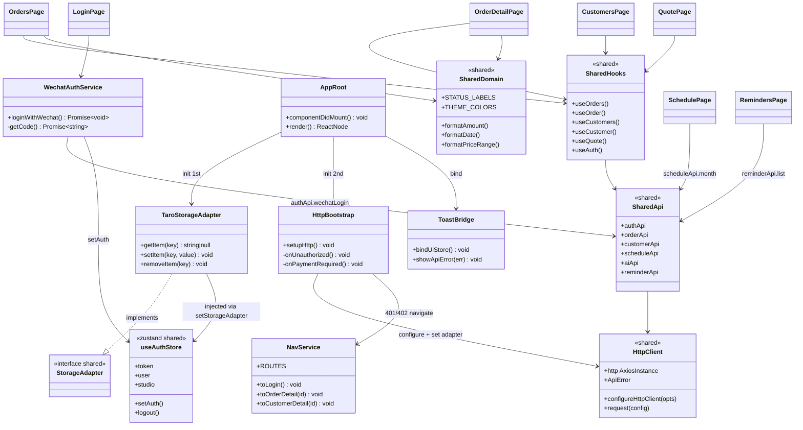
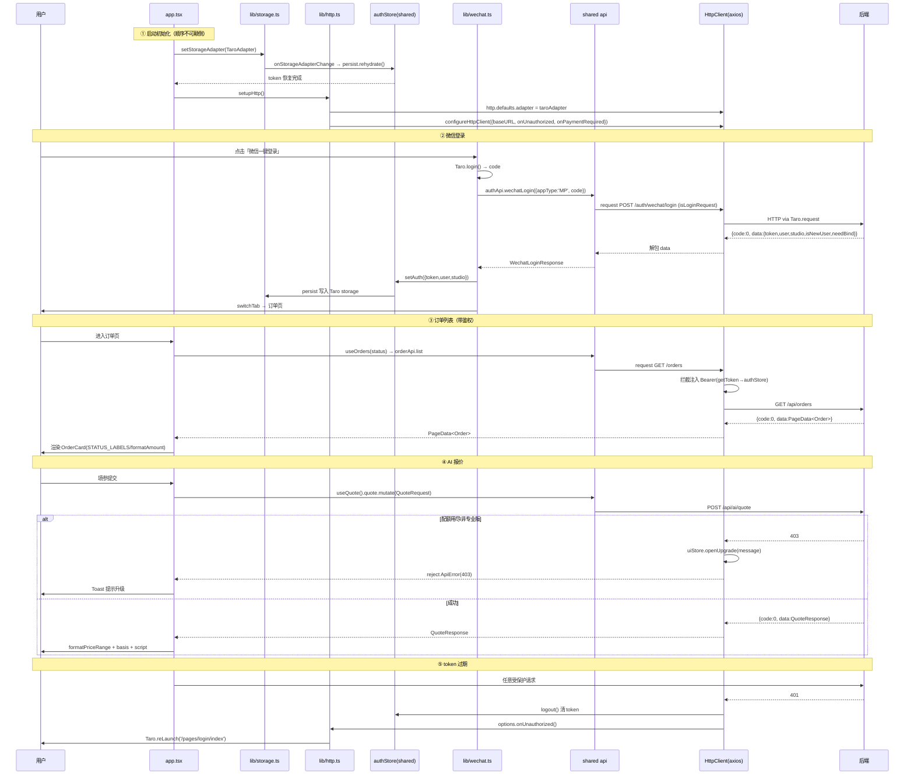
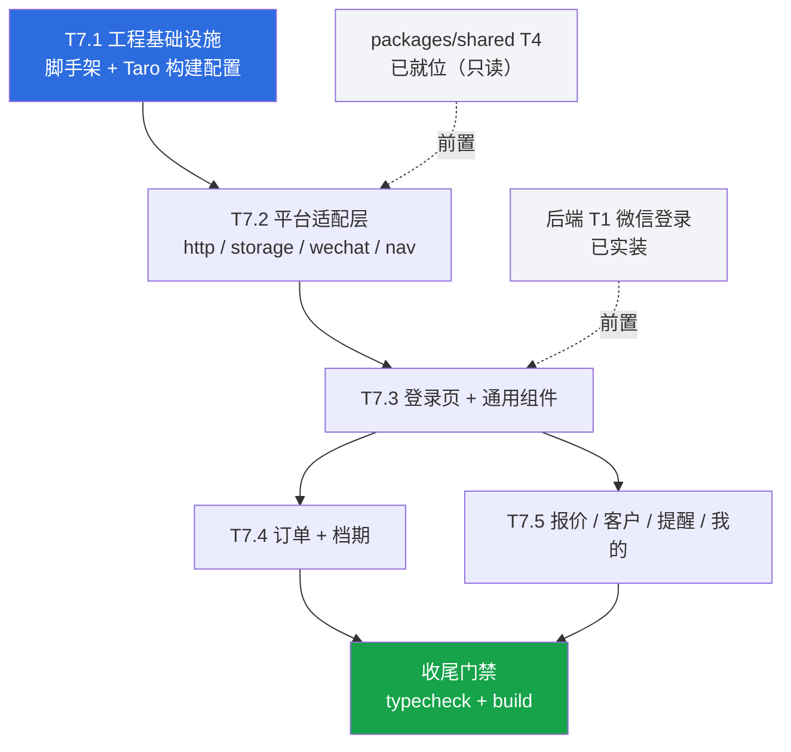

# T7 微信小程序（Taro）增量架构设计 + 任务分解

> 阶段3-B · apps/miniprogram · 查看/轻操作版首版
> 上游已定稿：`prd-phase3.md`、`architecture-mobile.md`（§1.2 / §1.5 / §3.3 / §6.4 / §7）、`architecture-multiterminal.md`
> 本文为**增量设计**：只描述 `apps/miniprogram` 新增内容，不改动 `packages/shared` 与后端。
> 撰写人：架构师 高见远（Gao）｜产出仅设计与分解，不含代码。

---

## 0. 前置核对结论（已实读源码，非推测）

架构师已逐文件核对 `packages/shared/src/**` 真实源码，以下为**可直接采信的事实**，工程师照此实现即可，无需再猜：

| 核对项 | 真实状态 | 对 T7 的影响 |
|---|---|---|
| `@photogai/shared` exports 子路径 | `.` `/types` `/api` `/hooks` `/store` `/http` `/domain` `/package.json` `/*` 均已配置 | ✅ 可按子路径导入 |
| `main`/`types` 字段 | 均指向 **`./src/index.ts`（未编译的 TS 源码）** | ⚠️ **Taro 必须把该包纳入编译范围**，见 §4.3 风险 R1 |
| `peerDependencies` | `react ^18.3.0`、`@tanstack/react-query ^5.51.0`、`zustand ^4.5.0`、`axios ^1.7.0` | apps/miniprogram 必须自带这 4 个依赖 |
| `http/adapters.ts`（架构 §1.2 图中列出） | ❌ **实际不存在**，`http/` 下只有 `HttpClient.ts` + `index.ts` | ⚠️ **Taro 适配器落在 app 侧**，见 §2.2 与风险 R2 |
| `HttpClientOptions` 字段 | 仅 `baseURL / timeout / getToken / onUnauthorized / onPaymentRequired`，**无 adapter 字段** | ⚠️ 适配器需通过导出的 `http` 实例注入，见 §2.2 |
| 通知中心后端 API | ❌ **shared `api/` 下无 notification/notice 模块**（已全量 grep 确认） | ⚠️ **通知中心改以 `reminderApi` 为数据源**，见 §5.6 与风险 R4 |
| `subscriptionApi` | 是 `billingApi` 的**别名**（`export const subscriptionApi = billingApi`） | 两个名字都可用，语义相同 |
| 根 `tsconfig.base.json` | `strict` + `noUnusedLocals` + `noUnusedParameters` + `moduleResolution: "Bundler"` | 严格度高，见 §4.2 |
| `.npmrc` | `node-linker=hoisted`、`link-workspace-packages=true` | workspace 包为软链，影响 Taro 编译范围，见 R1 |

> **给工程师的硬性纪律**：下方 §3 表格中的导出名均为**实读源码所得**，可直接使用。若发现任何偏差，以 `packages/shared/src` 实际源码为准，**禁止臆造导入路径或导出名**。

---

## Part A：系统设计

## 1. 实现方案

### 1.1 技术难点与对策

| # | 难点 | 对策 |
|---|---|---|
| D1 | 小程序无 `XMLHttpRequest`，axios 默认适配器直接报错 | 用 `axios-taro-adapter` 生成适配器，在 app 启动时赋给 shared 导出的 `http` 实例的 `defaults.adapter`（**不改 shared**） |
| D2 | shared 以**未编译 TS 源码**分发（`main: ./src/index.ts`） | Taro `config/index.ts` 中把 workspace 包纳入编译：关闭 prebundle + `mini.compile.include` 命中 `packages/shared` 真实路径 |
| D3 | 小程序无 `localStorage` | `src/lib/storage.ts` 用 `Taro.getStorageSync/setStorageSync/removeStorageSync` 实现 `StorageAdapter`，启动时 `setStorageAdapter()` 注入；shared `authStore` 监听到注入后自动 `rehydrate()` |
| D4 | 401/402 跳转各端路由不同 | shared 只抛 `ApiError(code)`；`src/lib/http.ts` 注入 `onUnauthorized → Taro.reLaunch(登录页)`、`onPaymentRequired → Taro.showModal` 提示去 Web 端续费 |
| D5 | 微信 AppID/Secret 未就位 | `project.config.json` 用占位 appid，`config/*.ts` 用 `defineConstants` 注入 `API_BASE`；**不写死密钥**（secret 仅后端持有） |
| D6 | 三端字段/交互必须一致 | 所有标签/状态机/金额日期格式化**一律走 shared `domain/`**，禁止小程序端另写一份 |
| D7 | tabBar 最多 5 个 | 一级 tab 定为 订单/档期/报价/客户/我的；提醒与通知中心作为「我的」下的二级页面 |

### 1.2 框架选型（遵循 architecture-mobile.md §6.4，不自行更换）

- **Taro 3.6.x**（`@tarojs/components|react|runtime|plugin-react`）+ React 18 语法，编译目标 `weapp`
- **taro-ui ^3.3.0** 作为组件库（对位 Web 的 MUI）
- **axios ^1.7.0 + axios-taro-adapter ^1.0.0**（复用 shared HttpClient，端点函数零改动）
- **@tanstack/react-query ^5.51.0 + zustand ^4.5.0**（与 Web/RN 完全一致）
- **dayjs ^1.11.13**（仅日历排布用；金额/日期展示格式化仍走 shared `domain/order.ts`）

### 1.3 架构分层

```
┌─ pages/*        小程序页面（Taro 组件，唯一端内 UI 层）
├─ components/*   端内展示组件（无业务请求）
├─ lib/*          平台适配层（http / storage / wechat / nav / toast / queryClient）
└─ @photogai/shared   hooks → api → http → domain / store / types（三端唯一真源，只读不改）
```
**铁律**：`pages/` 与 `components/` **禁止直接 import axios、禁止拼接 URL 字符串**，一切请求必须经 shared 的 `hooks/` 或 `api/`。

---

## 2. 文件列表（相对 `apps/miniprogram/`）

### 2.1 完整文件树

```
apps/miniprogram/
├── package.json                     # 依赖声明（§4.1），name: @photogai/miniprogram
├── project.config.json              # 微信开发者工具配置，appid 占位 "touristappid"
├── project.private.config.json      # 本地私有配置（加入 .gitignore）
├── tsconfig.json                    # extends ../../tsconfig.base.json
├── babel.config.js                  # taro preset
├── .gitignore                       # dist/ .temp/ project.private.config.json
├── config/
│   ├── index.ts                     # Taro 主配置：weapp / 编译 shared / alias / prebundle 关闭
│   ├── dev.ts                       # defineConstants.API_BASE = 开发后端地址
│   └── prod.ts                      # defineConstants.API_BASE = 生产地址
├── types/
│   └── global.d.ts                  # 声明 API_BASE 常量类型 + taro-ui 样式模块声明
└── src/
    ├── app.config.ts                # pages 注册 + tabBar + window 主题
    ├── app.tsx                      # 根组件：注入 storage/http、QueryClientProvider
    ├── app.scss                     # 全局样式，引入 taro-ui 样式与主题变量
    ├── styles/
    │   ├── theme.scss               # THEME_COLORS/RADIUS → scss 变量（值对齐 shared domain）
    │   └── mixins.scss              # 卡片/列表/文本省略等通用 mixin
    ├── lib/
    │   ├── http.ts                  # ★ 注入 taro adapter + configureHttpClient(401/402 导航)
    │   ├── storage.ts               # ★ Taro storage 实现 StorageAdapter + setStorageAdapter
    │   ├── wechat.ts                # ★ Taro.login() → code → authApi.wechatLogin({appType:'MP'})
    │   ├── nav.ts                   # 路由常量 + navigateTo/reLaunch 封装
    │   ├── toast.ts                 # 订阅 shared uiStore → Taro.showToast/showModal
    │   └── queryClient.ts           # QueryClient 实例（小程序友好的重试/缓存策略）
    ├── components/
    │   ├── PageContainer/index.tsx  # 页面壳：下拉刷新 + 统一内边距 + 背景色
    │   ├── StateView/index.tsx      # 加载/空/错误三态统一渲染（含重试按钮）
    │   ├── StatusTag/index.tsx      # 订单状态徽标（文案取 STATUS_LABELS）
    │   ├── FieldRow/index.tsx       # 详情页「标签—值」行
    │   ├── OrderCard/index.tsx      # 订单列表项（标题/状态/金额/档期/客户）
    │   ├── CustomerCard/index.tsx   # 客户列表项（姓名/手机/订单数/最近拍摄）
    │   └── ReminderCard/index.tsx   # 提醒/通知列表项（类型标签/到期/关联单）
    └── pages/
        ├── login/index.tsx + .config.ts + .scss        # 微信一键登录
        ├── orders/index.tsx + .config.ts + .scss       # [tab] 订单列表（状态筛选）
        ├── order-detail/index.tsx + .config.ts + .scss # 订单详情（只读）
        ├── schedule/index.tsx + .config.ts + .scss     # [tab] 档期月历（冲突标记）
        ├── quote/index.tsx + .config.ts + .scss        # [tab] AI 报价（填参→区间+话术）
        ├── customers/index.tsx + .config.ts + .scss    # [tab] 客户列表（搜索）
        ├── customer-detail/index.tsx + .config.ts + .scss # 客户详情（只读）
        ├── mine/index.tsx + .config.ts + .scss         # [tab] 我的（账号/套餐/入口/退出）
        ├── reminders/index.tsx + .config.ts + .scss    # 提醒列表
        └── notices/index.tsx + .config.ts + .scss      # 通知中心（数据源见 §5.6）
```

> Taro 约定：每个页面目录含 `index.tsx`（组件）、`index.config.ts`（页面级配置，如导航栏标题）、`index.scss`（样式）。

### 2.2 平台适配层三个关键文件的职责（最易写错，重点说明）

| 文件 | 必须做的事 | 明确禁止 |
|---|---|---|
| `src/lib/storage.ts` | 实现 `StorageAdapter{getItem,setItem,removeItem}`（Taro 同步 API；`getItem` 在无值时**必须返回 `null` 而非 `''`**），并 `setStorageAdapter(该实现)` | 不得自行读写 `photogai_token` 键，键名由 shared `authStore` 的 persist（name `photogai-auth`）管理 |
| `src/lib/http.ts` | ① `import { http, configureHttpClient } from '@photogai/shared/http'`；② 用 `axios-taro-adapter` 生成适配器赋给 `http.defaults.adapter`；③ 调 `configureHttpClient({ baseURL: API_BASE, timeout, onUnauthorized, onPaymentRequired })` | 不得新建 axios 实例（否则拦截器/解包全部失效）；不传 `getToken`（默认已从 authStore 取，正确） |
| `src/lib/wechat.ts` | 封装 `Taro.login()` 取 `code` → 调 `authApi.wechatLogin({ appType: 'MP', code })` → `useAuthStore.getState().setAuth(...)` | 不得自行拼 `/auth/wechat/login` URL；不得在前端持有 AppSecret |

> **`setStorageAdapter` 与 `configureHttpClient` 的调用时机**：必须在 `app.tsx` 顶层模块作用域（早于任何页面渲染与请求）执行，且 **storage 先于 http**——因为 `http` 的 `getToken` 默认从 authStore 读，而 authStore 需先经适配器 rehydrate 才有 token。

---

## 3. 与 `@photogai/shared` 的精确消费点映射

> 下表导出名**均已实读源码确认存在**。`✅已核实` = 架构师已在源码中见到该导出；工程师可直接使用。

### 3.1 能力 → shared 导出映射

| 能力 | 页面 | shared 导入（子路径） | 导出名 | 状态 |
|---|---|---|---|---|
| 微信登录 | login | `@photogai/shared/api` | `authApi.wechatLogin(data)` | ✅已核实 |
| 登录态读写 | 全局 | `@photogai/shared/store` | `useAuthStore`（`.setAuth/.logout/.token/.user/.studio`） | ✅已核实 |
| 登录态聚合 | mine | `@photogai/shared/hooks` | `useAuth()` → `{isAuthenticated,user,studio,setAuth,logout,setStudioPlanType}` | ✅已核实 |
| 存储适配 | lib/storage | `@photogai/shared/store` | `StorageAdapter`(type)、`setStorageAdapter` | ✅已核实 |
| HTTP 配置 | lib/http | `@photogai/shared/http` | `http`、`configureHttpClient`、`ApiError` | ✅已核实 |
| 订单列表 | orders | `@photogai/shared/hooks` | `useOrders(status?, page?, size?)` → `PageData<Order>` | ✅已核实 |
| 订单详情 | order-detail | `@photogai/shared/hooks` | `useOrder(id, enabled?)` → `Order` | ✅已核实 |
| 档期月历 | schedule | `@photogai/shared/api` | `scheduleApi.month(year, month)` → `ScheduleItem[]` | ✅已核实 |
| 档期 queryKey | schedule | `@photogai/shared/hooks` | `queryKeys.scheduleMonth(year, month)` | ✅已核实 |
| AI 报价 | quote | `@photogai/shared/hooks` | `useQuote()` → `{quote(mutation), pendingQuote, consumePending, ...}` | ✅已核实 |
| 客户列表 | customers | `@photogai/shared/hooks` | `useCustomers(keyword?, page?, size?)` → `PageData<Customer>` | ✅已核实 |
| 客户详情 | customer-detail | `@photogai/shared/hooks` | `useCustomer(id, enabled?)` → `Customer` | ✅已核实 |
| 提醒/通知 | reminders / notices | `@photogai/shared/api` | `reminderApi.list(status?, dueOnly?)` → `Reminder[]` | ✅已核实 |
| 提醒 queryKey | reminders | `@photogai/shared/hooks` | `queryKeys.reminders` | ✅已核实 |
| 套餐信息 | mine | `@photogai/shared/hooks` | `useSubscription()` — **实现前核对 shared 真实导出**（`hooks/useSubscription.ts` 存在，具体导出名与返回结构未逐行核实） | ⚠️ 待核对 |
| 主题色/圆角 | styles/theme | `@photogai/shared/domain` | `THEME_COLORS`、`RADIUS` | ✅已核实 |
| 状态标签/状态机 | StatusTag / order-detail | `@photogai/shared/domain` | `STATUS_LABELS`、`NEXT_STATUSES`、`STATUS_COLUMNS`、`orderStatusLabel()`、`nextStatusesOf()` | ✅已核实 |
| 金额/日期格式化 | 各页 | `@photogai/shared/domain` | `formatAmount()`、`formatDate()`、`formatDateTime()` | ✅已核实 |
| 报价展示 | quote | `@photogai/shared/domain` | `formatPriceRange(low, high)` | ✅已核实 |
| 提醒类型标签 | ReminderCard | `@photogai/shared/domain` | `REMINDER_LABELS`（由 constants re-export） | ✅已核实 |
| 错误码兜底文案 | lib/toast | `@photogai/shared/domain` | `messageOfErrorCode(code)`、`ERROR_CODE_MESSAGES` | ✅已核实 |
| 领域类型 | 全端 | `@photogai/shared/types` | `Order` `OrderStatus` `Customer` `ScheduleItem` `Reminder` `ReminderStatus` `ReminderType` `QuoteRequest` `QuoteResponse` `PageData<T>` `Conflict` `User` `Studio` | ✅已核实 |
| 微信登录类型 | lib/wechat | `@photogai/shared/types` | `WechatLoginRequest`、`WechatLoginResponse`、`WechatAppType` | ✅已核实 |

### 3.2 首版**不使用**的 shared 导出（避免工程师过度接线）

`useCreateOrder / useUpdateOrder / useDeleteOrder / useChangeOrderStatus / useAssignOrder / useCreateCustomer / useUpdateCustomer / useDeleteCustomer`（重操作留 Web）、`pushApi / useRegisterDevice`（订阅消息后置，见 R3）、`storageApi`（图片上传后置）、`contractApi / dashboardApi / teamApi / repurchaseApi / reminderRuleApi / calibrationApi / commApi / quotaApi`。

### 3.3 关键数据结构（实读所得，页面字段以此为准）

```
Order        { id, studioId, customerId, customerName?, title, shootType?, status,
               amount?, depositAmount?, currency?, shootDate?, shootEndDate?,
               durationHours?, photoCount?, region?, style?, quoteSuggestion?,
               assignedTo?, createdAt?, updatedAt?, history? }
ScheduleItem { orderId, title, shootDate?, shootEndDate?, status, conflict }
Customer     { id, studioId, name, wechatId?, phone?, tags?, note?, lastShootDate?,
               sourceChannel?, orderCount?, lastOrderAt?, lastAmount?, orders? }
Reminder     { id, orderId?, customerId?, type, dueAt?, status, orderTitle?, customerName? }
QuoteRequest { shootType, durationHours?, photoCount?, region?, style?, customerName? }
QuoteResponse{ priceLow, priceHigh, basis, script, remainingQuota }
PageData<T>  { content, totalElements, totalPages, number, size }
```
> 注意：列表接口返回 `PageData<T>`，页面须取 **`data.content`**，不可直接当数组用。

---

## 4. 后端接口契约核对清单

### 4.1 T7 首版实际调用的端点

| # | 方法 | 路径 | 触发页面 | 后端状态 |
|---|---|---|---|---|
| W1 | POST | `/api/auth/wechat/login` | login | ✅ T1 已实装（`WechatService/WechatConfig/UserWechat/WechatLoginRequest`）；⚠️ 需配 `WECHAT_MP_APPID/SECRET` |
| — | GET | `/api/orders?status&page&size` | orders | ✅ 既有 |
| — | GET | `/api/orders/{id}` | order-detail | ✅ 既有 |
| — | GET | `/api/schedule/month?year&month` | schedule | ✅ 既有 |
| — | POST | `/api/ai/quote` | quote | ✅ 既有（受 FREE 5 次/月配额与 402/403 约束） |
| — | GET | `/api/customers?keyword&page&size` | customers | ✅ 既有 |
| — | GET | `/api/customers/{id}` | customer-detail | ✅ 既有 |
| — | GET | `/api/reminders?status&dueOnly` | reminders / notices | ✅ 既有 |
| — | GET | 订阅信息端点（`billingApi`/`subscriptionApi`） | mine | ✅ 既有；**实现前核对具体方法名** |

**结论：T7 首版对后端零新增开发**，唯一阻塞项是微信 AppID/Secret 配置（属运维配置，不属编码）。

### 4.2 首版**不调用**的端点
`W2 wechat/bind`、`W3–W5 push/*`（订阅消息 T2 后置）、`W6–W8 storage/*`（图片上传后置）、全部写操作（`POST/PUT/DELETE orders|customers`）。

### 4.3 环境与配置清单

| 配置项 | 位置 | 首版取值 |
|---|---|---|
| `API_BASE` | `config/dev.ts` / `config/prod.ts` 的 `defineConstants` | dev：后端地址 + `/api`；prod：占位待填 |
| 微信 `appid` | `project.config.json` | 占位（`touristappid`），真机联调前替换 |
| `WECHAT_MP_APPID/SECRET` | **后端** `application.yml`/环境变量 | 待客户提供；**绝不出现在小程序代码中** |
| request 合法域名 | 微信公众平台后台 | 待 AppID 就位后配置；开发期在开发者工具勾选「不校验合法域名」 |

---

## 5. 首版页面清单与字段（查看/轻操作版）

> **总纪律**：字段、文案、状态标签、金额/日期格式**必须与 Web 端一致**；`STATUS_LABELS / NEXT_STATUSES / REMINDER_LABELS / THEME_COLORS` 一律来自 shared `domain/constants`，**禁止在小程序端硬编码中文状态名或色值**。

### 5.1 登录页 `pages/login`
- 元素：Logo、标题、**「微信一键登录」主按钮**（`#2D6CDF`）、隐私说明
- 交互：点击 → `Taro.login()` 取 code → `authApi.wechatLogin({appType:'MP', code})` → `setAuth` → `Taro.switchTab` 到订单页
- 异常：`ApiError` → `Taro.showToast` 展示 `error.message`；按钮 loading 防重复点击

### 5.2 订单列表 `pages/orders` [tab] + 详情 `pages/order-detail`
- 列表项字段：`title`、`StatusTag(status)`、`formatAmount(amount)`、`formatDate(shootDate)`、`customerName`
- 顶部状态筛选：由 `STATUS_COLUMNS` 生成「全部 + 各状态」标签栏 → 传入 `useOrders(status)`
- 详情字段（只读）：标题、状态、金额/定金、拍摄档期（起止）、时长、张数、地区、风格、客户、报价建议 `quoteSuggestion`、状态流转历史 `history`
- 详情底部：灰底提示「新建 / 编辑 / 改状态请在 Web 端操作」（首版明确边界，避免用户找不到功能）

### 5.3 档期 `pages/schedule` [tab]
- 数据：`scheduleApi.month(year, month)` → `ScheduleItem[]`
- 月历格：有档期的日期打点；**`conflict === true` 的日期用 `THEME_COLORS.error` 高亮标记**
- 点击日期 → 下方列出当日 `ScheduleItem`（title / StatusTag / 起止时间）→ 点击跳订单详情
- 顶部：上月/下月切换（用 dayjs 计算年月）

### 5.4 AI 报价 `pages/quote` [tab]
- 表单字段（严格对齐 `QuoteRequest`）：拍摄类型 `shootType`(必填)、时长 `durationHours`、张数 `photoCount`、地区 `region`、风格 `style`、客户名 `customerName`
- 提交：`useQuote().quote.mutate(req)`
- 结果区：`formatPriceRange(priceLow, priceHigh)` 大字展示 + 报价依据 `basis` + **可复制的话术 `script`**（`Taro.setClipboardData`）+ 剩余次数 `remainingQuota`
- 配额/权限：403/402 由 shared 拦截器统一处理，页面只需展示 `ApiError.message`
- 首版**不做**「一键填入订单」（依赖建单，属重操作，留 Web）

### 5.5 客户 `pages/customers` [tab] + 详情 `pages/customer-detail`
- 列表：搜索框（防抖 300ms → `useCustomers(keyword)`）；列表项 `name`、`phone`、`orderCount`、`formatDate(lastShootDate)`
- 详情（只读）：姓名、微信号、手机（点击 `Taro.makePhoneCall`）、标签、来源渠道、生日/纪念日、备注、历史订单列表（点击跳订单详情）

### 5.6 提醒 `pages/reminders` 与通知中心 `pages/notices`
- 数据源：**均为 `reminderApi.list()`**（后端无独立站内信 API，见风险 R4）
- `reminders`：`reminderApi.list('PENDING', true)` → 待办提醒；字段 `REMINDER_LABELS[type]`、`formatDateTime(dueAt)`、`orderTitle`/`customerName`
- `notices`：`reminderApi.list()` 全量 → 按 `dueAt` 倒序的通知流，含已完成/已忽略，用 `status` 区分样式
- 首版**只读**，不做「标记完成」（`reminderApi.updateStatus` 属写操作，留 Web）

### 5.7 我的 `pages/mine` [tab]
- 展示：`user.username`、`studio.name`、`studio.planType` 套餐徽标
- 入口：提醒列表、通知中心
- 操作：退出登录（`logout()` → `Taro.reLaunch` 到 login）

### 5.8 tabBar 定义（`app.config.ts`）
| 顺序 | pagePath | 文案 |
|---|---|---|
| 1 | `pages/orders/index` | 订单 |
| 2 | `pages/schedule/index` | 档期 |
| 3 | `pages/quote/index` | 报价 |
| 4 | `pages/customers/index` | 客户 |
| 5 | `pages/mine/index` | 我的 |

`selectedColor` = `#2D6CDF`，`color` = `#6B7280`（对齐 `THEME_COLORS`）。

---

## 6. 微信登录链路

```
用户点「微信一键登录」
  → Taro.login()                       // 取临时 code
  → authApi.wechatLogin({appType:'MP', code})
  → 后端 code2Session 解析 openid/unionid → 命中/新建 studio
  → 返回 WechatLoginResponse{token,user,studio,isNewUser,needBind}
  → useAuthStore.setAuth({token,user,studio})
  → zustand persist 经 storageBridge → 我方 Taro StorageAdapter → 落 Taro storage
  → Taro.switchTab('/pages/orders/index')

后续任意请求：
  http 请求拦截 → options.getToken() 读 authStore.token → 注入 Authorization: Bearer

401（非登录请求）：
  shared 拦截器 → authStore.logout() → options.onUnauthorized()
  → 我方注入的回调 → Taro.reLaunch('/pages/login/index')
```
> `setAuth` 接收的类型是 `AuthResponse`，而 `wechatLogin` 返回 `WechatLoginResponse`（多 `isNewUser`/`needBind` 两个字段，`token/user/studio` 同构）。**工程师实现时如遇 TS 类型不兼容，按结构取 `{token,user,studio}` 传入，不要改 shared**。

---

## 7. 数据结构与接口（类图）



## 8. 程序调用流程（时序图）



---

## Part B：任务分解

## 9. 依赖包清单（`apps/miniprogram/package.json`）

```
dependencies:
  @photogai/shared        workspace:*      共享包（三端唯一真源）
  @tarojs/components      3.6.x            Taro 组件
  @tarojs/react           3.6.x            React 渲染器
  @tarojs/runtime         3.6.x            运行时
  @tarojs/taro            3.6.x            Taro API（Taro.login/storage/navigate）
  @tarojs/plugin-react    3.6.x            React 插件（按 3.6 实际包名核对）
  taro-ui                 ^3.3.0           组件库（对位 MUI）
  react                   ^18.3.0          peer of shared
  axios                   ^1.7.0           peer of shared
  axios-taro-adapter      ^1.0.0           ★ 让 axios 走 Taro.request
  zustand                 ^4.5.0           peer of shared
  @tanstack/react-query   ^5.51.0          peer of shared
  dayjs                   ^1.11.13         日历年月计算

devDependencies:
  @tarojs/cli             3.6.x
  @tarojs/mini-runner     3.6.x
  @types/react            ^18.3.0
  typescript              ^5.5.0

scripts:
  dev:weapp   = taro build --type weapp --watch
  build:weapp = taro build --type weapp
  typecheck   = tsc --noEmit
  lint        = tsc --noEmit
```
> **版本纪律**：`@tarojs/*` 全部锁同一 minor（3.6.x）；`react`/`zustand`/`axios`/`react-query` 版本必须**满足 shared 的 peerDependencies**，否则 pnpm hoisted 下会出现双实例（zustand 双实例 = 登录态读不到）。

## 10. 任务列表（按依赖顺序，共 5 个）

### T7.1　工程基础设施与 Taro 构建配置　`P0`　依赖：无
**产出文件**
`package.json`、`project.config.json`、`project.private.config.json`、`tsconfig.json`、`babel.config.js`、`.gitignore`、`config/index.ts`、`config/dev.ts`、`config/prod.ts`、`types/global.d.ts`、`src/app.config.ts`、`src/app.tsx`(占位)、`src/app.scss`、`src/styles/theme.scss`、`src/styles/mixins.scss`

**关键要求**
1. `tsconfig.json` 继承 `../../tsconfig.base.json`；`compilerOptions.types` 含 `@tarojs/taro`；`jsx` 保持 `react-jsx`
2. `config/index.ts`：`projectName`、`framework: 'react'`、`compiler: { type: 'webpack5', prebundle: { enable: false } }`（**必须关 prebundle**，见 R1）、`mini.compile.include` 命中 `packages/shared` 源码路径、`plugins: ['@tarojs/plugin-html']` 按需
3. `config/dev.ts` / `config/prod.ts`：`defineConstants.API_BASE`（**注意 defineConstants 的值需 `JSON.stringify()`**）
4. `types/global.d.ts`：`declare const API_BASE: string`
5. `src/styles/theme.scss` 的色值**必须逐一对齐** shared `THEME_COLORS`（`#2D6CDF` / `#1A1A1A` / `#f7f8fa` / `#F2F4F7` / `#6B7280` / `#16A34A` / `#F59E0B` / `#DC2626`）与 `RADIUS`(10/12)
6. `app.config.ts` 注册全部 10 个页面 + 5 个 tabBar 项
7. 验收：`pnpm install` 成功、`pnpm --filter @photogai/miniprogram build:weapp` 能产出 dist（页面可为空壳）

---

### T7.2　平台适配层（shared 接线）　`P0`　依赖：T7.1
**产出文件**
`src/lib/storage.ts`、`src/lib/http.ts`、`src/lib/wechat.ts`、`src/lib/nav.ts`、`src/lib/toast.ts`、`src/lib/queryClient.ts`、`src/app.tsx`(完善)

**关键要求**
1. **实现前先 Read**：`packages/shared/src/store/storage.ts`、`http/HttpClient.ts`、`api/auth.ts`，核对导出名与签名
2. `storage.ts`：`getItem` 无值返回 `null`（Taro `getStorageSync` 无值返回 `''`，**必须转换**）
3. `http.ts`：复用 shared 导出的 `http` 实例设 `defaults.adapter`，**不新建 axios 实例**
4. `app.tsx` 初始化顺序：`setStorageAdapter` → `setupHttp` → `bindToast` → `QueryClientProvider` 包裹
5. `queryClient.ts`：小程序建议 `retry: 1`、`refetchOnWindowFocus: false`、`staleTime: 30s`
6. `toast.ts`：订阅 `useUiStore` 的 toast 状态 → `Taro.showToast`；`openUpgrade` → `Taro.showModal`（引导去 Web 端升级）
7. 验收：启动无红屏；`typecheck` 通过

---

### T7.3　登录页 + 通用组件库　`P0`　依赖：T7.2
**产出文件**
`src/pages/login/{index.tsx,index.config.ts,index.scss}`、`src/components/PageContainer/index.tsx`、`src/components/StateView/index.tsx`、`src/components/StatusTag/index.tsx`、`src/components/FieldRow/index.tsx`

**关键要求**
1. 登录链路严格按 §6；按钮 loading + 失败 Toast
2. `StatusTag` 文案取 `STATUS_LABELS`，**禁止硬编码中文**
3. `StateView` 统一三态（loading / empty / error+重试），后续所有列表页复用
4. 未登录访问 tab 页时统一 `reLaunch` 到登录页（在 `PageContainer` 或各页入口用 `useAuth().isAuthenticated` 守卫）
5. 验收：开发者工具中可走通「登录 → 落 storage → 冷启动仍保持登录态」

---

### T7.4　订单与档期模块　`P1`　依赖：T7.3　（**可与 T7.5 并行**）
**产出文件**
`src/pages/orders/{index.tsx,index.config.ts,index.scss}`、`src/pages/order-detail/{index.tsx,index.config.ts,index.scss}`、`src/pages/schedule/{index.tsx,index.config.ts,index.scss}`、`src/components/OrderCard/index.tsx`

**关键要求**
1. 列表取 `PageData.content`；下拉刷新触发 `refetch`
2. 状态筛选项由 `STATUS_COLUMNS` 生成
3. 档期冲突 `conflict === true` 用 `THEME_COLORS.error` 标记
4. 详情页底部标注「重操作请在 Web 端完成」
5. 验收：三页数据正确渲染，金额/日期格式与 Web 端逐字一致

---

### T7.5　报价 / 客户 / 提醒 / 我的 模块　`P1`　依赖：T7.3　（**可与 T7.4 并行**）
**产出文件**
`src/pages/quote/{index.tsx,index.config.ts,index.scss}`、`src/pages/customers/{...}`、`src/pages/customer-detail/{...}`、`src/pages/reminders/{...}`、`src/pages/notices/{...}`、`src/pages/mine/{...}`、`src/components/CustomerCard/index.tsx`、`src/components/ReminderCard/index.tsx`

**关键要求**
1. 报价结果用 `formatPriceRange`；话术支持复制
2. 客户搜索防抖 300ms
3. 提醒/通知数据源均为 `reminderApi.list`（见 R4），只读
4. 「我的」页 `useSubscription()` **实现前核对 shared 真实导出**；若返回结构不符预期，退化为直接展示 `useAuth().studio.planType`
5. 验收：六页渲染正确；403/402 场景弹窗提示正常

---

### 收尾门禁（并入 T7.5 验收，非独立任务）
- 根目录 `pnpm typecheck` 全绿（含 `@photogai/miniprogram`）
- `pnpm --filter @photogai/miniprogram build:weapp` 成功
- 全局搜索确认：小程序端**无** `axios.create`、**无** 硬编码 `/api/` 字符串、**无** 硬编码中文状态名与十六进制主题色

## 11. 任务依赖图



## 12. 共享知识（跨文件约定，工程师必读）

| 约定 | 内容 |
|---|---|
| 响应格式 | `{code,data,message}`，`code=0` 成功；**shared `request()` 已自动解包，页面拿到的就是 `data`** |
| 分页 | 列表接口返回 `PageData<T>`，取 `.content` |
| 鉴权 | `Authorization: Bearer <jwt>`，shared 拦截器自动注入，**页面不得手写 header** |
| 错误处理 | 只 catch `ApiError`，用 `err.message`；缺失时用 `messageOfErrorCode(err.code)` |
| 401/402/403 | shared 已统一处理（清 token / 升级弹窗），端侧只提供导航回调 |
| token 键 | authStore persist name = `photogai-auth`（**不是** `photogai_token`）；端侧不直接操作 |
| 主题色 | 只用 `THEME_COLORS` 的两主色 `#2D6CDF`/`#1A1A1A`，**禁止引入第三主色** |
| 圆角 | `RADIUS.base=10` / `RADIUS.card=12` |
| 日期 | 展示走 `formatDate`/`formatDateTime`；`shootDate` 为 DATE 语义，勿做时区转换 |
| 金额 | 走 `formatAmount`，CNY 前缀 `¥`，千分位 |
| 状态机 | `STATUS_LABELS`/`NEXT_STATUSES`/`STATUS_COLUMNS` 唯一真源在 shared |
| 单位 | Taro 中 `px` 会按设计稿 750 换算为 rpx，样式统一按 750 设计稿写 |

## 13. 待确认事项与风险

| # | 风险/待确认 | 影响 | 默认方案（不阻塞编码） |
|---|---|---|---|
| **R1** | shared 以**未编译 TS 源码**分发 + pnpm `node-linker=hoisted` 软链，Taro 默认不编译 node_modules，**极可能构建报错**（首个会踩的坑） | 高 · 阻塞构建 | `config/index.ts` 关闭 `prebundle`，并在 `mini.compile.include` 加入 shared 源码真实路径；若仍失败，退路是给 shared 加 `tsup` 预构建产物（**需回报主理人，属改 T4 范围**） |
| **R2** | 架构 §1.2 图中的 `shared/http/adapters.ts` **实际不存在** | 中 | Taro 适配器落在 `apps/miniprogram/src/lib/http.ts`，通过 `http.defaults.adapter` 注入；shared 零改动。**架构文档图与现状的偏差已在此备案** |
| **R3** | 微信 AppID/Secret 未就位 | 中 · 不阻塞编码 | `project.config.json` 用占位 appid；开发者工具「不校验合法域名」；**无法真机预览与真实微信登录联调**，需 AppID 到位后补一轮联调 |
| **R4** | **后端无独立通知/站内信 API**（已全量核对 shared `api/`） | 中 | 通知中心首版以 `reminderApi.list()` 为数据源；若产品要求真正的站内信，需后端新增模块（**不在 T7 范围，需 PM 拍板**） |
| **R5** | 订阅消息推送（T2）后置 | 低 | 首版不接 `pushApi`；`requestSubscribeMessage` 与模板 ID 待客户申请后另起任务 |
| **R6** | 图片上传（W6–W8）后置 | 低 | 首版无上传入口；dev 期后端为 LOCAL 兜底 |
| **R7** | `useSubscription()` 返回结构未逐行核实 | 低 | 「我的」页实现前 Read `hooks/useSubscription.ts`；不符则退化用 `useAuth().studio.planType` |
| **R8** | `zustand`/`react` 双实例风险（hoisted + peerDeps） | 中 | 版本严格对齐 shared peerDeps；若登录态读不到，优先排查依赖双实例 |
| **R9** | `setAuth(AuthResponse)` vs `wechatLogin` 返回 `WechatLoginResponse` 类型差异 | 低 | 按结构取 `{token,user,studio}` 传入，**不改 shared** |

---

## 14. 工程师可直接照做的清单

### 14.1 实现前必读（**强制**，防止臆造导入）
```
packages/shared/package.json                 # exports 子路径 + peerDeps
packages/shared/src/api/index.ts             # 端点对象名
packages/shared/src/hooks/index.ts           # hook 名
packages/shared/src/store/index.ts           # store 与 StorageAdapter
packages/shared/src/types/index.ts           # 类型名
packages/shared/src/http/HttpClient.ts       # configureHttpClient 签名（无 adapter 字段！）
packages/shared/src/domain/constants.ts      # THEME_COLORS / RADIUS / 错误码
packages/shared/src/hooks/useSubscription.ts # R7 待核对
```

### 14.2 文件清单与实现顺序

| 序 | 任务 | 文件 | 并行 |
|---|---|---|---|
| 1 | T7.1 | `package.json` `project.config.json` `tsconfig.json` `babel.config.js` `config/{index,dev,prod}.ts` `types/global.d.ts` `src/app.config.ts` `src/app.scss` `src/styles/{theme,mixins}.scss` | — |
| 2 | T7.2 | `src/lib/{storage,http,wechat,nav,toast,queryClient}.ts` `src/app.tsx` | — |
| 3 | T7.3 | `src/pages/login/*` `src/components/{PageContainer,StateView,StatusTag,FieldRow}/index.tsx` | — |
| 4a | T7.4 | `src/pages/{orders,order-detail,schedule}/*` `src/components/OrderCard/index.tsx` | ✅ 与 4b 并行 |
| 4b | T7.5 | `src/pages/{quote,customers,customer-detail,reminders,notices,mine}/*` `src/components/{CustomerCard,ReminderCard}/index.tsx` | ✅ 与 4a 并行 |
| 5 | 门禁 | `pnpm typecheck` + `build:weapp` + 三项全局搜索检查 | — |

### 14.3 三条铁律
1. **不改 `packages/shared`**——如确需改动，先回报主理人（属 T4 范围）
2. **不硬编码**——中文状态名、主题色值、API 路径，一律来自 shared
3. **先 Read 后 import**——所有 shared 导出名以源码为准

---

*T7 微信小程序增量设计结束 — 架构师 高见远（Gao）｜回传主理人评审后交工程师实施。*
