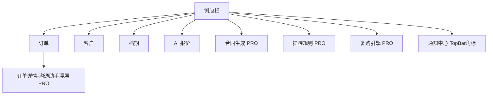

# 摄影师的 AI 接单跟单助手 — 阶段2 增量 PRD（P1 五项）

> 版本：v2.0（增量版，仅描述相对阶段1 的**变更**）
> 作者：产品经理 许清楚（Xu）
> 日期：2026-07-23
> 配套基线：`prd.md`（v1.0 完整版）、`architecture.md`（v1.0 阶段1 架构）
> 状态：待主理人 + 客户评审
>
> **阅读前提**：本文档不复述阶段1 已定内容（MVP 四项、状态流、档期冲突、AI 报价、客户库、收费定价 ¥39/月、技术栈 Vite+React+MUI+Tailwind / Spring Boot / PostgreSQL / DeepSeek）。仅聚焦阶段2 新增的五项能力及其变更点。

---

## 1. 变更摘要（相对阶段1 新增了什么）

阶段1（P0）已落地：订单 CRUD + 状态流、档期日历+冲突硬阻断、AI 报价（限次/无限）、客户库、**基础站内提醒（P0 硬编码 3 类）**、免费额度与升级引导。**专业版付费墙已存在**（`studio.plan_type` = FREE/PRO，`QuotaService` 对 FREE 抛 `403`）。

阶段2（P1）在其上**增量新增**以下能力：

| # | 新增能力 | 类型 | 依赖 LLM | 复用/变更点 |
|---|---|---|---|---|
| 1 | **AI 沟通助手** | 生成式文案（催款/跟进/答疑） | ✅ 是 | 复用 `LlmClient` + `AiQuoteService` 规则拼装+降级模式；新 `AiCommService` |
| 2 | **合同生成** | 订单信息套模板（下载/复制） | ❌ 否（模板为主，AI 润色可选） | 新 `contract_template` 表 + 字段替换引擎 |
| 3 | **消息推送（站内）** | 提醒触达摄影师侧（通知中心+角标） | ❌ 否 | 扩展现有 `reminder` 机制 + 通知中心 UI；微信/短信留 P3 |
| 4 | **提醒规则** | 可配置触发规则（启停/偏移） | ❌ 否（纯后端） | 新 `reminder_rule` 表；重构 `OrderService.triggerReminders`，新规则 CRUD API |
| 5 | **复购引擎** | 按客户画像+拍摄周期触发复购提醒+话术 | ✅ 话术是（扫描纯后端） | 扩展 `customer` 画像字段 + 定时扫描 + 复用 reminder（新增 REPURCHASE 类型）|

### 新增用户故事（概览，详见第2 节）
- 沟通助手 ×3（催款/跟进答疑/免费拦截）
- 合同生成 ×3（内置模板/下载复制/自定义模板待定）
- 提醒规则 ×1（启停与偏移配置）
- 消息推送 ×1（站内通知中心）
- 复购引擎 ×3（周期触发/话术生成/免费拦截）

### 新增页面 / 组件（前端）
- `CommAssistantDrawer`（订单详情浮层，沟通助手）
- `ContractPage`（合同生成页）
- `ReminderRulePage`（提醒规则设置）
- `RepurchasePage`（复购列表）
- `NotificationCenter`（TopBar 通知中心角标，扩展既有 `ReminderList`）
- 全局：在 `api/client.ts` 统一拦截 `403 → UpgradeModal`（既有弹窗复用）

### 新增接口（后端，统一前缀 `/api`，需 JWT）
| 方法 | 路径 | 说明 |
|---|---|---|
| POST | `/api/ai/comm` | 生成沟通话术 `{orderId, scenario} → {text}`（PRO+LLM）|
| GET | `/api/reminder-rules` | 查本工作室提醒规则（PRO）|
| POST/PUT/DELETE | `/api/reminder-rules` | 增/改/删/启停规则（PRO）|
| GET | `/api/contract-templates` | 内置+自定义模板列表 |
| POST | `/api/contracts/generate` | 套模板生成合同 `{orderId, templateId} → {title, content}`（PRO）|
| GET | `/api/repurchases` | 复购任务列表（PRO）|
| （内部）| 定时任务 `@Scheduled` | 每日扫描：复购触发 + 到期提醒"激活" |

---

## 2. 新增用户故事（覆盖五项，Given/When/Then 验收）

> 编号沿用 `US-P2-xx`。角色统一为「独立摄影师」。PRO = 专业版（¥39/月）。

### 2.1 AI 沟通助手

**US-P2-01 催款话术生成（LLM）**
As a 摄影师, I want 选"催尾款/催定金"场景让 AI 依据订单+客户画像生成可复制文案, so that 省时且语气专业不伤人。
- **Given** 某订单状态为「定金」或「已交付（尾款未付）」且客户已建档案
- **When** 我在订单详情点「AI 沟通助手」→ 选场景「催尾款」→ 点生成
- **Then**
  - ≤5 秒内返回一段中文文案；
  - 文案自动填充客户称呼、订单金额、已付/未付占位符（如"王小姐，您婚纱写真尾款 ¥1999 还差一步~"）；
  - 提供「复制」按钮；LLM 不可用时降级为规则模板话术（不报错、不空）。

**US-P2-02 跟进 / 答疑话术生成（LLM）**
As a 摄影师, I want 针对"拍摄前须知/交付后求好评/通用答疑"生成话术, so that 标准化触达、减少重复手敲。
- **Given** 选定订单并选择场景 ∈ {拍摄前提醒, 交付后求好评, 通用答疑}
- **When** 点生成
- **Then** 返回对应场景话术（含拍摄时间/交付物提示等订单上下文）；同一订单同一场景可重复生成（PRO 无限次）。

**US-P2-03 沟通助手免费版拦截**
As a 免费摄影师, I want 能看到沟通助手入口感知价值, so that 在被拦截时了解升级能解锁什么。
- **Given** 当前 `studio.plan_type = FREE`
- **When** 点击「生成」
- **Then** 后端返回 `403`，前端弹出既有 `UpgradeModal`（文案含"沟通助手为专业版功能"）；不消耗任何生成额度、不产生文案。

### 2.2 合同生成

**US-P2-04 内置模板生成合同**
As a 摄影师, I want 选订单+内置模板一键生成合同草案, so that 不手搓合同。
- **Given** 订单含客户、拍摄类型、金额、档期
- **When** 进入「合同生成」→ 选模板（如「摄影服务合同」）→ 选订单 → 生成
- **Then** 关键字段（双方称谓、拍摄类型、金额/定金、拍摄日期、交付物）由订单信息自动填充；页面展示可编辑预览。

**US-P2-05 合同下载 / 复制**
As a 摄影师, I want 把生成合同复制或下载, so that 直接发给客户签署。
- **Given** 已生成合同预览
- **When** 点「复制全文」或「下载 .md/.txt」
- **Then** 复制至剪贴板 / 触发文件下载；内容含全部替换后字段、无水印占位符残留。

**US-P2-06 合同模板来源（待确认项，见第6 节）**
默认方案：阶段2 内置 2–3 套通用模板（摄影服务合同 / 肖像权授权书 / 定金协议），字段替换为主、不依赖 LLM。用户上传自定义模板留作后续增强（见 Open Question Q4）。

### 2.3 消息推送（阶段2 站内）

**US-P2-07 站内通知中心**
As a 摄影师, I want 在站内一处看到所有待办提醒（催款/拍摄前/求好评/复购）, so that 不漏节点。
- **Given** 系统已按规则生成若干 `PENDING` 提醒
- **When** 我点 TopBar 铃铛
- **Then** 展开通知中心，按 `due_at` 升序列出待处理提醒（含订单标题、类型、到期日）；可单条「标记完成/忽略」；角标显示到期（`due_at ≤ now`）且 PENDING 的数量。

### 2.4 提醒规则

**US-P2-08 提醒规则配置与启停**
As a 专业版摄影师, I want 自定义提醒的触发点、提前量并启停, so that 提醒节奏贴合我的习惯。
- **Given** `plan_type = PRO`，工作室已种子化默认规则（等同阶段1 行为：定金后3 天催款、拍摄前1 天提醒、交付后3 天求好评）
- **When** 进入「提醒规则」→ 改某条偏移天数 / 开关启用
- **Then** 保存后对新触发订单生效；关闭后该事件不再生成提醒；`PENDING` 历史提醒不受影响（不回溯删除）。

### 2.5 复购引擎

**US-P2-09 复购周期触发（纯后端扫描）**
As a 摄影师, I want 交付后按拍摄周期自动生成复购提醒, so that 拍完不失踪、提高复购。
- **Given** 客户档案有「最近拍摄日 + 复购周期（如宝宝照 365 天）」
- **When** 每日定时任务扫描发现 `最近拍摄日 + 周期 ≤ 今天` 且未生成过该周期任务
- **Then** 自动创建一条 `REPURCHASE` 类型提醒（归到通知中心与复购列表）；同一周期不重复生成（幂等，按 customer+cycle 去重）。

**US-P2-10 复购话术生成（LLM，可选）**
As a 摄影师, I want 对复购任务一键生成跟进话术, so that 触达文案不费力。
- **Given** 存在一条 `REPURCHASE` 提醒
- **When** 在复购列表点「生成话术」
- **Then** 依据客户画像（类型/历史订单/周期）返回复购邀约文案；可复制；LLM 不可用时降级模板（"XX 您好，去年为您拍摄的婚纱一周年啦，预约续拍享老客礼~"）。

**US-P2-11 复购免费版拦截**
As a 免费摄影师, I want 看到复购入口, so that 知晓专业版含复购引擎。
- **Given** `plan_type = FREE`
- **When** 进入「复购」或点「生成话术」
- **Then** 列表展示空态 + 升级引导；任意动作返回 `403 → UpgradeModal`，不触发扫描/生成。

### 2.6 收费墙贯通（跨功能）

**US-P2-12 统一 403 → 升级弹窗**
As a 免费摄影师, I want 所有专业版功能入口可见但触发统一升级引导, so that 体验一致、转化路径清晰。
- **Given** 访问沟通助手/合同/提醒规则编辑/复购任一 PRO 功能
- **When** 触发受限操作
- **Then** 前端统一经 `api/client.ts` 拦截 `403` 弹出 `UpgradeModal`（文案按功能区分），后端不返回任何业务数据。

---

## 3. 阶段2 需求池（按实现批次 + 依赖分级）

> 优先级锚定：阶段2 五项均**落在专业版付费墙内**（免费版可见入口、触发升级）。
> 依赖标注：`[LLM]` = 需大模型；`[BE]` = 纯后端；`[FE]` = 前端；`[SCHED]` = 定时任务。

### 建议实现批次（依赖顺序）

```
批次 A（机制底座，纯后端+前端，无 LLM）
  提醒规则(P1-4) + 消息推送站内(P1-3)
       │  为复购引擎(P1-5) 与"可配置提醒"提供统一机制
       ▼
批次 B（生成式，依赖 LLM）
  AI 沟通助手(P1-1)
       │  复购话术(P1-5) 复用其生成能力
       ▼
批次 C（模板，无 LLM）
  合同生成(P1-2)
       ▼
批次 D（引擎，扫描纯后端 + 话术 LLM）
  复购引擎(P1-5)
```

### 需求清单

| 编号 | 需求 | 批次 | 依赖 | 验收要点 |
|---|---|---|---|---|
| **P1-4** | 提醒规则可配置 | A | `[BE][FE]` | 新 `reminder_rule` 表；事件(DEPOSIT/SHOOT/DELIVER/REPURCHASE)+偏移天数+启停；PRO 种子默认规则=阶段1 行为；重构 `OrderService.triggerReminders` 读取规则；规则 CRUD API |
| **P1-3** | 消息推送（站内） | A | `[BE][FE]` | 通知中心（TopBar 角标+抽屉）；按 `due_at` 过滤"已到期"；复用 `reminder` 表与既有列表/标记接口；微信/短信/邮件留 P3 |
| **P1-1** | AI 沟通助手 | B | `[LLM][FE]` | 新 `AiCommService` 复用 `LlmClient`；场景枚举(催定金/催尾款/拍摄前/求好评/答疑)；输出填充订单+客户字段；降级模板；PRO 无限（不计次）|
| **P1-2** | 合同生成 | C | `[BE][FE]` | 新 `contract_template`(内置2–3 套)+字段替换引擎；`/contracts/generate` 返回 `title+content`；复制/下载；PRO 门禁 |
| **P1-5** | 复购引擎 | D | `[BE][SCHED][LLM]` | `customer` 扩画像字段(last_shoot_date/repurchase_cycle_days/birthday/anniversary/repurchase_enabled)；每日 `@Scheduled` 扫描生成 `REPURCHASE` 提醒（幂等）；话术复用沟通助手能力；PRO 门禁 |

### 数据模型增量（供架构师）
- **reminder_rule**：`id, studio_id, event(VARCHAR), offset_days(INT, 负=提前), enabled(BOOL), channel(VARCHAR 默认 INAPP), created_at, updated_at`
- **reminder.type 扩展**：新增 `DELIVER_REVIEW`（交付后求好评）、`REPURCHASE`（复购）；原 3 类保留
- **contract_template**：`id, studio_id(NULL=系统内置), name, category, content(TEXT 含 {{占位符}}), builtin(BOOL), created_by, created_at`
- **customer 扩字段**：`last_shoot_date(DATE), repurchase_cycle_days(INT NULL), birthday(DATE NULL), anniversary(DATE NULL), repurchase_enabled(BOOL 默认 true), source_channel(VARCHAR NULL 微信/小红书/转介绍)`
- **QuotaService 新增**：`requirePro(studioId)` → FREE 抛 `FORBIDDEN`；被 P1-1/2/4/5 写操作调用

### 与阶段1 的衔接注意
- 阶段1 的**硬编码 3 类提醒对免费版继续生效**（不回归）；PRO 工作室改走 `reminder_rule`（种子=同等行为）。
- 沟通助手/复购话术**不计免费限额**（PRO 无限），但需 LLM 降级兜底，避免服务抖动。

---

## 4. UI 增量设计（极简风，沿用 ≤2 主色 `#2D6CDF` / `#1A1A1A`）

> 规则：卡片化、留白大、列表优先；主操作蓝 `#2D6CDF`，文字 `#1A1A1A`，背景白，浅灰分隔 `#F2F4F7`。

### 4.1 沟通助手浮层（CommAssistantDrawer，挂订单详情）

```
┌─────────────────────────────────────────────┐
│ 订单：王小姐-婚纱写真   状态：已交付          │
├─────────────────────────────────────────────┤
│ [AI 沟通助手]  ▸ 浮层                          │
│   场景： (催尾款)(拍摄前)(求好评)(答疑)        │
│   ┌───────────────────────────────────────┐  │
│   │ 💡 王小姐您好，您婚纱写真尾款 ¥1999    │  │
│   │    还差最后一步，方便时微信转我就行~   │  │
│   └───────────────────────────────────────┘  │
│   [复制文案]   [重新生成]   免费剩余：无限     │
└─────────────────────────────────────────────┘
   免费版点「生成」→ 403 → 升级弹窗（不出现文案）
```

### 4.2 合同生成页（ContractPage）

```
┌─────────────────────────────────────────────┐
│ 合同生成                          [+ 新建模板]│
├───────────────┬─────────────────────────────┤
│ 选择模板       │ 预览（字段已填充）           │
│ ▸ 摄影服务合同 │ ─────────────────────────    │
│ ▸ 肖像权授权   │ 甲方(摄影师)：__工作室       │
│ ▸ 定金协议     │ 乙方(客户)：王小姐           │
│                │ 拍摄类型：婚纱写真           │
│ 关联订单       │ 金额：¥2999 / 定金¥1000     │
│ [王小姐-婚纱▾] │ 档期：2026-06-28            │
│                │ 交付物：精修__张+全部底片    │
│                │ ─────────────────────────    │
│                │ [复制全文] [下载 .md]         │
└───────────────┴─────────────────────────────┘
```

### 4.3 提醒规则设置（ReminderRulePage）

```
┌─────────────────────────────────────────────┐
│ 提醒规则（专业版）            [全部启用 ▾]    │
├─────────────────────────────────────────────┤
│ ☑ 定金后催款        定金后 [ 3 ] 天   站内   │
│ ☑ 拍摄前提醒        拍摄前 [ 1 ] 天   站内   │
│ ☑ 交付后求好评      交付后 [ 3 ] 天   站内   │
│ ☐ 复购提醒          周期后 [365] 天   站内   │
│ ─────────────────────────────────────────── │
│ 注：微信/短信通道将于后续版本开放            │
└─────────────────────────────────────────────┘
   免费版进入 → 列表灰显 + "PRO" 角标 → 编辑即 403
```

### 4.4 复购列表（RepurchasePage）

```
┌─────────────────────────────────────────────┐
│ 复购引擎（专业版）            [生成全部话术]  │
├─────────────────────────────────────────────┤
│ 👤 王小姐  婚纱  上次:2025-06  周期:365天    │
│   触发:今天  [生成话术][标记跟进]            │
│ ─────────────────────────────────────────── │
│ 👤 李先生  亲子  上次:2025-03  周期:365天    │
│   触发:下周  [生成话术][标记跟进]            │
└─────────────────────────────────────────────┘
```

### 4.5 通知中心（TopBar 扩展，复用 ReminderList）

```
┌─────────────────────────────────────────────┐
│ 摄影师AI助手          🔔 3   👤 许清楚        │
│                        ┌──────────────────┐  │
│                        │ 通知中心          │  │
│                        │ • 王小姐 尾款催付 今天│ │
│                        │ • 李先生 拍摄前1天 明天│ │
│                        │ • 张同学 求好评   3天后│ │
│                        │ [全部已读/标记完成] │  │
│                        └──────────────────┘  │
└─────────────────────────────────────────────┘
   角标数 = due_at≤now 且 PENDING 的提醒数
```

### 4.6 信息架构变更（Mermaid）



---

## 5. 收费墙影响（五项在免费 / 专业版的可见与拦截逻辑）

> 沿用阶段1 决策：专业版 ¥39/月 解锁"无限 AI + 沟通助手 + 合同 + 推送 + 复购"；**阶段2 不新增任何定价**。

| 功能 | 免费版（FREE） | 专业版（PRO） | 拦截/展示方式 |
|---|---|---|---|
| **AI 沟通助手** | 入口可见；点击生成 → `403` → `UpgradeModal` | ✅ 无限生成 | 后端 `requirePro`；前端 403 统一弹窗 |
| **合同生成** | 入口可见；生成 → `403` → 弹窗 | ✅ 内置模板生成/复制/下载 | 同左 |
| **提醒规则** | 入口可见但**灰显 + PRO 角标**；编辑/启停 → `403` | ✅ 可配置启停/偏移 | 同左（建议 UI 直接灰显降低挫败）|
| **消息推送（站内）** | ✅ **基础提醒可用**（阶段1 硬编码 3 类继续生效，不回归）| ✅ 额外解锁：可配置规则触发的提醒 + 复购提醒 + 通知中心增强 | 基础能力免费；"可配置/复购"部分 PRO |
| **复购引擎** | 入口可见；列表空态 + 升级引导；任何动作 → `403` | ✅ 周期扫描 + 话术 | 同左 |

### 拦截实现要点
- **后端**：`QuotaService.requirePro(studioId)` 在 P1-1/2/4/5 的写/生成入口抛 `FORBIDDEN(403)`；读取列表接口对 FREE 返回空/受限结构（不暴露他人数据）。
- **前端**：在 `api/client.ts` 拦截 `403` → 打开既有 `UpgradeModal`（按当前功能注入差异文案）。免费版 UI 可对 PRO 入口做"灰显+角标"以降低点击挫败，但**即便绕过灰显，后端 403 仍是最终防线**。
- **不回归原则**：阶段1 的免费版基础站内提醒、AI 报价 5 次/月、≤10 单，阶段2 一律保持不变。

### 转化逻辑补强（接阶段1 §7.3）
```
免费注册 → 录入客户/订单（沉淀）
  → 体验 AI 报价（钩子）
  → 看到 沟通助手/合同/复购 入口但被拦截（价值前置）
  → 单量触顶10单 / 想解锁 AI 跟单
  → 升级专业版（¥39/月，年付¥390；早鸟¥299/年）
  → 五项全开 → 高留存
```

---

## 6. 待确认问题（阶段2 相关，需客户拍板）

> 以下为阶段2 关键歧义；每项均给出了**推荐默认方案**（先这么做，不阻塞开发），客户可在评审时确认或调整。

**Q1 · 沟通助手"一键直发"是否阶段2 做？**
- 现状：微信/短信通道阶段1/2 均未接入，直发涉及平台接口与合规，工作量陡增。
- **推荐默认**：阶段2 **不做直发**。先做"生成 + 复制/可手动发送"；直发（微信/短信/邮件）留 P3。按钮仅提供「复制文案」。
- 待拍板：是否接受阶段2 仅"生成+复制"？

**Q2 · 消息推送阶段2 仅站内，还是接入邮件/企业微信？**
- 现状：微信生态未接；企业微信/邮件需额外对接。
- **推荐默认**：阶段2 **仅站内**（通知中心 + TopBar 角标 + 既有提醒列表）。邮件/企业微信/微信推送留 P3。
- 待拍板：是否接受阶段2 仅站内？还是优先接企业微信（国内摄影师团队常用）？

**Q3 · 复购触发周期如何配置？**
- 现状：`customer` 当前无周期/生日字段。
- **推荐默认**：提供**默认模板 + 用户可覆盖**——系统按拍摄类型给默认周期（宝宝照/亲子/婚纱 → 365 天；毕业 → 可关闭），允许摄影师在客户档案手动改 `repurchase_cycle_days`、填生日/纪念日。默认模板为主，自定义为增强。
- 待拍板：默认周期取值是否认可？是否需要"生日/纪念日"关怀任务（额外提醒类型）？

**Q4 · 合同模板来源？**
- 现状：无模板表。
- **推荐默认**：阶段2 **内置 2–3 套通用模板**（摄影服务合同 / 肖像权授权书 / 定金协议），纯字段替换、不依赖 LLM；用户上传自定义模板作为**后续增强**（P3 或阶段2 末可选）。
- 待拍板：是否接受阶段2 仅内置模板？自定义上传优先级？是否需要律师审核/免责声明？

**Q5 · 阶段1 遗留中影响阶段2 的如何处置？**
- Q5a 档期提醒软/硬：阶段1 架构已定**硬阻断**（时间段重叠 409）。阶段2 提醒规则沿用"硬"语义，不新增软提醒——确认即可。
- Q5b 是否接支付：阶段1/架构已定**不接支付**（定金/尾款仅记录状态与金额）。阶段2 催款提醒基于"状态+金额差额"触发，**不依赖真实到账**；但允许摄影师手动标记"已付"以关闭对应催款提醒。确认沿用。
- Q5c 免费版站内提醒是否保留：确认阶段2 不回收免费版基础站内提醒（见 §5 不回归原则）。
- Q5d 客户画像字段收集：复购引擎需在客户档案加周期/生日等字段，是否一并收集"来源渠道（微信/小红书/转介绍）"用于画像？建议收集。

**Q6 · 复购/提醒扫描的执行与通知时机（工程侧）**
- 推荐：后端 `@Scheduled` 每日扫描；站内提醒在 `due_at ≤ now` 时于通知中心"亮起"，无需长连接推送。确认无实时推送 SLA 要求。

---

## 7. 对架构 / 工程师的落地改动映射（速查）

| 阶段2 项 | 主要改动点（基于现有代码） |
|---|---|
| 提醒规则 | 新增 `reminder_rule` 实体/Repository/DTO；`ReminderRuleController/Service`；重构 `OrderService.triggerReminders` 读取规则（PRO）/ 回退硬编码（FREE） |
| 消息推送站内 | `ReminderType` 增 `DELIVER_REVIEW`；`ReminderController` 增"按到期过滤"；前端新增 `NotificationCenter` + TopBar 角标 |
| AI 沟通助手 | 新增 `ai/AiCommController/Service`、`ai/dto/CommRequest/CommResponse`；复用 `LlmClient`、`AiQuoteService` 的 prompt 拼装+降级；`QuotaService.requirePro` |
| 合同生成 | 新增 `contract/ContractController/Service`、`contract/entity/ContractTemplate`、`contract/dto`；字段替换引擎；`QuotaService.requirePro` |
| 复购引擎 | `Customer` 扩画像字段（Flyway `V2__phase2.sql`）；新增 `@Scheduled` 扫描 Service；`ReminderType` 增 `REPURCHASE`；复购话术复用沟通助手生成 |
| 收费墙 | `QuotaService.requirePro(studioId)`；前端 `api/client.ts` 统一 `403 → UpgradeModal`；PRO 入口灰显组件 |

---

*增量 PRD 结束 — 提交主理人齐活林评审，并交架构师用于阶段2 技术方案设计（建议新开 `architecture-phase2.md` 展开任务分解）。*
