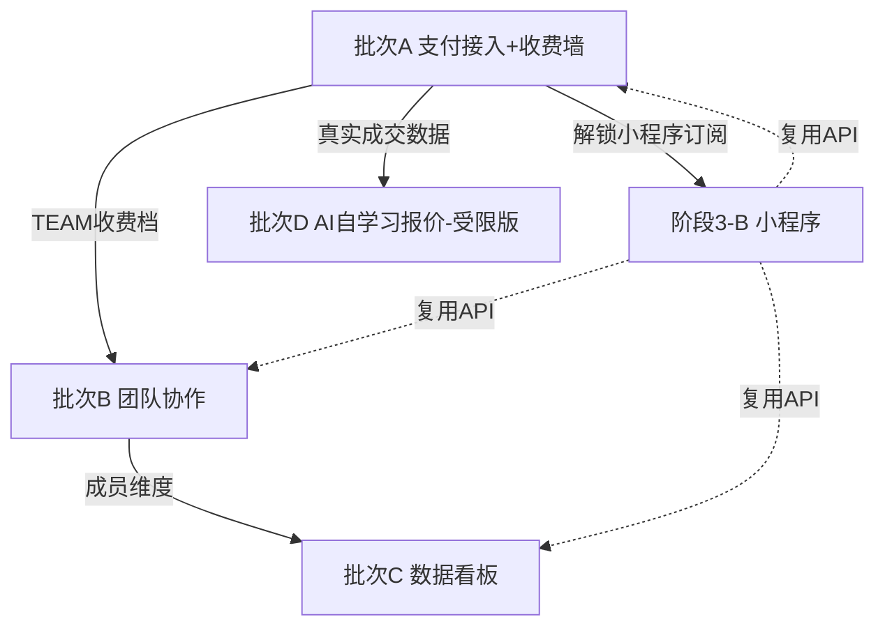
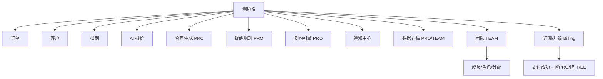

# 摄影师的 AI 接单跟单助手 — 阶段3 增量 PRD（P2 五项）

> 版本：v3.0（增量版，仅描述相对阶段2 的**变更**）
> 作者：产品经理 许清楚（Xu）— 因专用 PM agent 临时不可用，由我独立以许清楚视角产出，标准与许清楚一致
> 日期：2026-07-24
> 配套基线：`prd.md`（v1.0）、`architecture.md`（v1.0）、`prd-phase2.md`（v2.0）、`architecture-phase2.md`（v2.0）
> 状态：待主理人齐活林 + 客户评审
>
> **阅读前提**：本文档不复述阶段1/2 已定内容（MVP 四项、状态流、档期冲突、AI 报价、客户库、沟通助手、合同、提醒规则、复购引擎；收费定价 ¥39/月、技术栈 Vite+React+MUI+Tailwind / Spring Boot / PostgreSQL / DeepSeek；**多租户已按 `studio_id` 隔离、阶段1 已建模 `studio`+`user(role OWNER|MEMBER)`**）。仅聚焦阶段3（P2 池五项）的新增与变更，并先做**分期与优先级定盘**。

---

## 1. 分期与优先级判断（最关键）

### 1.1 总判断

P2 五项按「工程量 + 外部依赖 + 商业价值」拆为两组：

| 项目 | 分组 | 本阶段是否做 | 一句话理由 |
|---|---|---|---|
| **支付接入** | 本阶段 · 批次 A（最优先） | ✅ 做 | 商业闭环"最后一公里"，此前一直"演示手动置 PRO"，不接支付就没有真实收费；最小闭环可先用 mock 跑通 |
| **团队协作** | 本阶段 · 批次 B | ✅ 做 | 阶段1 已建模 `studio`+`user`，零改造预留；纯后端+权限，无外部资质；仅多一个 TEAM 收费档位 |
| **数据看板** | 本阶段 · 批次 C | ✅ 做 | 阶段1/2 表（orders/customer/status_history/reminder）已足够支撑核心指标；纯后端聚合+前端可视化，无外部资质 |
| **AI 自学习报价** | 本阶段 · 批次 D（受限版） | ⚠️ 做"受限版" | 完整自动学习风险高（易偏离市场）；先做"校准建议面板 + 人工确认 + 安全边界"，**不自动覆盖**线上系数 |
| **小程序** | **独立立项「阶段3-B 独立工程」** | 🔀 独立工程，不混编 | 独立前端工程 + 微信集成（appid/secret/登录），与 Web 后端增量混编会稀释本阶段重点；可并行启动，复用现有 REST API |

### 1.2 关键建议（逐条回应主理人关注点）

**建议一 · 小程序独立立项为「阶段3-B 独立工程」**
- 小程序是**独立前端工程**（独立仓库、独立构建、微信开发者工具链），且必然新建微信集成（appid/secret、微信登录 `code2session`、可能的小程序内微信支付）。
- 若与 Web 后端增量（支付/团队/看板/校准）塞进同一增量，会同时引入"微信工程 + 支付通道 + 权限模型"三类不确定性，排期与回归都失控。
- **推荐**：小程序作为独立立项，复用本阶段落地后的后端 REST API（订单/档期/报价/客户/提醒/通知中心均已就绪）；小程序内的"订阅升级"依赖批次 A 的支付接入（或小程序内微信支付）。可在批次 A 启动后并行开发。

**建议二 · 支付接入本阶段做，先打最小闭环 + 沙箱 mock**
- 此前所有 PRO 都是"演示手动置 PRO"，没有真实资金流，阶段3 必须补齐。
- **最小闭环**：`订阅下单 → 生成支付单 → 支付成功回调 → 自动置 PRO → 到期自动降 FREE`。
- **沙箱策略**：无真实商户号时，提供 `mock-pay` 端点模拟支付成功，先跑通状态机与收费墙联动；微信/支付宝商户资质到位后切换真实通道。
- **通道选择见待确认 Q2**：建议先微信支付打通（与小程序/微信生态一致），支付宝作为第二通道；双通道可后置。

**建议三 · 团队协作本阶段做，权限模型需客户拍板**
- 阶段1 已留 `studio`+`user(role)`，P2 零改造预留成立，工程量可控。
- 阶段2 仅 OWNER|MEMBER 两态；团队协作需扩展为 **OWNER / ADMIN / MEMBER / READONLY** 四态（见 Q3）。
- 依赖关系：团队协作的"团队版收费（¥99/月）"依赖批次 A 的支付接入；但权限模型本身（邀请/角色/订单分配/数据可见性）是纯后端，可与 A 并行。

**建议四 · 数据看板本阶段做，数据源基本够用**
- 核心指标（收入、订单数、咨询→定金转化率、复购率、客单价）可由 `orders`(amount/status/status_history)、`customer`(repurchase 画像、阶段2 `REPURCHASE` 提醒) 聚合得出，**无需埋点**。
- 若要看"消息打开率/提醒触达率"等运营细节才需埋点，那不是阶段3 必做项（见 Q4）。
- 团队维度（按成员统计业绩）依赖批次 B；可先发"工作室整体"版，再补成员拆分。

**建议五 · AI 自学习报价做"受限版"，安全边界优先**
- 阶段1/2 报价是"规则系数 + LLM，固定权重"，未用历史成交校准。
- 完整自动学习风险：样本少时校准会**偏离市场**（如某摄影师早期低价单拉低全局建议价）。
- **受限版**：基于历史"已成交订单"（金额真实、状态到 DELIVER/REPURCHASE）计算系数偏移**建议值**，展示校准面板，由摄影师**人工确认是否采纳**；采纳才生效，且设**安全边界**（单次偏移 ≤±15%、仅在样本 ≥ N 单时出建议）。不自动覆盖线上系数。

### 1.3 推荐实现批次（依赖顺序）

```
[批次 A] 支付接入 + 收费墙改造（商业化底座，最优先，阻塞小程序订阅 & 团队版收费）
   │   ├─ 支付下单 / 回调 / mock / 订阅生命周期（订阅表 + 支付单表）
   │   └─ plan_type 扩展 FREE|PRO|TEAM，过期自动降 FREE
   ▼
[批次 B] 团队协作（权限模型，纯后端）
   │   依赖 A 仅为了 TEAM 收费档；权限本身可与 A 并行
   ▼
[批次 C] 数据看板（经营洞察）
   │   团队维度依赖 B；可先发整体版
   ▼
[批次 D] AI 自学习报价（受限版：校准面板 + 人工确认 + 安全边界）
       独立，建议后置（历史成交数据随 A 真实支付更可信）

═══════ 并行独立工程 ══════
[阶段3-B] 微信小程序（独立前端工程 + 微信集成）
   复用现有 API；内订阅依赖批次 A；可与 A/B/C/D 并行启动
```

**依赖图（Mermaid）**


---

## 2. 变更摘要（相对阶段2 新增了什么）

阶段2（P1）已落地：AI 沟通助手、合同生成、站内通知中心、可配置提醒规则、复购引擎；专业版付费墙已存在（`studio.plan_type`=FREE/PRO，`QuotaService.requirePro` 抛 `403`）。**但 PRO 状态此前靠演示手动置位，无真实支付**。

阶段3（P2）在其上**增量新增**：

| # | 新增能力 | 类型 | 外部依赖 | 复用/变更点 |
|---|---|---|---|---|
| 1 | **支付接入** | 订阅下单→支付→自动置PRO/过期降FREE | 微信支付/支付宝商户资质（沙箱可 mock） | 新增 `subscription`/`payment_order` 表；`studio.plan_type` 扩展 TEAM；重构 `QuotaService` 以订阅有效期为 PRO 真源 |
| 2 | **团队协作** | 多账号、角色权限、订单分配、数据按 studio 隔离（已具备） | 无 | `users.role` 扩为 OWNER/ADMIN/MEMBER/READONLY；新增 `team_invitation` 表；订单/客户已按 `studio_id` 隔离，零改造 |
| 3 | **数据看板** | 收入/转化率/复购率/客单价可视化 | 无（复用现有表） | 新增只读聚合 API（无新表或仅轻量物化视图）；前端 Dashboard 页 |
| 4 | **AI 自学习报价** | 基于历史成交校准系数建议 + 人工确认 | 复用 `LlmClient`（可选） | 新增 `quote_calibration` 表（建议+采纳留痕）；报价 Service 读取已采纳校准系数；安全边界 |
| 5 | **小程序（阶段3-B 独立工程）** | 移动端接单/档期/报价/客户/提醒 | 微信 appid/secret + 微信登录 | 独立前端工程；复用现有 REST API；新增微信登录 `code2session` 集成对接后端账号 |

### 新增页面 / 组件（Web 端，批次 A–D）
- `BillingPage`（订阅/支付页，含套餐选择、支付二维码/跳转、当前订阅状态）
- `TeamPage`（团队成员管理：邀请/角色/移除）
- `DashboardPage`（经营看板：核心指标卡 + 趋势 + 漏斗 + 复购）
- `QuoteCalibrationPanel`（AI 自学习校准面板：建议值 + 采纳/驳回 + 安全边界提示）
- `UpgradeModal` 增强：过期/未订阅时文案区分"新购 / 续费 / 团队版"

### 新增接口（后端，统一前缀 `/api`，需 JWT）

| 方法 | 路径 | 说明 | 依赖 |
|---|---|---|---|
| POST | `/api/billing/subscribe` | `{planType, channel} → {outTradeNo, payUrl/qrCode}` | 支付通道 |
| POST | `/api/billing/notify/{channel}` | 支付通道异步回调（微信/支付宝） | 支付通道 |
| POST | `/api/billing/mock-pay` | `{outTradeNo} → 模拟支付成功`（沙箱） | 无 |
| GET | `/api/billing/subscription` | 当前工作室订阅状态/到期日 | 无 |
| POST | `/api/billing/cancel` | 取消自动续费（标记不再续） | 无 |
| POST | `/api/team/invite` | `{email/phone, role} → 邀请` | 无 |
| GET | `/api/team/members` | 成员列表（含角色） | 无 |
| PUT | `/api/team/members/{id}` | 改成员角色 | 无 |
| DELETE | `/api/team/members/{id}` | 移除成员 | 无 |
| POST | `/api/team/accept` | `{token} → 接受邀请加入 studio` | 无 |
| GET | `/api/dashboard/overview` | 收入/订单/客单价/复购率（按 range） | 无 |
| GET | `/api/dashboard/funnel` | 咨询→定金→…转化率漏斗 | 无 |
| GET | `/api/dashboard/members` | 按成员业绩拆分（依赖团队） | 团队协作 |
| GET | `/api/ai/quote-calibration` | 校准建议列表（样本/偏移/边界） | 无 |
| POST | `/api/ai/quote-calibration/apply` | `{id} → 采纳建议，写回系数` | 无 |

---

## 3. 新增用户故事（覆盖本阶段纳入能力，Given/When/Then）

> 编号 `US-P3-xx`。角色：独立摄影师 / 工作室主理人（OWNER）。PRO=专业版，TEAM=团队版。

### 3.1 支付接入（批次 A）

**US-P3-01 专业版订阅下单**
As a 摄影师, I want 在订阅页选"专业版 ¥39/月"并支付, so that 真实解锁无限 AI 与跟单功能。
- **Given** 当前 `studio.plan_type = FREE` 且 `subscription` 无有效记录
- **When** 我进入「升级专业版」→ 选微信支付 → 点「立即订阅」
- **Then** 后端生成 `payment_order`(PENDING) + `out_trade_no`，返回支付二维码/跳转 URL；前端展示"待支付"态；`studio.plan_type` 仍为 FREE（未支付不提前解锁）。

**US-P3-02 支付成功自动置 PRO**
As a 摄影师, I want 付款后系统自动把我升到专业版, so that 不用等人工/手动置位。
- **Given** 已生成待支付 `payment_order`
- **When** 支付通道回调通知该 `out_trade_no` 已支付（或沙箱 `mock-pay` 触发）
- **Then** 后端写 `subscription`(PRO, ACTIVE, expires_at=now+30d)，将 `studio.plan_type` 置 `PRO`，前端刷新后 PRO 功能全部解锁；通知中心推送"已升级专业版"。

**US-P3-03 到期自动降 FREE（数据不丢）**
As a 专业版摄影师, I want 订阅到期后自动回到免费版但数据保留, so that 不因过期丢客户/订单。
- **Given** `subscription` 已 `expires_at < now` 且未续费
- **When** 定时任务/访问时检测到期
- **Then** `studio.plan_type` 自动置 `FREE`；订单/客户/历史提醒全部保留；PRO 功能再次触发 `403 → UpgradeModal`（文案"您的专业版已到期，续费继续"）；未支付订单不影响既有数据。

**US-P3-04 沙箱 mock 支付跑通闭环**
As a 工程师/测试, I want 无商户号时用 mock 支付验证闭环, so that 不阻塞开发与演示。
- **Given** 环境无真实微信/支付宝商户资质
- **When** 调 `POST /api/billing/mock-pay {outTradeNo}`
- **Then** 走与真实回调相同的状态机（置 PRO / 写订阅），全程不连外部通道；仅沙箱/测试环境可启用该端点（生产禁用）。

**US-P3-05 团队版订阅（TEAM）**
As a 工作室主理人, I want 为团队订阅"团队版 ¥99/月"并邀请成员, so that 多人共用一个 Studio 协同。
- **Given** OWNER 在订阅页选"团队版"
- **When** 完成支付（同 US-P3-02 链路，planType=TEAM）
- **Then** `subscription`(TEAM) 生效，`studio.plan_type=TEAM`；解锁团队协作与权限管理；成员上限 2–5 人；到期降级逻辑同 US-P3-03（降回 FREE，成员关系保留）。

### 3.2 团队协作（批次 B）

**US-P3-06 邀请成员加入 Studio**
As a OWNER, I want 用邮箱/手机邀请同事加入我的工作室, so that 助理/合伙摄影师共用一套订单客户。
- **Given** `studio.plan_type` 为 TEAM（或 PRO 允许 1 成员，TEAM 允许多）
- **When** 在「团队」页点「邀请成员」→ 填邮箱+角色(ADMIN/MEMBER/READONLY) → 发送
- **Then** 生成 `team_invitation`(token, 未过期)；对方凭 token 在「接受邀请」加入，其 `users.studio_id` 指向本 studio、`role` 取邀请值；邀请过期(如 7d)可重发。

**US-P3-07 角色权限隔离**
As a 工作室, I want 不同成员有不同操作权限, so that 助理不能乱改核心设置。
- **Given** 成员角色 ∈ {OWNER, ADMIN, MEMBER, READONLY}
- **When** 某成员尝试操作（如 READONLY 试图删订单 / MEMBER 试图改提醒规则）
- **Then** 后端按角色矩阵拦截：READONLY 仅读订单/客户/日历；MEMBER 可 CRUD 订单/客户但不可改团队与计费；ADMIN 近似 OWNER 但不可转让所有权/退订；越权返回 `403`；所有数据仍按 `studio_id` 隔离，跨成员可见但受角色约束。

**US-P3-08 订单分配与归属**
As a OWNER, I want 把订单分配给具体摄影师, so that 业绩可拆分、责任清晰。
- **Given** 团队内有多名 MEMBER
- **When** 在订单详情「分配给」选某成员
- **Then** 订单记 `assigned_to = users.id`（新增可空字段）；看板可按时员拆分；被分配成员在自己的视图可见该单；删除成员时其名下订单回退"未分配"而非丢失。

### 3.3 数据看板（批次 C）

**US-P3-09 经营看板核心指标**
As a 摄影师, I want 一眼看到收入/订单数/客单价/复购率, so that 不用自己算账。
- **Given** 工作室有历史订单（含金额与状态流转）
- **When** 进入「数据看板」选时间范围（如近 30 天/本季度）
- **Then** 展示：总收入、订单数、客单价(AOV=收入/订单数)、咨询→定金转化率(DELIVER 或 DEPOSIT/咨询数)、复购率(有 REPURCHASE 或重复 customer/总客户)；指标卡 + 收入趋势折线；数据来自 `orders`/`status_history`/`customer`，不另埋点。

**US-P3-10 转化漏斗与团队拆分**
As a 工作室主理人, I want 看咨询→定金→拍摄→交付的转化漏斗, so that 找出流失环节。
- **Given** 存在 `status_history` 流转记录
- **When** 打开「转化漏斗」tab
- **Then** 展示各状态转化人数/占比（CONSULT→DEPOSIT→SHOOT→EDIT→DELIVER）；若已启用团队协作，可叠加「按成员」维度拆分各漏斗环节贡献。

### 3.4 AI 自学习报价（批次 D，受限版）

**US-P3-11 报价系数校准建议**
As a 摄影师, I want 系统基于我的历史成交单给出报价系数校准建议, so that 报价更贴合我的真实成交水平。
- **Given** 工作室有 ≥ N（默认 20，见 Q5）笔"已成交"历史订单（金额真实）
- **When** 打开「AI 报价校准」面板
- **Then** 展示各维度（地区/类型/风格）的建议系数偏移（如"上海·婚纱写真 建议 ×1.08"）、样本量、置信度；偏移受**安全边界**约束（单次 ≤±15%），超出部分截断并标注"已达边界"；不自动生效。

**US-P3-12 校准人工确认 + 安全边界**
As a 摄影师, I want 校准建议需我确认才生效, so that 系统不会擅自把我的报价带偏。
- **Given** 面板列出若干校准建议
- **When** 我逐条「采纳」或「驳回」；或「一键采纳全部（在边界内）」
- **Then** 采纳项写入 `quote_calibration`(applied)，报价 Service 读取已采纳系数参与后续 `/api/ai/quote`；驳回/未采纳不生效；任何建议若样本不足或偏移越界，面板明确警示"建议仅供参考，未达生效条件"。

### 3.5 小程序（阶段3-B 独立工程，接口契约）

**US-P3-13 小程序移动接单**
As a 摄影师, I want 在微信里随时查订单/档期/报价, so that 外拍时不用开电脑。
- **Given** 小程序已发布并绑定本产品后端
- **When** 微信内打开小程序，微信登录后
- **Then** 展示我的订单列表（按状态）、档期日历（冲突标记）、AI 报价入口、客户库、通知中心；复用 Web 端既有 REST API；只读/轻操作优先，重编辑仍在 Web。

**US-P3-14 小程序微信登录复用 Studio 账号**
As a 摄影师, I want 用微信一键登录小程序且对应我的 Studio, so that 不重复注册。
- **Given** 后端已对接微信 `code2session`（appid/secret）
- **When** 小程序拿 `wx.login` 的 code 调后端登录
- **Then** 后端用 code 换 openid，匹配/创建本 studio 下的 `users`(wechat_openid)，返回 JWT；与 Web 账号同属一个 `studio_id`，数据互通。

---

## 4. 阶段3 需求池（按推荐批次分级 + 依赖标注）

> 依赖标注：`[支付]`=需微信/支付宝通道；`[微信]`=需微信集成(appid/secret)；`[LLM]`=需大模型；`[BE]`=纯后端；`[FE]`=前端；`[资质]`=需外部商户/主体资质；`[独立工程]`=独立前端工程。

| 编号 | 需求 | 批次 | 依赖 | 外部资质 | 验收要点 |
|---|---|---|---|---|---|
| **P2-2** | 支付接入（订阅下单→支付→置PRO/降FREE） | A | `[支付][BE][FE][资质]` | ✅ 微信/支付宝商户号 | `subscription`+`payment_order` 表；回调置 PRO；过期降 FREE；mock 端点沙箱可用；PRO 真源改为订阅有效期 |
| **P2-2a** | 收费墙改造（plan_type 扩 TEAM） | A | `[BE]` | 无 | `studio.plan_type` ∈ FREE/PRO/TEAM；`QuotaService` 以订阅有效期判 PRO；UpgradeModal 区分新购/续费/团队 |
| **P2-3** | 团队协作（成员/角色/分配） | B | `[BE][FE]` | 无 | `users.role` 扩 4 态；`team_invitation` 表；订单 `assigned_to`；角色矩阵拦截；数据按 studio 隔离 |
| **P2-4** | 数据看板（核心指标+漏斗） | C | `[BE][FE]` | 无 | 复用 orders/status_history/customer；收入/订单/AOV/转化率/复购率；时间范围筛选；团队维度（依赖 B） |
| **P2-5** | AI 自学习报价（受限版） | D | `[BE][LLM可选]` | 无 | `quote_calibration` 表；建议+采纳留痕；安全边界(≤±15%、样本阈值)；不自动覆盖 |
| **P2-1** | 微信小程序 | **阶段3-B 独立工程** | `[微信][独立工程][FE]` | ✅ 微信小程序 appid/secret | 独立工程；复用 REST API；微信登录 code2session；移动接单/档期/报价/客户/提醒 |

### 推荐落地顺序
1. **批次 A（支付+收费墙）** — 商业闭环底座，最优先，阻塞小程序订阅与团队版收费。
2. **批次 B（团队协作）** — 纯后端可并行；TEAM 收费依赖 A。
3. **批次 C（数据看板）** — 可与 A/B 并行；团队维度依赖 B。
4. **批次 D（AI 校准受限版）** — 独立，建议后置（真实成交数据随 A 更可信）。
5. **阶段3-B（小程序）** — 独立工程，A 启动后并行；内订阅依赖 A。

---

## 5. UI 增量设计（极简风，沿用 ≤2 主色 `#2D6CDF` / `#1A1A1A`）

> 规则：卡片化、留白大、列表优先；主操作蓝 `#2D6CDF`，文字 `#1A1A1A`，背景白，浅灰分隔 `#F2F4F7`。

### 5.1 支付订阅页（BillingPage，批次 A）
```
┌─────────────────────────────────────────────┐
│ 升级订阅                          当前：免费版 │
├─────────────────────────────────────────────┤
│ ┌──────────────┐  ┌────────────────────────┐ │
│ │ 专业版 PRO   │  │ 团队版 TEAM            │ │
│ │ ¥39/月       │  │ ¥99/月 (2–5人)         │ │
│ │ 无限AI+跟单  │  │ 含专业版+协作权限      │ │
│ │ [选这个]     │  │ [选这个]               │ │
│ └──────────────┘  └────────────────────────┘ │
│ 支付方式： (微信支付)(支付宝)(沙箱Mock)       │
│ ┌─────────────────────────────────────────┐ │
│ │           [ 微信支付二维码 ]             │ │
│ │   待支付 ¥39  ·  扫码后自动开通         │ │
│ └─────────────────────────────────────────┘ │
│ 注：不抽成，订阅即解锁，到期自动保留数据    │
└─────────────────────────────────────────────┘
   支付成功 → 角标/通知中心："已升级专业版"
   过期 → 顶部黄条："专业版已到期，续费继续"
```

### 5.2 团队协作管理（TeamPage，批次 B）
```
┌─────────────────────────────────────────────┐
│ 团队（团队版）              [+ 邀请成员]      │
├─────────────────────────────────────────────┤
│ 👤 齐活林  主理人(OWNER)   inv****@x.com  [—]│
│ 👤 许清楚  管理员(ADMIN)   xu****@x.com   [...]│
│ 👤 小李    成员(MEMBER)    li****@wx     [改角色][移除]│
│ 👤 实习生  只读(READONLY)  in****@wx     [改角色][移除]│
│ ─────────────────────────────────────────── │
│ 角色说明：只读=仅查看；成员=订单客户CRUD；  │
│          管理员≈主理人(不可退订/转让)        │
└─────────────────────────────────────────────┘
   邀请 → 填邮箱+角色 → 生成邀请链接/码
   改角色 → 后端角色矩阵校验 → 越权 403
```

### 5.3 数据看板（DashboardPage，批次 C）
```
┌─────────────────────────────────────────────┐
│ 数据看板               [近30天 ▾][本季 ▾]    │
├─────────────────────────────────────────────┤
│ ┌────────┐ ┌────────┐ ┌────────┐ ┌────────┐ │
│ │收入 ¥xx│ │订单 32 │ │客单价  │ │复购率  │ │
│ │▲12%   │ │▲ 5    │ │¥1,280 │ │ 18%   │ │
│ └────────┘ └────────┘ └────────┘ └────────┘ │
│ 收入趋势                               [折线]│
│ ┌─────────────────────────────────────────┐ │
│ │ 转化漏斗                               │ │
│ │ 咨询 50 → 定金 32 → 拍摄 28 → 交付 26 │ │
│ │ ▓▓▓▓▓▓▓▓▓▓  ▓▓▓▓▓▓▓   ▓▓▓▓▓▓   ▓▓▓▓▓   │ │
│ └─────────────────────────────────────────┘ │
│ [按成员拆分 ▾]（需启用团队协作）            │
└─────────────────────────────────────────────┘
```

### 5.4 AI 自学习报价校准面板（QuoteCalibrationPanel，批次 D）
```
┌─────────────────────────────────────────────┐
│ AI 报价校准（建议，需你确认才生效）          │
├─────────────────────────────────────────────┤
│ 样本：上海·婚纱写真 24单  置信度：中        │
│ 当前系数 ×1.00  →  建议 ×1.08  (边界内 +8%) │
│   [采纳] [驳回]                              │
│ ─────────────────────────────────────────── │
│ 样本：北京·亲子 6单   置信度：低(样本不足)  │
│ 建议 ×0.82  ⚠ 未达生效条件，仅供参考        │
│   [采纳(禁用)] [驳回]                       │
│ ─────────────────────────────────────────── │
│ 安全边界：单次偏移≤±15% · 样本≥20单才生效   │
│ [一键采纳全部(边界内)]                      │
└─────────────────────────────────────────────┘
   采纳 → 写 quote_calibration(applied) → 后续报价读取
   不自动覆盖线上系数
```

### 5.5 信息架构变更（Mermaid）


---

## 6. 收费墙影响（支付接入后 免费/专业版 转化与拦截变化）

> 阶段1/2 收费墙：专业版 ¥39/月 解锁"无限 AI + 沟通助手 + 合同 + 推送 + 复购"；此前 PRO 状态靠**演示手动置位**，无真实支付。阶段3 支付接入后，PRO 真源改为**订阅有效期**。

| 维度 | 阶段1/2（手动 PRO） | 阶段3（支付接入后） |
|---|---|---|
| **PRO 真源** | `studio.plan_type` 手动置位 | `subscription` 有效记录（expires_at > now）→ PRO；无/过期 → FREE |
| **升级触发** | 第 11 单 / PRO 功能 403 → UpgradeModal（演示） | 同左，但「立即订阅」走真实支付闭环（US-P3-01/02） |
| **支付成功** | — | 自动置 PRO，解锁全部；通知中心推送"已升级" |
| **到期处理** | — | 自动降 FREE，**数据全保留**；PRO 功能重新 403 → UpgradeModal（文案"已到期，续费继续"） |
| **新档位 TEAM** | 无 | 团队版 ¥99/月（2–5 人），解锁团队协作；到期降级回 FREE（成员关系保留） |
| **免费版权益** | ≤10单 / AI报价5次/月 / 基础站内提醒 | **不变**（不回归）；新增"看板/团队"入口可见但 PRO/TEAM 拦截 |

### 拦截实现要点
- **后端**：`QuotaService` 改为读 `subscription` 有效期判 PRO；`requirePro` 抛 `PRO_REQUIRED(403)` 不变；新增 `requireTeam`（团队协作/成员管理入口，非 TEAM 抛 `403`）。
- **前端**：`api/client.ts` 统一 `403 → UpgradeModal` 已具备；增强文案区分"新购 / 续费 / 团队版"；顶部黄条提示"已到期"。
- **不回归原则**：阶段1 免费额度（≤10单、AI 5次/月、基础提醒）与阶段2 五项 PRO 门禁**全部保持不变**，仅增加"支付真实生效"与"TEAM 档位"。
- **转化逻辑补强（接阶段2 §5）**：
```
免费注册 → 沉淀订单/客户 → 体验 AI 报价(钩子)
  → 看到 沟通/合同/复购/看板/团队 入口(被拦截,价值前置)
  → 单量触顶10单 / 想解锁
  → 升级专业版(真实支付¥39/月,年付¥390,早鸟¥299)
  → [团队] 再升团队版¥99/月
  → 五项+看板+协作全开 → 高留存
  → 订阅到期自动降 FREE(数据不丢) → 续费循环
```

---

## 7. 待确认问题（阶段3 相关，需客户拍板）

> 每项均给**推荐默认方案**（先这么做，不阻塞开发），客户评审时可调整。

**Q1 · 小程序本阶段做还是独立立项？**
- 现状：独立前端工程 + 微信集成（appid/secret/登录），与 Web 后端增量混编风险高。
- **推荐默认**：**独立立项「阶段3-B 独立工程」**，复用本阶段落地后的后端 REST API；不与批次 A–D 同批。小程序内订阅依赖批次 A 支付。
- 待拍板：是否认可独立立项？小程序首版范围是否仅"接单/档期/报价/客户/提醒"轻操作？

**Q2 · 支付通道选微信 / 支付宝 / 双通道？是否先 mock 跑通？**
- 现状：微信/支付宝均需商户资质（营业执照等），沙箱无商户号。
- **推荐默认**：**先微信支付打通**（与微信/小程序生态一致），支付宝作为第二通道后置；**沙箱先用 `mock-pay` 跑通"下单→置PRO→降FREE"全状态机**，商户资质到位后切真实通道。
- 待拍板：单通道(微信)还是双通道？是否接受先 mock 后真实？

**Q3 · 团队协作的权限模型（管理员/成员/只读）？**
- 现状：阶段1 `users.role` 仅 OWNER|MEMBER。
- **推荐默认**：扩展为 **OWNER / ADMIN / MEMBER / READONLY** 四态；角色矩阵：READONLY 仅读；MEMBER 可 CRUD 订单/客户不可改团队与计费；ADMIN≈OWNER 但不可退订/转让；OWNER 全权。订单可 `assigned_to` 分配。
- 待拍板：四态是否够用？是否需要"可限制某成员只看自己分配的订单"（行级隔离）？

**Q4 · 数据看板数据源（阶段1/2 表是否足够，要不要埋点）？**
- 现状：orders/status_history/customer/reminder 已可支撑收入、订单、AOV、转化率、复购率。
- **推荐默认**：**阶段3 不埋点**，核心指标全部由现有表聚合；仅当需"消息打开率/提醒触达率"等运营细节再考虑轻量埋点（后置）。
- 待拍板：是否认可不埋点？是否需导出 CSV/对接财务？

**Q5 · AI 自学习报价的校准范围与安全边界？**
- 现状：阶段1/2 报价为"规则系数+LLM 固定权重"，未用历史成交。
- **推荐默认**：**受限版**——仅基于"已成交订单(到 DELIVER/REPURCHASE 且有真实金额)"计算建议；安全边界：单次偏移 ≤±15%、样本 ≥20 单才生效、采纳需人工确认、不自动覆盖线上系数；样本不足仅展示"仅供参考"。
- 待拍板：样本阈值 20 是否合适？是否允许"自动采纳在边界内且高置信的建议"（仍建议保持人工确认）？是否区分"地区/类型/风格"三维分别校准？

**Q6 · 团队版与专业版的关系与定价？**
- 现状：阶段1 §7.2 给过团队版 ¥99/月（2–5 人）。
- **推荐默认**：团队版 = 专业版全部能力 + 协作权限，¥99/月；专业版仍是单人 ¥39/月；二者互斥（一个 studio 同时只一个有效订阅档）。免费版保持 ≤10 单。
- 待拍板：团队版是否含"成员数上限"硬限制（如 5 人）？超员需升档还是按人加价？

**Q7 · 支付相关的退款/续费/发票？**
- **推荐默认**：阶段3 先做"新购 + 自动续费开关 + 到期降级"；退款流程与发票（增值税普通/电子）作为**后续增强**（涉及商户平台与合规），不阻塞首版闭环。
- 待拍板：是否阶段3 就要发票能力？退款是否需对接通道原路退？

---

## 8. 对架构 / 工程师的落地改动映射（速查，供架构师开 `architecture-phase3.md`）

| 阶段3 项 | 主要改动点（基于现有代码） |
|---|---|
| 支付接入 | 新增 `billing/Subscription`、`billing/PaymentOrder` 实体/Repo/DTO；`billing/BillingController/Service`；`studio.plan_type` 扩枚举(FREE/PRO/TEAM)；重构 `QuotaService` 以订阅有效期判 PRO；新增 `notify/{channel}` 回调 + `mock-pay`；`ErrorCode` 增 `PAYMENT_*`；生产禁用 mock 端点 |
| 收费墙 | `QuotaService.requirePro` 改读订阅；新增 `requireTeam`；`UpgradeModal` 文案增强；顶部"已到期"黄条 |
| 团队协作 | `users.role` 扩 4 态 + 角色矩阵拦截器；新增 `team/TeamInvitation`(实体/Repo/Service/Controller)；`orders` 增 `assigned_to`(可空)；`TeamService` 校验成员上限与角色 |
| 数据看板 | 新增 `dashboard/DashboardController/Service`（只读聚合，复用 orders/status_history/customer）；无新表或仅轻量物化；前端 `DashboardPage` |
| AI 自学习报价 | 新增 `ai/QuoteCalibration`(实体/Repo/Service/Controller)；`AiQuoteService` 读取已采纳系数；安全边界校验(±15%/样本阈值)；前端 `QuoteCalibrationPanel` |
| 小程序(阶段3-B) | 独立仓库；新增微信登录集成(后端 `auth/WechatLoginController` 用 code2session 换 openid→JWT)；复用现有订单/档期/报价/客户/提醒/通知 API；不修改 Web 业务源码 |

---

*增量 PRD 结束 — 提交主理人齐活林评审，并交架构师用于阶段3 技术方案设计（建议新开 `architecture-phase3.md`；小程序单独开 `architecture-miniprogram.md`）。*
