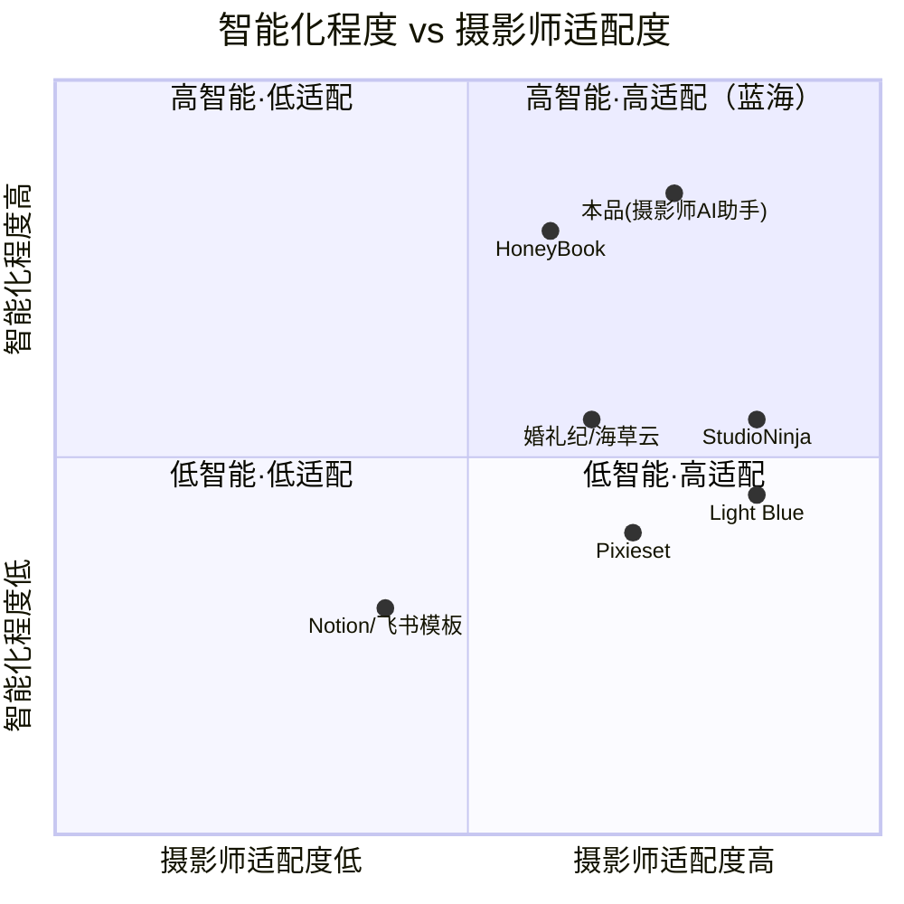

# 摄影师的 AI 接单跟单助手 — 产品需求文档（PRD）

> 版本：v1.0（完整版，含竞品分析）
> 作者：产品经理 许清楚（Xu）
> 日期：2026-07-23
> 状态：待主理人 + 客户评审

---

## 0. 项目信息

| 项 | 内容 |
|---|---|
| **Language** | 中文（与用户需求一致） |
| **Project Name** | `photographer_ai_assistant` |
| **前端技术栈** | Vite + React + MUI + Tailwind CSS |
| **后端技术栈** | Java Spring Boot |
| **存储** | PostgreSQL |
| **AI 接入** | 大模型 API（Prompt 工程为主，不训模型） |
| **平台优先级** | 先 Web，小程序后置 |

### 原始需求复述

面向**独立摄影师 / 2–5 人小摄影工作室**的轻量接单跟单 SaaS，用 AI 降低沟通与事务性工作，**不碰拍摄本身**。
核心痛点与 AI 落点：

- 咨询散落微信/小红书/朋友圈 → 易漏单、报价乱、档期冲突 → **AI 智能报价 + 档期冲突检测**
- 订单状态（定金/拍摄/修图/交付）靠脑子或 Excel → 易忘 → **状态流引擎 + 到期自动提醒**
- 反复答同样问题、写合同/催款耗时间 → **AI 沟通助手生成跟进话术/催款文案**
- 拍完失联、无沉淀 → **客户画像沉淀 + 复购提醒**

**MVP（阶段1）只做能收费的最小闭环**：①订单管理（CRUD+状态流）②档期日历（冲突检测）③AI 报价助手 ④客户库。
**收费方向**：订阅制、不抽成；基础版免费（≤10单），专业版 ¥39/月不限单 + AI 功能；先小圈子年费验证。

---

## 1. 产品目标

### 1.1 北极星指标（North Star Metric）

> **周活跃摄影师数（WAU） × 人均在管有效订单数（Active Orders / Photographer / Week）**

- **为什么**：单一看"注册数"会虚高（摄影师爱尝鲜但不用）；单一看"在管订单数"会被老用户刷量。二者乘积同时要求**有人用**（活跃）和**用得深**（把真实订单托管进来），才是订阅价值成立的真实信号。
- **辅助口径**：周使用 ≥2 天摄影师占比、人均录入客户数。

### 1.2 阶段目标

| 阶段 | 时间窗 | 范围 | 量化目标 |
|---|---|---|---|
| **阶段1 · MVP 验证** | 0–3 月 | 四项 MVP（订单/日历/报价/客户库） | 上线可用；**50 个付费摄影师**；月流失率 < 10%；WAU×人均订单 ≥ 1.5 |
| **阶段2 · AI 增效** | 3–6 月 | 沟通助手、合同生成、消息推送 | **300 付费**；NPS > 30；AI 功能周使用率 > 40% |
| **阶段3 · 增长闭环** | 6–12 月 | 小程序、支付接入、复购引擎、团队协作 | **1000 付费**；年续费率 > 60%；复购订单占比 > 15% |

---

## 2. 竞品分析

### 2.1 竞品对比表（6 个管理类工具 + 1 个线索源）

| 产品 | 定位 / 地区 | 核心功能 | 收费模式 | 摄影师适配度 | 智能化(AI) | 主要短板 |
|---|---|---|---|---|---|---|
| **StudioNinja** | 摄影专用 CRM / 海外 | 线索管理、工作流自动化、在线预订、合同/发票/支付、日历 | $16–40/月（年付更优） | 高（专为摄影设计） | 中（工作流自动化强，无原生 GenAI） | 无中文/无微信生态；价格对国内偏高；AI 能力缺位 |
| **HoneyBook** | 通用创意 CRM + AI / 海外 | 提案、合同、发票、支付、AI 邮件草稿、会议纪要与趋势洞察 | $29–109/月 | 中（通用创意，非摄影专属） | 高（原生 GenAI 邮件/摘要） | 非摄影垂直；无微信/小红书打通；国内访问与合规存疑；贵 |
| **Pixieset** | 作品交付 + Studio Manager / 海外 | 客户画廊、网站、网店、简易 CRM/预订 | 免费 + $8–40/月 | 中（交付极强，管理偏弱） | 低（无 GenAI） | CRM/档期/状态流不成熟，更像画廊工具 |
| **Light Blue** | 摄影 CRM（桌面+云，离线） / 英国 | 客户、排期、财务、工作流、离线优先 | £30/月 或按设备付费 | 高（摄影专属，排期细） | 低（无原生 AI） | 无客户画廊；偏欧美；无微信；无原生 GenAI |
| **婚礼纪（海草云）** | 婚嫁行业全场景 SaaS / 国内 | 平台开店、引流、CRM/ERP、智能修片、谈单展示 | 平台抽佣 + 按模块增值 SaaS | 中（婚嫁垂直，非独立摄影通用） | 中（AI 投放/修片） | **绑定平台流量、抽佣**；非独立摄影通用；数据在平台侧 |
| **Notion / 飞书 自建模板** | 通用协作工具自建 / 国内 | 多维表格、看板、审批流、云文档 | 免费 或 ¥几十/人/月 | 低（通用，需自行搭建） | 低（手动为主） | 无原生 AI 报价；无自动提醒；搭建与维护有学习成本；微信不直达 |
| **小红书 / 微信（线索源）** | 流量与私信入口 / 国内 | 种草、私信咨询 | 免费 | —（非管理工具） | 极低 | **只产生线索，无任何跟单/管理功能**——决定本产品"入口在微信/小红书，管理在本产品"的设计 |

### 2.2 竞品象限图（Mermaid）



### 2.3 关键洞察

1. **市场存在"高适配但低智能"与"高智能但低适配"两簇，右上蓝海空缺**：StudioNinja / Light Blue 适配摄影师但 AI 弱；HoneyBook AI 强但非摄影专属、无微信。本品可占据"既懂摄影、又强 AI"的空白位。
2. **国内独立摄影师的"微信/小红书入口"是所有海外工具的共同盲区**：跨境工具无微信生态，婚礼纪虽国内但绑定平台抽佣。本品应把"线索从微信/小红书进、管理在本产品"做成天然工作流。
3. **不抽成是差异化卖点**：婚礼纪等平台靠抽佣，摄影师敏感；订阅制不抽成可建立信任。
4. **自建模板（Notion/飞书）是隐性强敌**：免费、灵活，但无 AI 报价、无自动提醒、需维护——本品用"开箱即用的 AI 报价 + 自动提醒"直接碾压其"手动搭建"的摩擦。

---

## 3. 市场定位

- **站位**：国内独立摄影师 / 小工作室的"AI 原生接单跟单 SaaS"，卡位**高适配 × 高智能**蓝海。
- **一句话差异化**：*海外工具不懂微信、平台工具要抽佣、自建模板没有 AI——本品用 AI 把"接单到复购"做得比人快、比模板聪明、比平台自由。*
- **目标心智**：摄影师的"接单跟单外挂大脑"，不碰拍摄，只让摄影师少操心、多接单。
- **边界**：不做拍摄/修图/画廊交付（Pixieset 的强项），不做平台流量抽佣（婚礼纪的模式），专注"接单—跟单—复购"的事务智能。

---

## 4. 用户故事（≥8 条，覆盖接单/跟单/复购主链路）

> 格式：As a [角色], I want [功能] so that [收益]。验收标准（AC）以 Given/When/Then 或可量化清单表达。

1. **US-01 咨询转订单（接单）**
   As a 独立摄影师, I want 把微信/小红书来的咨询一键新建为"咨询中"订单并关联客户, so that 不漏单。
   - AC：从订单列表"新建"可在 ≤3 步录入客户+咨询信息；新建后状态=咨询中；列表按状态分栏可见。

2. **US-02 AI 智能报价（接单）**
   As a 摄影师, I want 输入拍摄类型/时长/张数/地区, AI 给出报价区间与话术, so that 报价快且不乱。
   - AC：输入 4 个必填项后 ≤5 秒返回建议价（区间+依据）；可一键填入订单"报价"字段；免费版每月限 5 次、专业版无限。

3. **US-03 档期冲突检测（接单）**
   As a 摄影师, I want 新建/改期拍摄时系统提示档期冲突, so that 不双订。
   - AC：同一摄影师同日已存在拍摄订单时，保存触发红色冲突提示并阻止重叠；日历视图冲突日高亮。

4. **US-04 状态流推进（跟单）**
   As a 摄影师, I want 订单按 咨询→定金→拍摄→修图→交付→复购 推进并可回退, so that 脑子里不用记。
   - AC：状态机仅允许相邻状态正向/回退流转；每次变更记录时间戳与操作人。

5. **US-05 到期自动提醒（跟单）**
   As a 摄影师, I want 定金未付/拍摄前1天/修图超期 系统自动提醒, so that 不忘记。
   - AC：可配置提醒规则；到期前按设定提前量推送站内提醒（阶段2扩展微信/短信）；提醒可标记已处理。

6. **US-06 客户库沉淀（跟单/复购）**
   As a 摄影师, I want 每个客户有档案(联系方式/历史订单/偏好标签), so that 服务连续、易复购。
   - AC：客户详情聚合其全部订单与标签；删除客户前校验无进行中订单。

7. **US-07 AI 跟进/催款话术（跟单，阶段2）**
   As a 摄影师, I want 选订单状态让 AI 生成催款/跟进文案, so that 省时间且语气专业。
   - AC：选择"催尾款"等场景后生成可复制文案；文案含客户名/金额占位符自动填充。

8. **US-08 复购提醒（复购）**
   As a 摄影师, I want 交付后按规则触发复购/节日提醒, so that 拍完不失踪。
   - AC：交付完成 N 天后（可配）生成复购任务；生日/纪念日标签客户触发节日关怀任务。

9. **US-09 合同生成（跟单，阶段2）**
   As a 摄影师, I want 用订单信息套模板生成合同草案, so that 不手搓合同。
   - AC：选模板+订单自动填充关键字段；导出/复制可用。

10. **US-10 免费转付费（商业化）**
    As a 免费摄影师, I want 单量到 10 单时被引导升级且数据不丢, so that 平滑转化。
    - AC：第 11 单新建时弹升级提示；历史 10 单与客户库完整保留；升级后立即解锁不限单+AI 无限。

---

## 5. 需求池（P0 / P1 / P2）

> P0 = MVP 四项（阶段1，必须）；P1 = 阶段2 增效；P2 = 阶段3 增长。

### P0 — MVP（阶段1，must have）
| 编号 | 需求 | 说明 | 验收要点 |
|---|---|---|---|
| P0-1 | 订单管理 CRUD | 新建/编辑/删除/查看订单，含客户、金额、状态 | 增删改查可用；软删除 |
| P0-2 | 状态流引擎 | 咨询→定金→拍摄→修图→交付→复购，相邻流转+回退 | 非法跳变被拦截；留痕 |
| P0-3 | 档期日历 + 冲突检测 | 月/周视图，拍摄日标记，重叠冲突提示 | 冲突高亮+阻止保存 |
| P0-4 | AI 报价助手 | 输入类型/时长/张数/地区→建议价+话术 | ≤5s 返回；免费限次/付费无限 |
| P0-5 | 客户库 | 客户档案、联系方式、标签、历史订单聚合 | 详情聚合；删除校验 |
| P0-6 | 认证与多端登录 | 摄影师账号体系（Web） | 注册/登录/登出 |
| P0-7 | 免费版额度控制 | ≤10 单阈值与升级引导 | 触顶弹窗；数据保留 |

### P1 — 阶段2（should have）
| 编号 | 需求 | 说明 |
|---|---|---|
| P1-1 | AI 沟通助手（催款/跟进话术） | 场景化生成可复制文案 |
| P1-2 | 合同生成（模板套用） | 订单信息自动填充 |
| P1-3 | 消息推送（微信/短信/站内） | 提醒触达客户侧与摄影师侧 |
| P1-4 | 到期自动提醒规则配置 | 可自定义提前量与触发点 |
| P1-5 | 复购提醒引擎 | 交付后/生日/节日任务 |

### P2 — 阶段3（nice to have）
| 编号 | 需求 | 说明 |
|---|---|---|
| P2-1 | 小程序端 | 移动接单/查档期 |
| P2-2 | 支付接入（微信支付） | 定金/尾款在线收 |
| P2-3 | 团队协作（2–5 人） | 多账号、权限、分配 |
| P2-4 | 数据看板 | 营收/转化/复购率 |
| P2-5 | AI 自学习报价 | 基于历史报价迭代建议 |

---

## 6. UI 设计稿（极简风）

**设计规范**
- 字体：统一 `Inter` / 系统中文字体（一套字体贯穿）
- 主色：≤2 主色 —— 主色 `#2D6CDF`（蓝，主操作/激活），辅助 `#1A1A1A`（文字/重要），背景白 `#FFFFFF`，浅灰分隔 `#F2F4F7`
- 风格：卡片化、留白大、操作路径短；列表优先于表单

### 6.1 订单列表（看板/列表混合）
```
┌──────────────────────────────────────────────────────────┐
│ 摄影师AI助手                        [+ 新建订单]   👤 许清楚 │
├──────────┬──────────┬──────────┬──────────┬───────────────┤
│ 咨询中 3 │ 定金 2   │ 拍摄 1   │ 修图 1   │ 交付/复购 2    │
├──────────┴──────────┴──────────┴──────────┴───────────────┤
│ ▸ 王小姐-婚纱写真  ¥2999  06-28拍摄  [AI报价][改状态]      │
│ ▸ 李先生-亲子     ¥1299  待定金    [催定金][改状态]        │
│ ▸ 张同学-毕业     ¥899   07-02拍摄  [改状态]               │
└──────────────────────────────────────────────────────────┘
```

### 6.2 档期日历（冲突高亮）
```
┌──────────────────────────────────────────────────┐
│ 2026年6月              <  月  >   [今天]           │
├──┬──┬──┬──┬──┬──┬──┬───────────────────────────────┤
│一│二│三│四│五│六│日│                              │
│  │23│24│25│26│27│28│ 28/王小姐婚纱(冲突⚠)        │
│29│30│ 1│ 2│ 3│ 4│ 5│ 02/张同学毕业               │
│ 6│ 7│ 8│ 9│10│11│12│                             │
└──┴──┴──┴──┴──┴──┴──┴───────────────────────────────┘
  ⚠ 红色 = 档期冲突（同摄影师重叠）
```

### 6.3 AI 报价助手
```
┌────────────────────────────────────┐
│ AI 智能报价                         │
├────────────────────────────────────┤
│ 拍摄类型 [婚纱写真▾]                │
│ 时长(小时) [ 4 ]   张数 [ 80 ]      │
│ 地区 [ 上海▾ ]   风格 [ 轻奢▾ ]     │
│ [ 生成报价 ]                        │
├────────────────────────────────────┤
│ 💡 建议价：¥2,600 – ¥3,400         │
│ 依据：同城均价×风格系数×张数档      │
│ [一键填入订单] [复制话术]           │
│ 免费剩余：本月 3/5 次               │
└────────────────────────────────────┘
```

### 6.4 客户库
```
┌────────────────────────────────────────┐
│ 客户库              [+ 新建客户]  🔍搜索 │
├────────────────────────────────────────┤
│ 👤 王小姐  微信:wx_***  标签:婚纱/高客单 │
│    历史:2单  最近:2026-06  ¥2999        │
│ ────────────────────────────────────── │
│ 👤 李先生  微信:li_***  标签:亲子/转介绍 │
│    历史:1单  最近:2026-06  ¥1299        │
└────────────────────────────────────────┘
  点击客户 → 右侧抽屉展示档案+全部订单+标签编辑
```

---

## 7. 收费点设计

### 7.1 付费墙划分
| 功能 | 免费版 | 专业版（¥39/月） |
|---|---|---|
| 订单管理 / 状态流 | ✅（≤10 单） | ✅ 不限单 |
| 档期日历 / 冲突检测 | ✅ 基础 | ✅ 增强（多视图/团队） |
| 客户库 | ✅ 基础 | ✅ 不限 + 标签/画像 |
| **AI 报价助手** | ⚠ **限 5 次/月**（钩子） | ✅ 无限 |
| AI 沟通助手（催款/跟进） | ❌ | ✅ |
| 合同生成 | ❌ | ✅ |
| 消息推送（微信/短信） | ❌ | ✅ |
| 复购提醒引擎 | ❌ | ✅ |
| 数据看板 / 团队协作 | ❌ | 阶段3 |

### 7.2 定价建议
- **基础版**：免费（≤10 单），用于获客与沉淀。
- **专业版**：**¥39/月**，或年付 **¥390/年**（省 ¥78，约 8.3 折）。
- **早鸟年费（阶段1 验证用）**：**¥299/年**，限前 100 名小圈子摄影师，锁定年费现金流与反馈。
- **团队版（阶段3）**：¥99/月（2–5 人），含协作与权限。

### 7.3 转化逻辑
```
免费注册 → 录入客户/订单（数据沉淀，提高迁移成本）
   → 体验 AI 报价（惊艳时刻，限次制造稀缺）
   → 单量触顶 10 单 / 想要沟通助手+合同+推送
   → 升级专业版（年付优先，早鸟降价促决策）
   → AI 持续增效 → 高留存 → 阶段3 团队/小程序扩面
```
- **不抽成**作为信任锚点，对比婚礼纪等平台抽佣。
- **AI 报价**是首要转化钩子：免费限次让人体验"AI 比自己报价快准"，付费解锁无限+其余 AI 功能。

---

## 8. 待确认问题（需客户拍板的关键歧义）

1. **小程序时机**：客户说"小程序后置、先 Web"。阶段1 是否纯 Web？是否需预留微信登录/小程序入口占位？（影响后端鉴权与阶段2 消息推送设计）
2. **AI 报价的数据来源与依据**：是基于用户输入规则（类型/时长/张数/地区）生成建议价，还是需接入行业均价/竞品价参考？模型用哪家（国内合规，如通义/智谱/DeepSeek）？是否允许模型记忆用户历史报价自我迭代（P2）？
3. **是否接入支付**（微信支付/定金尾款）：阶段1 未提及。若阶段1 不做支付，定金/尾款仅"记录状态"还是需真实流转？
4. **沟通助手触达方式**（阶段2）：AI 生成文案是"仅生成可复制"，还是直接打通微信/小红书发送？后者涉及平台接口与合规，工作量差异大。
5. **数据合规**：客户微信/手机号等个人信息存储是否需等保/隐私合规评估？免费版数据归属与导出权？
6. **"≤10 单"定义**：是"同时在管订单数"还是"累计创建数"？归档/交付后是否释放额度？
7. **档期冲突规则**：同一摄影师同日只能 1 单，还是按时间段重叠判定？外地/跨城拍摄如何计？是否考虑助理/第二机位？
8. **复购提醒触发逻辑**：交付后 N 天？生日/纪念日？行业淡旺季（如婚纱旺季前触达）？
9. **团队协作归属**：2–5 人工作室的协作（多账号/权限/订单分配）放阶段1 还是阶段3？影响数据权限模型与 MVP 范围。
10. **品牌与定价最终确认**：暂定名"摄影师的 AI 接单跟单助手"是否定稿？早鸟 ¥299/年 与专业版 ¥39/月 是否客户认可？

---

*文档结束 — 提交主理人齐活林评审，并转架构师用于技术方案设计。*
